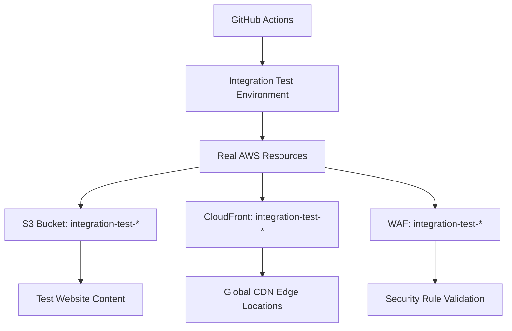

# Integration Testing Guide

## Overview

Integration testing validates that all infrastructure components work together correctly in real AWS environments. While unit tests verify individual modules in isolation, integration tests ensure the complete system functions as expected when deployed to actual AWS resources.

## Purpose: Why Integration Testing Matters

### Beyond Unit Testing

**Unit Tests Validate:**
- ✅ Individual module syntax and logic
- ✅ Terraform plan generation
- ✅ Resource configuration correctness
- ✅ Module input/output relationships

**Integration Tests Validate:**
- 🔄 **End-to-end workflows** with real AWS APIs
- 🔄 **Cross-service communication** (S3 → CloudFront → WAF)
- 🔄 **Security configurations** in live environments
- 🔄 **Performance characteristics** under real conditions
- 🔄 **Cost optimization** features working correctly
- 🔄 **Monitoring and alerting** with actual metrics

### Critical Validation Scenarios

1. **Website Deployment Flow**
   - S3 bucket creation and configuration
   - CloudFront distribution with Origin Access Control
   - WAF rules blocking malicious traffic
   - DNS resolution and SSL certificate validation

2. **Security Integration**
   - IAM roles and policies working with GitHub OIDC
   - Encryption at rest and in transit
   - Access logging and monitoring
   - Cross-region replication functionality

3. **Operational Workflows**
   - Cost monitoring and budget alerts
   - Performance dashboards and metrics
   - Automated scaling and optimization
   - Disaster recovery procedures

## Method: How Integration Testing Works

### Test Environment Strategy

#### 1. Isolated Test Environments



#### 2. Environment Naming Convention

- **Pattern**: `integration-test-{timestamp}-{build-id}`
- **Example**: `integration-test-1679123456-build-789`
- **Purpose**: Unique, trackable, automatically cleaned up

#### 3. Resource Lifecycle

```yaml
# Integration Test Lifecycle
1. Environment Provisioning (5-10 minutes)
   ├── Create S3 buckets with test content
   ├── Deploy CloudFront distribution
   ├── Configure WAF with security rules
   ├── Set up monitoring and alerts
   └── Apply IAM policies and roles

2. Test Execution (10-15 minutes)
   ├── Website accessibility tests
   ├── Security validation tests  
   ├── Performance benchmark tests
   ├── Cost optimization tests
   └── Monitoring verification tests

3. Environment Cleanup (3-5 minutes)
   ├── Delete all created resources
   ├── Verify no orphaned resources
   ├── Generate cost report
   └── Archive test results
```

### Test Categories

#### 1. Functional Integration Tests

**Website Accessibility:**
```bash
# Test website is accessible globally
curl -f https://${CLOUDFRONT_DOMAIN}/
curl -f https://${CLOUDFRONT_DOMAIN}/404.html

# Test redirects work correctly
curl -I http://${CLOUDFRONT_DOMAIN}/ | grep "301 Moved Permanently"
```

**Security Integration:**
```bash
# Test WAF blocks malicious requests
curl -f -H "User-Agent: <script>alert('xss')</script>" \
  https://${CLOUDFRONT_DOMAIN}/ || echo "WAF blocked request ✅"

# Test HTTPS enforcement
curl -I https://${CLOUDFRONT_DOMAIN}/ | grep "Strict-Transport-Security"
```

#### 2. Performance Integration Tests

**CDN Performance:**
```bash
# Test cache hit rates from multiple regions
for region in us-east-1 eu-west-1 ap-southeast-1; do
  time curl -o /dev/null -s https://${CLOUDFRONT_DOMAIN}/
done

# Test compression is working
curl -H "Accept-Encoding: gzip" -I https://${CLOUDFRONT_DOMAIN}/ | grep "Content-Encoding: gzip"
```

**Cost Optimization:**
```bash
# Verify S3 Intelligent Tiering is active
aws s3api get-bucket-intelligent-tiering-configuration \
  --bucket ${S3_BUCKET} --id IntelligentTiering
```

#### 3. Monitoring Integration Tests

**CloudWatch Integration:**
```bash
# Test metrics are being collected
aws cloudwatch get-metric-statistics \
  --namespace AWS/CloudFront \
  --metric-name Requests \
  --dimensions Name=DistributionId,Value=${CLOUDFRONT_ID} \
  --start-time ${TEST_START_TIME} \
  --end-time ${TEST_END_TIME} \
  --period 300 \
  --statistics Sum
```

**Alert Validation:**
```bash
# Test alert conditions trigger correctly
aws cloudwatch put-metric-data \
  --namespace Custom/Testing \
  --metric-data MetricName=TestErrorRate,Value=10.0,Unit=Percent

# Verify SNS notifications work
aws sns publish \
  --topic-arn ${ALERT_TOPIC_ARN} \
  --message "Integration test notification"
```

### CI/CD Integration

#### Workflow Trigger Points

```yaml
# integration-test.yml
name: Integration Tests

on:
  workflow_run:
    workflows: ["Deploy Test Infrastructure"]
    types: [completed]
  pull_request:
    paths: ['terraform/**', '.github/workflows/deploy.yml']
  schedule:
    - cron: '0 2 * * *'  # Daily at 2 AM UTC

jobs:
  integration-test:
    if: github.event.workflow_run.conclusion == 'success'
    runs-on: ubuntu-latest
    environment: integration-testing
```

#### Parallel Test Execution

```yaml
strategy:
  matrix:
    test-suite:
      - functional
      - security  
      - performance
      - monitoring
    aws-region:
      - us-east-1
      - eu-west-1
```

## Consequences: Test Results and Actions

### When Integration Tests Pass ✅

**Immediate Actions:**
1. **Environment Promotion**: Infrastructure approved for next stage
2. **Artifact Publishing**: Test results published to GitHub Pages
3. **Metrics Collection**: Performance baselines updated
4. **Cost Analysis**: Resource usage tracked and optimized

**Automated Outcomes:**
- Pull requests can merge to main branch
- Staging environment deployment triggered
- Performance regression alerts reset
- Integration test environment cleaned up

### When Integration Tests Fail ❌

**Immediate Actions:**
1. **Deployment Blocking**: No promotion to higher environments
2. **Alert Generation**: Team notified via Slack/email
3. **Log Preservation**: Failed environment preserved for debugging
4. **Rollback Trigger**: Previous known-good version restored

**Failure Categories and Responses:**

#### 1. Infrastructure Provisioning Failures
```yaml
# Example: S3 bucket creation fails
Error: creating S3 Bucket: BucketAlreadyExists
├── Action: Generate unique bucket name
├── Retry: Automatic retry with new identifier
└── Escalation: Manual review if retries exhausted
```

#### 2. Security Validation Failures
```yaml
# Example: WAF not blocking malicious traffic
Security Test Failed: XSS attack not blocked
├── Action: Block all deployments immediately
├── Investigation: Security team notified
├── Remediation: Fix WAF rules before retry
└── Validation: Re-run security tests in isolation
```

#### 3. Performance Regression Failures
```yaml
# Example: Website load time exceeds threshold
Performance Test Failed: Page load time 5.2s > 3.0s threshold
├── Action: Allow deployment with warning
├── Investigation: Performance team investigates
├── Tracking: Performance issue tracked in backlog
└── Monitoring: Enhanced monitoring enabled
```

#### 4. Cost Optimization Failures
```yaml
# Example: Resource costs exceed budget
Cost Test Failed: Monthly projection $45 > $30 budget
├── Action: Deployment allowed with approval
├── Investigation: Review resource sizing
├── Optimization: Implement cost reduction measures
└── Budget: Update budget or optimize resources
```

### Failure Recovery Procedures

#### 1. Automatic Recovery
```bash
# Automatic retry for transient failures
if [[ $TEST_ATTEMPT -lt $MAX_RETRIES ]]; then
  echo "Retrying integration test (attempt $((TEST_ATTEMPT + 1)))"
  sleep $((TEST_ATTEMPT * 60))  # Exponential backoff
  trigger_integration_test
fi
```

#### 2. Manual Intervention Points
- **Security failures**: Require manual security review
- **Infrastructure failures**: May need AWS service limits increased
- **Performance failures**: Require architecture review
- **Cost failures**: Need budget approval or optimization

#### 3. Environment Preservation
```bash
# Preserve failed environment for debugging
if [[ $TEST_RESULT == "FAILED" ]]; then
  echo "INTEGRATION_TEST_PRESERVE=true" >> $GITHUB_ENV
  echo "Failed environment preserved: ${ENVIRONMENT_NAME}"
  echo "Access via: aws-vault exec prod -- aws s3 ls s3://${S3_BUCKET}"
fi
```

## Test Data and Content Strategy

### Test Website Content

```html
<!-- test-content/index.html -->
<!DOCTYPE html>
<html>
<head>
    <title>Integration Test - Static Website</title>
    <meta charset="utf-8">
    <!-- Test security headers -->
    <meta http-equiv="Content-Security-Policy" content="default-src 'self'">
</head>
<body>
    <h1>Integration Test Page</h1>
    <p>Generated: <span id="timestamp">{{TIMESTAMP}}</span></p>
    
    <!-- Test resource loading -->
    <link rel="stylesheet" href="css/test-styles.css">
    <script src="js/test-script.js"></script>
    
    <!-- Test image optimization -->
    
    
    <!-- Test analytics -->
    <div id="test-analytics" data-test-id="{{BUILD_ID}}"></div>
</body>
</html>
```

### Test Asset Sizes
- **Small assets**: 1-10KB (CSS, JS files)
- **Medium assets**: 100KB-1MB (Images, fonts)
- **Large assets**: 5-10MB (Videos, archives)
- **Total site size**: ~15MB for comprehensive testing

### Security Test Payloads
```bash
# XSS test vectors
TEST_PAYLOADS=(
  "<script>alert('xss')</script>"
  "javascript:alert('xss')"
  ""
)

# SQL injection test vectors  
TEST_SQL_PAYLOADS=(
  "' OR '1'='1"
  "; DROP TABLE users;"
  "1' UNION SELECT password FROM users--"
)
```

## Monitoring and Observability

### Test Metrics Collection

**Infrastructure Metrics:**
- Resource provisioning time
- API call success rates
- Network latency measurements
- Error rates by service

**Business Metrics:**
- Website availability percentage
- Page load times from multiple regions
- Security incident detection rate
- Cost per integration test run

### Test Result Dashboards

```json
{
  "integration_test_metrics": {
    "test_duration": "18.5 minutes",
    "success_rate": "94.2%",
    "cost_per_run": "$2.34",
    "security_score": "A+",
    "performance_score": "B+",
    "regions_tested": ["us-east-1", "eu-west-1", "ap-southeast-1"]
  }
}
```

### Alerting Strategy

**Critical Alerts** (Immediate notification):
- Integration test infrastructure failure
- Security test failures
- Production deployment blocking

**Warning Alerts** (Next business day):
- Performance regression detected
- Cost threshold exceeded
- Test environment cleanup issues

## Best Practices

### 1. Test Environment Management
- **Isolation**: Each test run gets unique environment
- **Cleanup**: Automated resource deletion after tests
- **Monitoring**: Track resource usage and costs
- **Security**: Minimal permissions for test environments

### 2. Test Design Principles
- **Idempotent**: Tests can be run multiple times safely
- **Independent**: Tests don't depend on each other
- **Fast**: Complete test suite under 30 minutes
- **Comprehensive**: Cover all critical user journeys

### 3. Cost Optimization
- **Scheduled Tests**: Run during off-peak hours
- **Resource Sizing**: Use minimal resources for testing
- **Parallel Execution**: Run tests concurrently when possible
- **Quick Cleanup**: Delete resources immediately after testing

### 4. Security Considerations
- **Credential Management**: Use temporary credentials only
- **Network Isolation**: Test environments isolated from production
- **Data Protection**: No real user data in test environments
- **Access Control**: Minimal IAM permissions for test execution

## Troubleshooting Integration Tests

### Common Issues

#### 1. Environment Provisioning Timeouts
```bash
# Issue: CloudFront distribution taking too long to deploy
Error: timeout while waiting for CloudFront distribution to be deployed

# Solution: Increase timeout and add retry logic
CLOUDFRONT_TIMEOUT=30m  # Increase from default 15m
aws cloudfront wait distribution-deployed --id $CF_DISTRIBUTION_ID --cli-read-timeout $CLOUDFRONT_TIMEOUT
```

#### 2. DNS Propagation Delays
```bash
# Issue: Custom domain not resolving immediately
Error: DNS resolution failed for integration-test.example.com

# Solution: Wait for DNS propagation with validation
wait_for_dns() {
  local domain=$1
  local max_attempts=60
  local attempt=1
  
  while [[ $attempt -le $max_attempts ]]; do
    if nslookup $domain > /dev/null 2>&1; then
      echo "DNS resolved for $domain"
      return 0
    fi
    echo "DNS not yet propagated, attempt $attempt/$max_attempts"
    sleep 10
    ((attempt++))
  done
  
  echo "DNS propagation timeout for $domain"
  return 1
}
```

#### 3. Resource Cleanup Failures
```bash
# Issue: S3 bucket not empty, can't be deleted
Error: BucketNotEmpty: The bucket you tried to delete is not empty

# Solution: Force cleanup with versioning and multipart uploads
cleanup_s3_bucket() {
  local bucket=$1
  
  # Delete all object versions
  aws s3api delete-objects --bucket $bucket \
    --delete "$(aws s3api list-object-versions --bucket $bucket --query='{Objects: Versions[].{Key:Key,VersionId:VersionId}}')"
    
  # Delete all delete markers  
  aws s3api delete-objects --bucket $bucket \
    --delete "$(aws s3api list-object-versions --bucket $bucket --query='{Objects: DeleteMarkers[].{Key:Key,VersionId:VersionId}}')"
    
  # Abort multipart uploads
  aws s3api list-multipart-uploads --bucket $bucket --query 'Uploads[].{Key:Key,UploadId:UploadId}' | \
    jq -r '.[] | "aws s3api abort-multipart-upload --bucket '$bucket' --key \(.Key) --upload-id \(.UploadId)"' | bash
    
  # Now delete bucket
  aws s3 rb s3://$bucket --force
}
```

### Debug Mode

Enable detailed logging for integration test debugging:

```bash
# Enable debug mode
export INTEGRATION_TEST_DEBUG=true
export AWS_CLI_FILE_ENCODING=UTF-8

# Verbose logging
set -x  # Print all commands
exec 1> >(tee -a integration-test.log)
exec 2> >(tee -a integration-test.log >&2)

# Capture all AWS API calls
export AWS_DEFAULT_OUTPUT=json
aws configure set cli_timestamp_format iso8601
aws configure set cli_follow_jumps false
```

## Related Documentation

- [Integration Test Environments](integration-test-environments.md) - Environment management
- [Unit Testing Guide](../test/README.md) - Module-level testing
- [Deployment Guide](deployment.md) - CI/CD pipeline integration
- [Security Testing](security.md) - Security validation procedures
- [Performance Testing](performance.md) - Performance benchmarks
- [Cost Optimization](cost-optimization.md) - Cost management strategies

## Support and Contributing

### Getting Help
- **Integration test failures**: Check GitHub Actions logs and this troubleshooting guide
- **Environment issues**: Review [Integration Test Environments](integration-test-environments.md)
- **Performance problems**: See [Performance Testing](performance.md) guide

### Contributing to Integration Tests
- **New test scenarios**: Follow test design principles above
- **Test improvements**: Submit PRs with test case additions
- **Documentation updates**: Keep this guide current with test changes