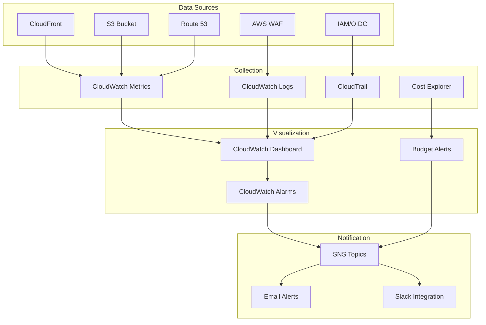

# 📊 Monitoring Guide

Comprehensive monitoring and observability setup for AWS static website infrastructure.

## 📋 Executive Summary

**🎯 Purpose**: Provides real-time visibility into website performance, security events, and cost metrics using AWS CloudWatch.

**👥 Target Audience**: DevOps teams, system administrators, and operations engineers responsible for monitoring infrastructure.

**⏱️ Time Investment**: 
- **Quick Setup**: 10 minutes for basic monitoring
- **Full Dashboard**: 1 hour for comprehensive monitoring
- **Custom Alerts**: 2-3 hours for advanced alerting

**🔑 Key Monitoring Areas**:
- **Performance**: Response times, cache hit rates, error rates
- **Security**: WAF blocks, authentication events, access patterns
- **Cost**: Budget tracking, usage trends, optimization opportunities
- **Availability**: Uptime monitoring, health checks, failover

**📊 Monitoring Stack**:
- **CloudWatch**: Metrics, logs, dashboards, alarms
- **CloudTrail**: API activity and security events
- **X-Ray**: Distributed tracing (optional)
- **Cost Explorer**: Cost analysis and optimization

**🚀 Quick Start**: Jump to [Dashboard Setup](#dashboard-setup) for immediate monitoring.

---

## 🎯 Monitoring Architecture

### Observability Stack



### Key Metrics Tracked

**Performance Metrics**:
- **Response Time**: Origin response time, CloudFront latency
- **Cache Performance**: Cache hit ratio, cache miss rate
- **Error Rates**: 4xx errors, 5xx errors, WAF blocks
- **Traffic Patterns**: Requests per second, bandwidth utilization

**Security Metrics**:
- **WAF Activity**: Blocked requests, rule violations
- **Authentication**: OIDC token usage, failed authentications
- **Access Patterns**: Geographic distribution, user agents
- **Security Events**: Unusual access patterns, potential threats

**Cost Metrics**:
- **Service Costs**: CloudFront, S3, WAF, Route 53
- **Data Transfer**: Origin fetches, cache efficiency
- **Storage**: S3 storage costs, lifecycle optimization
- **Budget Variance**: Actual vs. predicted costs

---

## 📊 Dashboard Setup

### CloudWatch Dashboard Configuration

The infrastructure automatically creates a comprehensive dashboard with:

**Performance Panel**:
- CloudFront request count and cache hit ratio
- Origin response time and error rates
- S3 bucket metrics and replication status

**Security Panel**:
- WAF blocked requests and rule violations
- Authentication events and OIDC usage
- Geographic request distribution

**Cost Panel**:
- Daily cost trends and service breakdown
- Budget utilization and forecasting
- Resource efficiency metrics

### Accessing the Dashboard

```bash
# Get dashboard URL
cd terraform
DASHBOARD_URL=$(tofu output -raw cloudwatch_dashboard_url)
echo "Dashboard URL: $DASHBOARD_URL"

# View dashboard JSON
aws cloudwatch get-dashboard --dashboard-name $(tofu output -raw cloudwatch_dashboard_name)
```

### Custom Dashboard Creation

```bash
# Create custom dashboard
aws cloudwatch put-dashboard \
  --dashboard-name "Static-Website-Custom" \
  --dashboard-body file://dashboard-config.json
```

---

## 🚨 Alerting Configuration

### Automated Alerts

**Critical Alerts** (Immediate notification):
- Website unavailable for >5 minutes
- Error rate >10% for >10 minutes
- WAF blocking >1000 requests/5 minutes
- Monthly cost >120% of budget

**Warning Alerts** (Standard notification):
- Cache hit rate <80% for >30 minutes
- Response time >2 seconds for >15 minutes
- Daily cost >110% of budget
- Failed authentication attempts >50/hour

**Info Alerts** (Daily summary):
- Performance summary
- Security event summary
- Cost analysis
- Optimization recommendations

### Alert Configuration

```bash
# List current alarms
aws cloudwatch describe-alarms

# Create custom alarm
aws cloudwatch put-metric-alarm \
  --alarm-name "Website-High-Error-Rate" \
  --alarm-description "Website error rate exceeds 5%" \
  --metric-name "4xxErrorRate" \
  --namespace "AWS/CloudFront" \
  --statistic "Average" \
  --period 300 \
  --threshold 5 \
  --comparison-operator "GreaterThanThreshold" \
  --evaluation-periods 2
```

### Notification Setup

```bash
# Get SNS topic ARN
SNS_TOPIC=$(tofu output -raw sns_topic_arn)

# Subscribe to alerts
aws sns subscribe \
  --topic-arn "$SNS_TOPIC" \
  --protocol email \
  --notification-endpoint "admin@example.com"

# Test notification
aws sns publish \
  --topic-arn "$SNS_TOPIC" \
  --message "Test alert message"
```

---

## 📈 Performance Monitoring

### Key Performance Indicators

**Website Performance**:
- **Response Time**: <100ms (95th percentile)
- **Cache Hit Rate**: >85%
- **Error Rate**: <1%
- **Availability**: >99.9%

**Infrastructure Performance**:
- **Origin Response Time**: <200ms
- **Data Transfer**: Optimized bandwidth usage
- **Cost Efficiency**: <$50/month for standard usage

### Performance Queries

```bash
# Get performance metrics
aws cloudwatch get-metric-statistics \
  --namespace AWS/CloudFront \
  --metric-name OriginLatency \
  --dimensions Name=DistributionId,Value=$(tofu output -raw cloudfront_distribution_id) \
  --start-time $(date -d '1 hour ago' -u +%Y-%m-%dT%H:%M:%S) \
  --end-time $(date -u +%Y-%m-%dT%H:%M:%S) \
  --period 300 \
  --statistics Average,Maximum

# Check cache performance
aws cloudwatch get-metric-statistics \
  --namespace AWS/CloudFront \
  --metric-name CacheHitRate \
  --dimensions Name=DistributionId,Value=$(tofu output -raw cloudfront_distribution_id) \
  --start-time $(date -d '24 hours ago' -u +%Y-%m-%dT%H:%M:%S) \
  --end-time $(date -u +%Y-%m-%dT%H:%M:%S) \
  --period 3600 \
  --statistics Average
```

---

## 🛡️ Security Monitoring

### Security Event Tracking

**WAF Monitoring**:
- Blocked requests by rule
- Geographic attack patterns
- Rate limiting effectiveness
- Bot detection accuracy

**Authentication Monitoring**:
- OIDC token usage patterns
- Failed authentication attempts
- Unusual access patterns
- Privilege escalation attempts

### Security Queries

```bash
# Check WAF blocked requests
aws logs filter-log-events \
  --log-group-name aws-waf-logs-cloudfront \
  --filter-pattern "{ $.action = \"BLOCK\" }" \
  --start-time $(date -d '1 hour ago' +%s)000 \
  --end-time $(date +%s)000

# Check authentication events
aws logs filter-log-events \
  --log-group-name CloudTrail/management-events \
  --filter-pattern "{ $.eventName = \"AssumeRoleWithWebIdentity\" }" \
  --start-time $(date -d '1 hour ago' +%s)000 \
  --end-time $(date +%s)000
```

---

## 💰 Cost Monitoring

### Cost Tracking

**Budget Configuration**:
- Monthly budget alerts at 50%, 80%, 100%
- Service-specific cost tracking
- Usage forecasting and optimization
- Cost anomaly detection

**Cost Optimization Metrics**:
- S3 storage efficiency
- CloudFront cache optimization
- Data transfer costs
- Resource utilization

### Cost Queries

```bash
# Get current month costs
aws ce get-cost-and-usage \
  --time-period Start=$(date -d '1 month ago' +%Y-%m-%d),End=$(date +%Y-%m-%d) \
  --granularity MONTHLY \
  --metrics BlendedCost \
  --group-by Type=DIMENSION,Key=SERVICE

# Get cost by service
aws ce get-dimension-values \
  --dimension SERVICE \
  --time-period Start=$(date -d '1 month ago' +%Y-%m-%d),End=$(date +%Y-%m-%d)

# Check budget status
aws budgets describe-budgets \
  --account-id $(aws sts get-caller-identity --query Account --output text)
```

---

## 🔍 Log Analysis

### Log Sources

**CloudFront Access Logs**:
- Request patterns and geographic distribution
- Cache performance and optimization opportunities
- Error analysis and troubleshooting
- Security event detection

**WAF Logs**:
- Blocked requests and attack patterns
- Rule effectiveness and false positives
- Geographic threat analysis
- Bot detection and mitigation

**CloudTrail Logs**:
- API activity and authentication events
- Infrastructure changes and deployments
- Security events and compliance
- Operational audit trail

### Log Analysis Examples

```bash
# Analyze top IP addresses
aws logs filter-log-events \
  --log-group-name /aws/cloudfront/access-logs \
  --filter-pattern "{ $.status = \"200\" }" \
  --start-time $(date -d '1 hour ago' +%s)000 \
  --end-time $(date +%s)000 \
  | jq '.events[].message' \
  | grep -o '[0-9]\{1,3\}\.[0-9]\{1,3\}\.[0-9]\{1,3\}\.[0-9]\{1,3\}' \
  | sort | uniq -c | sort -nr | head -10

# Check error patterns
aws logs filter-log-events \
  --log-group-name /aws/cloudfront/access-logs \
  --filter-pattern "{ $.status >= 400 }" \
  --start-time $(date -d '1 hour ago' +%s)000 \
  --end-time $(date +%s)000
```

---

## 📱 Mobile and Real-Time Monitoring

### Mobile Dashboard Access

```bash
# Create mobile-friendly dashboard URL
MOBILE_DASHBOARD=$(tofu output -raw cloudwatch_dashboard_url | sed 's/console.aws.amazon.com/mobile.aws.amazon.com/')
echo "Mobile Dashboard: $MOBILE_DASHBOARD"
```

### Real-Time Monitoring

```bash
# Monitor live metrics
watch -n 30 "aws cloudwatch get-metric-statistics \
  --namespace AWS/CloudFront \
  --metric-name Requests \
  --dimensions Name=DistributionId,Value=$(tofu output -raw cloudfront_distribution_id) \
  --start-time $(date -d '5 minutes ago' -u +%Y-%m-%dT%H:%M:%S) \
  --end-time $(date -u +%Y-%m-%dT%H:%M:%S) \
  --period 300 \
  --statistics Sum \
  --query 'Datapoints[0].Sum'"
```

---

## 🔧 Troubleshooting Monitoring

### Common Issues

**Missing Metrics**:
- Check CloudWatch service permissions
- Verify metric names and namespaces
- Ensure correct region configuration

**High Costs**:
- Review CloudWatch log retention
- Optimize dashboard refresh rates
- Use metric filters effectively

**Alert Fatigue**:
- Adjust alert thresholds
- Use composite alarms for complex conditions
- Implement proper escalation

### Debug Commands

```bash
# Check CloudWatch permissions
aws logs describe-log-groups --query 'logGroups[?contains(logGroupName, `cloudfront`)].logGroupName'

# Verify metric existence
aws cloudwatch list-metrics --namespace AWS/CloudFront

# Test alarm conditions
aws cloudwatch get-metric-statistics \
  --namespace AWS/CloudFront \
  --metric-name "4xxErrorRate" \
  --dimensions Name=DistributionId,Value=$(tofu output -raw cloudfront_distribution_id) \
  --start-time $(date -d '1 hour ago' -u +%Y-%m-%dT%H:%M:%S) \
  --end-time $(date -u +%Y-%m-%dT%H:%M:%S) \
  --period 300 \
  --statistics Average
```

---

## 📚 Additional Resources

- [AWS CloudWatch Documentation](https://docs.aws.amazon.com/cloudwatch/)
- [CloudWatch Dashboard Guide](https://docs.aws.amazon.com/AmazonCloudWatch/latest/monitoring/CloudWatch_Dashboards.html)
- [Cost Optimization Guide](cost-optimization.md)
- [Security Monitoring](security.md#security-monitoring)

**Questions?** → [Troubleshooting Guide](troubleshooting.md) | [GitHub Issues](https://github.com/celtikill/static-site/issues)