# Monitoring & Observability Guide

**⭐⭐ Intermediate** - Complete guide to monitoring, logging, and observability for your static website infrastructure.

> **💡 For deployment**, see [Deployment Guide](../DEPLOYMENT.md).
> **💡 For architecture**, see [Architecture Guide](architecture.md).
> **💡 For troubleshooting**, see [Troubleshooting Guide](troubleshooting.md).

---

## Overview

This guide covers monitoring, logging, metrics, alerts, and observability for the AWS Static Website Infrastructure across all environments.

### What You'll Monitor

```mermaid
%%{init: {'theme':'default', 'themeVariables': {'fontSize':'16px'}}}%%
graph TD
    accTitle: Comprehensive Monitoring and Observability Architecture
    accDescr: Multi-layer observability architecture collecting metrics, logs, and events from all infrastructure components for comprehensive system visibility. The Website layer generates CloudWatch metrics for request counts, latency, and error rates while producing S3 access logs capturing detailed request information for analysis and compliance. CloudFront distribution contributes CloudWatch metrics for global edge performance while tracking cache hit ratios, origin latency, and geographic distribution through dedicated cache performance metrics. WAF protection generates security event logs capturing blocked requests, attack patterns, and threat intelligence while contributing security metrics to CloudWatch for automated response. Cost monitoring tracks AWS spending generating budget alerts when thresholds approach limits enabling proactive cost management and anomaly detection. Infrastructure deployment generates deployment status metrics tracking provisioning success, configuration drift, and resource health through CloudWatch. All metrics converge in CloudWatch serving as the central observability platform aggregating data from all sources. SNS notification topics receive alerts from multiple sources including CloudWatch metrics alarms, WAF security events, budget warnings, and deployment status changes, distributing notifications to appropriate teams and systems. This architecture implements comprehensive observability with centralized metrics collection, multi-source log aggregation, proactive alerting, and automated notification delivery ensuring rapid issue detection and response across all operational domains.

    A["🌐 Website"] --> B["📊 CloudWatch Metrics"]
    A --> C["📝 Access Logs"]

    D["☁️ CloudFront"] --> B
    D --> E["📈 Cache Performance"]

    F["🛡️ WAF"] --> G["🚨 Security Events"]
    F --> B

    H["💰 AWS Costs"] --> I["📉 Budget Alerts"]

    J["🏗️ Infrastructure"] --> K["🔄 Deployment Status"]
    J --> B

    B --> L["📧 SNS Notifications"]
    G --> L
    I --> L
    K --> L

    style B fill:#e1f5fe
    style L fill:#fff9c4

    linkStyle 0 stroke:#333333,stroke-width:2px
    linkStyle 1 stroke:#333333,stroke-width:2px
    linkStyle 2 stroke:#333333,stroke-width:2px
    linkStyle 3 stroke:#333333,stroke-width:2px
    linkStyle 4 stroke:#333333,stroke-width:2px
    linkStyle 5 stroke:#333333,stroke-width:2px
    linkStyle 6 stroke:#333333,stroke-width:2px
    linkStyle 7 stroke:#333333,stroke-width:2px
    linkStyle 8 stroke:#333333,stroke-width:2px
    linkStyle 9 stroke:#333333,stroke-width:2px
    linkStyle 10 stroke:#333333,stroke-width:2px
    linkStyle 11 stroke:#333333,stroke-width:2px
```



---

## Choose Your Path

### 🆕 First-Time User?
**Just deployed and want to check if everything's working?**

Start here:
- [View Your Dashboard](#view-your-dashboard) - See all metrics at a glance
- [Check Website Health](#website-health-checks) - Verify your site is online
- [Set Up Alerts](#setting-up-sns-notifications) - Get notified of issues

### 📊 Operations Team?
**Need to monitor production and respond to issues?**

Focus on:
- [CloudWatch Dashboards](#cloudwatch-dashboards) - Real-time metrics
- [Alerting](#alerting) - Configure alert thresholds
- [Security Monitoring](#security-monitoring) - Track security events
- [Troubleshooting](#troubleshooting) - Diagnose issues

### 💰 Cost Management?
**Tracking spending and optimizing costs?**

Check:
- [Cost Monitoring](#cost-monitoring) - Budget tracking and alerts
- [Cost Optimization Tips](#cost-optimization) - Reduce spending
- [Usage Patterns](#analyzing-usage-patterns) - Understand your usage

### 🔒 Security Team?
**Monitoring for security threats and compliance?**

Review:
- [Security Monitoring](#security-monitoring) - WAF events and threats
- [Access Logs](#s3-access-logs) - Audit access patterns
- [Security Alerts](#security-alerts) - Configure security notifications

---

## Table of Contents

1. [Quick Start](#quick-start)
2. [CloudWatch Dashboards](#cloudwatch-dashboards)
3. [Metrics & KPIs](#metrics--kpis)
4. [Logging](#logging)
5. [Alerting](#alerting)
6. [Cost Monitoring](#cost-monitoring)
7. [Performance Monitoring](#performance-monitoring)
8. [Security Monitoring](#security-monitoring)
9. [Troubleshooting](#troubleshooting)

---

## Quick Start

### View Your Dashboard

```bash
# Get dashboard URL
cd terraform/environments/ENVIRONMENT
tofu output cloudwatch_dashboard_url

# Open in browser
open $(tofu output -raw cloudwatch_dashboard_url)

# Or via AWS CLI
aws cloudwatch get-dashboard \
  --dashboard-name static-site-ENVIRONMENT-dashboard \
  --region us-east-1
```

### Check Current Metrics

```bash
# Website availability (last hour)
aws cloudwatch get-metric-statistics \
  --namespace AWS/S3 \
  --metric-name AllRequests \
  --dimensions Name=BucketName,Value=static-site-ENV-ACCOUNT_ID \
  --start-time $(date -u -d '1 hour ago' +%Y-%m-%dT%H:%M:%S) \
  --end-time $(date -u +%Y-%m-%dT%H:%M:%S) \
  --period 300 \
  --statistics Sum

# CloudFront requests (if enabled)
aws cloudwatch get-metric-statistics \
  --namespace AWS/CloudFront \
  --metric-name Requests \
  --dimensions Name=DistributionId,Value=DISTRIBUTION_ID \
  --start-time $(date -u -d '1 hour ago' +%Y-%m-%dT%H:%M:%S) \
  --end-time $(date -u +%Y-%m-%dT%H:%M:%S) \
  --period 300 \
  --statistics Sum
```

### View Recent Logs

```bash
# S3 access logs
aws logs tail /aws/s3/static-site-ENVIRONMENT --follow

# CloudFront logs (if enabled)
aws logs tail /aws/cloudfront/static-site-ENVIRONMENT --follow

# WAF logs (if enabled)
aws logs tail aws-waf-logs-static-site-ENVIRONMENT --follow
```

---

## CloudWatch Dashboards

### Dashboard Overview

Each environment has a CloudWatch dashboard with key metrics:

**Dashboard Sections:**
1. **Website Health** - Request count, error rate, latency
2. **CDN Performance** - Cache hit rate, origin latency (if CloudFront enabled)
3. **Security** - WAF blocks, authentication failures
4. **Infrastructure** - S3 storage, data transfer
5. **Costs** - Daily spend, budget status

### Accessing Dashboards

**Via Terraform Output:**
```bash
cd terraform/environments/ENVIRONMENT
tofu output cloudwatch_dashboard_url
```

**Via AWS Console:**
1. Navigate to CloudWatch console
2. Select **Dashboards** from left menu
3. Find `static-site-ENVIRONMENT-dashboard`

**Via AWS CLI:**
```bash
# List dashboards
aws cloudwatch list-dashboards --region us-east-1

# Get specific dashboard
aws cloudwatch get-dashboard \
  --dashboard-name static-site-ENVIRONMENT-dashboard \
  --region us-east-1
```

### Dashboard Widgets

| Widget | Metric | Purpose |
|--------|--------|---------|
| **Request Count** | Total requests/minute | Website traffic volume |
| **Error Rate** | 4xx/5xx errors | Website health |
| **Response Time** | Average latency | User experience |
| **Cache Hit Rate** | CloudFront cache hits | CDN efficiency |
| **Data Transfer** | Bytes transferred | Bandwidth usage |
| **WAF Blocks** | Blocked requests | Security threats |
| **Cost Tracking** | Daily spend | Budget compliance |

---

## Metrics & KPIs

### Website Availability

**Target**: 99.9% uptime

```bash
# Check uptime (last 24 hours)
aws cloudwatch get-metric-statistics \
  --namespace AWS/S3 \
  --metric-name 4xxErrors \
  --dimensions Name=BucketName,Value=BUCKET_NAME \
  --start-time $(date -u -d '24 hours ago' +%Y-%m-%dT%H:%M:%S) \
  --end-time $(date -u +%Y-%m-%dT%H:%M:%S) \
  --period 3600 \
  --statistics Sum

# Calculate availability
# Availability = (Total Requests - Errors) / Total Requests * 100
```

### Response Time

**Target**: < 200ms (S3 direct), < 100ms (CloudFront)

```bash
# S3 latency
aws cloudwatch get-metric-statistics \
  --namespace AWS/S3 \
  --metric-name TotalRequestLatency \
  --dimensions Name=BucketName,Value=BUCKET_NAME \
  --start-time $(date -u -d '1 hour ago' +%Y-%m-%dT%H:%M:%S) \
  --end-time $(date -u +%Y-%m-%dT%H:%M:%S) \
  --period 300 \
  --statistics Average

# CloudFront latency (if enabled)
aws cloudwatch get-metric-statistics \
  --namespace AWS/CloudFront \
  --metric-name OriginLatency \
  --dimensions Name=DistributionId,Value=DISTRIBUTION_ID \
  --start-time $(date -u -d '1 hour ago' +%Y-%m-%dT%H:%M:%S) \
  --end-time $(date -u +%Y-%m-%dT%H:%M:%S) \
  --period 300 \
  --statistics Average
```

### Cache Performance (CloudFront)

**Target**: > 80% cache hit rate

```bash
aws cloudwatch get-metric-statistics \
  --namespace AWS/CloudFront \
  --metric-name CacheHitRate \
  --dimensions Name=DistributionId,Value=DISTRIBUTION_ID \
  --start-time $(date -u -d '24 hours ago' +%Y-%m-%dT%H:%M:%S) \
  --end-time $(date -u +%Y-%m-%dT%H:%M:%S) \
  --period 3600 \
  --statistics Average
```

### Key Performance Indicators

| KPI | Target | Alert Threshold | Environment |
|-----|--------|-----------------|-------------|
| **Availability** | 99.9% | < 99.5% | All |
| **Error Rate** | < 1% | > 5% | All |
| **Response Time (S3)** | < 200ms | > 500ms | All |
| **Response Time (CF)** | < 100ms | > 200ms | Staging/Prod |
| **Cache Hit Rate** | > 80% | < 60% | Staging/Prod |
| **WAF Block Rate** | Varies | > 100/min | Prod |

---

## Logging

### S3 Access Logs

**Location**: `s3://static-site-logs-ENVIRONMENT-ACCOUNT_ID/s3-access/`

**Format**: S3 standard access log format

```bash
# Enable S3 access logging (if not enabled)
aws s3api put-bucket-logging \
  --bucket BUCKET_NAME \
  --bucket-logging-status \
    "LoggingEnabled={TargetBucket=LOG_BUCKET,TargetPrefix=s3-access/}"

# Download recent logs
aws s3 sync s3://static-site-logs-ENVIRONMENT-ACCOUNT_ID/s3-access/ ./logs/

# Query logs with athena
aws athena start-query-execution \
  --query-string "SELECT * FROM s3_access_logs WHERE request_date >= '2025-10-01' LIMIT 100" \
  --result-configuration OutputLocation=s3://athena-results/
```

### CloudFront Access Logs

**Location**: `s3://static-site-logs-ENVIRONMENT-ACCOUNT_ID/cloudfront/`

**Format**: CloudFront standard log format

```bash
# Enable CloudFront logging
aws cloudfront update-distribution \
  --id DISTRIBUTION_ID \
  --distribution-config file://distribution-config.json

# Download recent logs
aws s3 sync s3://static-site-logs-ENVIRONMENT-ACCOUNT_ID/cloudfront/ ./logs/cloudfront/

# Analyze with CloudWatch Logs Insights
aws logs start-query \
  --log-group-name /aws/cloudfront/static-site-ENVIRONMENT \
  --start-time $(date -u -d '1 hour ago' +%s) \
  --end-time $(date -u +%s) \
  --query-string 'fields @timestamp, @message | filter status >= 400'
```

### WAF Logs

**Location**: CloudWatch Logs - `aws-waf-logs-static-site-ENVIRONMENT`

```bash
# Enable WAF logging
aws wafv2 put-logging-configuration \
  --logging-configuration ResourceArn=WEB_ACL_ARN,LogDestinationConfigs=[LOG_DESTINATION]

# View recent WAF events
aws logs tail aws-waf-logs-static-site-ENVIRONMENT --follow

# Query blocked requests
aws logs filter-log-events \
  --log-group-name aws-waf-logs-static-site-ENVIRONMENT \
  --filter-pattern '"action":"BLOCK"' \
  --start-time $(date -u -d '1 hour ago' +%s)000
```

### CloudWatch Logs Insights Queries

**Top requested URLs:**
```sql
fields @timestamp, request_uri, status
| filter status = 200
| stats count() by request_uri
| sort count desc
| limit 20
```

**Error analysis:**
```sql
fields @timestamp, request_uri, status, user_agent
| filter status >= 400
| stats count() by status
| sort count desc
```

**Geographic distribution (CloudFront):**
```sql
fields @timestamp, edge_location, request_uri
| stats count() by edge_location
| sort count desc
```

---

## Alerting

### SNS Topics

Each environment has SNS topics for notifications:

**Topics:**
- `static-site-ENVIRONMENT-alerts` - Critical alerts
- `static-site-ENVIRONMENT-budget` - Cost alerts
- `static-site-ENVIRONMENT-security` - Security events

**Subscribe to alerts:**
```bash
# Email notifications
aws sns subscribe \
  --topic-arn arn:aws:sns:us-east-1:ACCOUNT_ID:static-site-ENVIRONMENT-alerts \
  --protocol email \
  --notification-endpoint your-email@example.com

# SMS notifications
aws sns subscribe \
  --topic-arn arn:aws:sns:us-east-1:ACCOUNT_ID:static-site-ENVIRONMENT-alerts \
  --protocol sms \
  --notification-endpoint +1234567890

# Slack/webhook notifications
aws sns subscribe \
  --topic-arn arn:aws:sns:us-east-1:ACCOUNT_ID:static-site-ENVIRONMENT-alerts \
  --protocol https \
  --notification-endpoint https://hooks.slack.com/services/YOUR/WEBHOOK/URL
```

### CloudWatch Alarms

**Configured alarms:**

1. **High Error Rate**
   - Threshold: > 5% errors over 5 minutes
   - Action: SNS notification

2. **Low Cache Hit Rate** (CloudFront)
   - Threshold: < 60% cache hits over 15 minutes
   - Action: SNS notification

3. **High Latency**
   - Threshold: > 500ms average over 10 minutes
   - Action: SNS notification

4. **Budget Exceeded**
   - Thresholds: 80%, 100%, 120% of budget
   - Action: SNS notification + email

**Create custom alarm:**
```bash
aws cloudwatch put-metric-alarm \
  --alarm-name static-site-ENVIRONMENT-custom-alert \
  --alarm-description "Custom alert description" \
  --namespace AWS/S3 \
  --metric-name 4xxErrors \
  --dimensions Name=BucketName,Value=BUCKET_NAME \
  --statistic Sum \
  --period 300 \
  --evaluation-periods 2 \
  --threshold 100 \
  --comparison-operator GreaterThanThreshold \
  --alarm-actions arn:aws:sns:us-east-1:ACCOUNT_ID:static-site-ENVIRONMENT-alerts
```

### Alert Severity Levels

| Severity | Description | Response Time | Example |
|----------|-------------|---------------|---------|
| **🔴 Critical** | Service down, data loss | Immediate | Website unreachable |
| **🟠 High** | Degraded performance | < 1 hour | High error rate |
| **🟡 Medium** | Warning conditions | < 4 hours | Cache hit rate low |
| **🟢 Low** | Informational | Best effort | Budget 80% threshold |

---

## Cost Monitoring

### AWS Budgets

**Budget configuration:**
```bash
# Get current budget
aws budgets describe-budgets --account-id ACCOUNT_ID

# View budget alerts
aws budgets describe-notifications-for-budget \
  --account-id ACCOUNT_ID \
  --budget-name static-site-ENVIRONMENT-budget
```

**Budget thresholds:**
- Dev: $50/month
- Staging: $75/month
- Production: $200/month

**Alert levels:**
- 80% - Warning (cost optimization review)
- 100% - Alert (immediate investigation)
- 120% - Critical (stop non-essential resources)

### Cost Explorer

```bash
# Get cost and usage (last 30 days)
aws ce get-cost-and-usage \
  --time-period Start=$(date -u -d '30 days ago' +%Y-%m-%d),End=$(date -u +%Y-%m-%d) \
  --granularity DAILY \
  --metrics BlendedCost \
  --group-by Type=DIMENSION,Key=SERVICE

# Get cost by resource
aws ce get-cost-and-usage \
  --time-period Start=$(date -u -d '30 days ago' +%Y-%m-%d),End=$(date -u +%Y-%m-%d) \
  --granularity MONTHLY \
  --metrics BlendedCost \
  --group-by Type=TAG,Key=Environment

# Forecast next month
aws ce get-cost-forecast \
  --time-period Start=$(date -u +%Y-%m-%d),End=$(date -u -d '+30 days' +%Y-%m-%d) \
  --metric BLENDED_COST \
  --granularity MONTHLY
```

### Cost Breakdown by Service

**Typical monthly costs:**

| Service | Dev | Staging | Production |
|---------|-----|---------|------------|
| **S3 Storage** | $0.50 | $1.00 | $2.00 |
| **S3 Requests** | $0.10 | $0.50 | $1.00 |
| **CloudFront** | $0 | $8.00 | $15.00 |
| **WAF** | $0 | $3.00 | $5.00 |
| **Route 53** | $0 | $1.00 | $1.00 |
| **CloudWatch** | $0.20 | $1.00 | $2.00 |
| **Data Transfer** | $0.20 | $1.50 | $4.00 |
| **Total** | **$1-5** | **$15-25** | **$25-50** |

---

## Performance Monitoring

### Website Performance

**Synthetic monitoring with curl:**
```bash
#!/bin/bash
# check-performance.sh

URL="https://your-website.com"

# Measure response time
time curl -o /dev/null -s -w \
  "Time: %{time_total}s\nStatus: %{http_code}\nSize: %{size_download} bytes\n" \
  "$URL"

# Detailed timing breakdown
curl -o /dev/null -s -w \
  "DNS: %{time_namelookup}s\nConnect: %{time_connect}s\nTLS: %{time_appconnect}s\nFirstByte: %{time_starttransfer}s\nTotal: %{time_total}s\n" \
  "$URL"
```

**CloudWatch Synthetic Canaries:**
```bash
# Create synthetic canary (optional)
aws synthetics create-canary \
  --name static-site-ENVIRONMENT-canary \
  --artifact-s3-location s3://synthetic-canaries/artifacts \
  --execution-role-arn ROLE_ARN \
  --schedule Expression="rate(5 minutes)" \
  --runtime-version syn-nodejs-puppeteer-3.9 \
  --code file://canary-script.zip
```

### Real User Monitoring (RUM)

**Add CloudWatch RUM to website:**
```html
<!-- Add to <head> section -->
<script>
  (function(n,i,v,r,s,c,x,z){
    n['CloudWatchRum']=r;
    n[r]=n[r]||function(){(n[r].q=n[r].q||[]).push(arguments)};
    // CloudWatch RUM configuration
  })(window,document,'script','cwr');

  cwr('init', {
    applicationId: 'YOUR_APP_ID',
    applicationVersion: '1.0.0',
    region: 'us-east-1',
    sessionSampleRate: 1,
    telemetries: ['performance', 'errors', 'http']
  });
</script>
```

---

## Security Monitoring

### WAF Monitoring

**View blocked requests:**
```bash
# Recent blocks
aws logs filter-log-events \
  --log-group-name aws-waf-logs-static-site-ENVIRONMENT \
  --filter-pattern '"action":"BLOCK"' \
  --start-time $(date -u -d '1 hour ago' +%s)000 \
  | jq '.events[].message | fromjson | {time: .timestamp, ip: .httpRequest.clientIp, country: .httpRequest.country, uri: .httpRequest.uri}'

# Block rate by rule
aws logs filter-log-events \
  --log-group-name aws-waf-logs-static-site-ENVIRONMENT \
  --filter-pattern '"action":"BLOCK"' \
  --start-time $(date -u -d '24 hours ago' +%s)000 \
  | jq -r '.events[].message | fromjson | .ruleGroupList[].terminatingRule.ruleId' \
  | sort | uniq -c | sort -rn
```

### CloudTrail Monitoring

**Audit AWS API calls:**
```bash
# Recent API calls
aws cloudtrail lookup-events \
  --lookup-attributes AttributeKey=ResourceType,AttributeValue=AWS::S3::Bucket \
  --max-results 50

# Failed authentication attempts
aws cloudtrail lookup-events \
  --lookup-attributes AttributeKey=EventName,AttributeValue=ConsoleLogin \
  --start-time $(date -u -d '24 hours ago' +%Y-%m-%dT%H:%M:%S) \
  | jq '.Events[] | select(.CloudTrailEvent | fromjson | .errorCode != null)'
```

### Security Hub

```bash
# Get security findings
aws securityhub get-findings \
  --filters '{"ProductName":[{"Value":"Security Hub","Comparison":"EQUALS"}],"SeverityLabel":[{"Value":"HIGH","Comparison":"EQUALS"},{"Value":"CRITICAL","Comparison":"EQUALS"}]}'

# Get compliance status
aws securityhub get-compliance-summary-by-config-rule
```

---

## Troubleshooting

### High Error Rate

**Diagnosis:**
```bash
# Check error distribution
aws logs filter-log-events \
  --log-group-name /aws/s3/static-site-ENVIRONMENT \
  --filter-pattern '[time, request_id, operation, key, request_uri, http_status=4*, ...]' \
  --start-time $(date -u -d '1 hour ago' +%s)000 \
  | jq -r '.events[].message' | awk '{print $6}' | sort | uniq -c | sort -rn
```

**Common causes:**
- 404 errors: Broken links or missing files
- 403 errors: Permission issues or WAF blocks
- 500 errors: S3/CloudFront issues

### Low Cache Hit Rate

**Diagnosis:**
```bash
# Check cache statistics
aws cloudfront get-distribution-config --id DISTRIBUTION_ID \
  | jq '.DistributionConfig.CacheBehaviors'
```

**Solutions:**
- Increase TTL values
- Optimize cache key parameters
- Enable query string forwarding selectively

### High Latency

**Diagnosis:**
```bash
# Breakdown by component
# 1. DNS resolution time
dig your-website.com

# 2. Connection time
curl -o /dev/null -s -w "Connect: %{time_connect}s\n" https://your-website.com

# 3. First byte time
curl -o /dev/null -s -w "TTFB: %{time_starttransfer}s\n" https://your-website.com
```

**Solutions:**
- Enable CloudFront (if not enabled)
- Optimize object sizes
- Enable compression
- Use appropriate cache settings

---

## Best Practices

### Monitoring Strategy

1. **Set up alerts proactively** - Don't wait for issues
2. **Monitor user experience** - Not just infrastructure
3. **Track costs regularly** - Avoid surprises
4. **Review logs periodically** - Identify patterns
5. **Test alerts** - Ensure notifications work
6. **Document baselines** - Know what's "normal"
7. **Automate responses** - Where possible

### Dashboard Design

- **Keep it simple** - Focus on key metrics
- **Use meaningful thresholds** - Based on real targets
- **Color code effectively** - Red = bad, Green = good
- **Add context** - Annotations for deployments
- **Regular reviews** - Update as needs change

### Cost Optimization

- **Right-size resources** - Don't over-provision
- **Use lifecycle policies** - Archive old logs
- **Monitor free tier usage** - Maximize free resources
- **Set budget alerts** - Multiple thresholds
- **Review monthly** - Identify cost trends

---

## Additional Resources

- **[Architecture Guide](architecture.md)** - System design
- **[Deployment Reference](deployment-reference.md)** - Operational commands
- **[Troubleshooting Guide](troubleshooting.md)** - Problem solving
- **[Cost Management Guide](cost-management.md)** - Cost optimization strategies
- **[Security Policy](../SECURITY.md)** - Security practices

---

**Last Updated**: 2025-10-07
**Version**: 1.0.0
