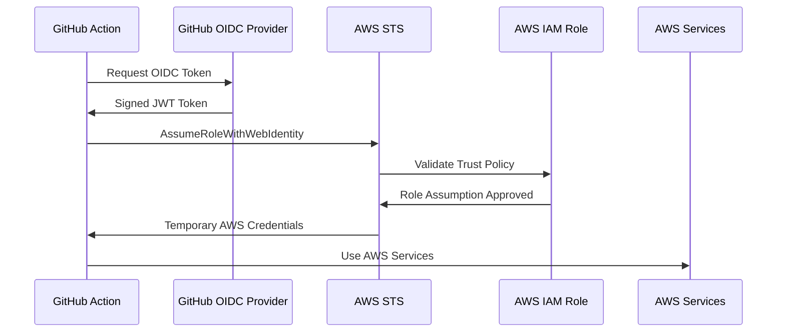
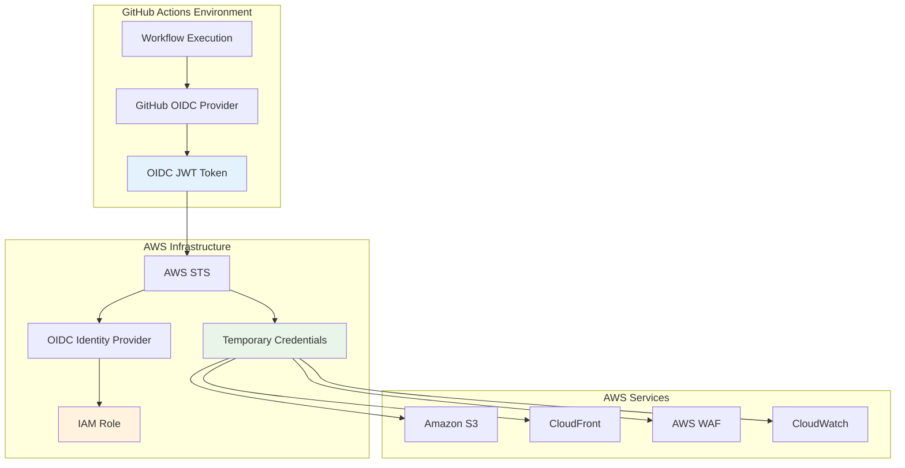

# OIDC Authentication for GitHub Actions

[](https://docs.github.com/en/actions/deployment/security-hardening-your-deployments/about-security-hardening-with-openid-connect)
[](https://docs.aws.amazon.com/IAM/latest/UserGuide/id_roles_providers_create_oidc.html)

Comprehensive guide to OpenID Connect (OIDC) authentication implementation for secure, keyless AWS access in GitHub Actions workflows.

## 📋 Table of Contents

- [Overview](#overview)
- [Security Benefits](#security-benefits)
- [Architecture](#architecture)
- [Implementation](#implementation)
- [Workflow Usage](#workflow-usage)
- [Troubleshooting](#troubleshooting)
- [Security Hardening](#security-hardening)
- [Compliance](#compliance)

## 🎯 Overview

### What is OIDC?

**OpenID Connect (OIDC)** is a modern authentication protocol that enables GitHub Actions to securely authenticate with cloud providers without storing long-term credentials. It uses short-lived tokens issued by GitHub's OIDC provider to assume AWS IAM roles.

### The Problem OIDC Solves

#### Traditional Approach (❌ Insecure)
```yaml
# Storing AWS keys as repository secrets
env:
  AWS_ACCESS_KEY_ID: ${{ secrets.AWS_ACCESS_KEY_ID }}
  AWS_SECRET_ACCESS_KEY: ${{ secrets.AWS_SECRET_ACCESS_KEY }}
```

**Security Issues:**
- 🔴 Long-lived credentials stored in repository
- 🔴 Manual credential rotation required
- 🔴 High compromise risk if secrets leak
- 🔴 Difficult to scope permissions properly
- 🔴 No audit trail of credential usage
- 🔴 Key management overhead across repositories

#### OIDC Approach (✅ Secure)
```yaml
# Token exchange with AWS IAM roles
permissions:
  id-token: write
  contents: read

- uses: aws-actions/configure-aws-credentials@v4.1.0
  with:
    role-to-assume: arn:aws:iam::123456789012:role/github-actions-role
    aws-region: us-east-1
```

## 🛡️ Security Benefits

### 1. Short-Lived Tokens
- **Duration**: Maximum 1 hour per token
- **Automatic expiry**: No manual rotation needed
- **Reduced blast radius**: Compromised tokens expire quickly

### 2. Cryptographic Trust Chain


### 3. Granular Access Control
- ✅ **Repository scoping**: Only specific repositories
- ✅ **Branch restrictions**: Control by branch/tag
- ✅ **Environment gating**: Different roles per environment
- ✅ **Workflow scoping**: Limit to specific workflows

### 4. Complete Audit Trail
- ✅ **CloudTrail logging**: All AWS API calls tracked
- ✅ **Session identification**: Unique session names per run
- ✅ **GitHub Actions logs**: Complete workflow execution history
- ✅ **IAM access history**: Role assumption tracking

## 🏗️ Architecture

### OIDC Flow Diagram


### OIDC Token Claims

When GitHub generates an OIDC token, it includes these claims:

```json
{
  "iss": "https://token.actions.githubusercontent.com",
  "sub": "repo:celtikill/static-site:ref:refs/heads/main",
  "aud": "sts.amazonaws.com",
  "repository": "celtikill/static-site",
  "repository_owner": "celtikill",
  "ref": "refs/heads/main",
  "sha": "abc123...",
  "workflow": "BUILD - Infrastructure and Website Preparation",
  "job_workflow_ref": "celtikill/static-site/.github/workflows/build.yml@refs/heads/main",
  "runner_environment": "github-hosted",
  "exp": 1642694400,
  "iat": 1642691400
}
```

**Security-Relevant Claims:**
- `sub`: Subject identifier (repository + branch)
- `repository`: Exact repository name  
- `ref`: Git reference (branch/tag)
- `workflow`: Which workflow is executing
- `exp`: Token expiration timestamp

## 🔧 Implementation

### 1. AWS OIDC Identity Provider Setup

#### Create OIDC Provider
```bash
# Using AWS CLI
aws iam create-open-id-connect-provider \
  --url https://token.actions.githubusercontent.com \
  --thumbprint-list 6938fd4d98bab03faadb97b34396831e3780aea1 \
  --client-id-list sts.amazonaws.com

# Verify creation
aws iam list-open-id-connect-providers
```

#### Provider Details
- **Provider URL**: `https://token.actions.githubusercontent.com`
- **Audience**: `sts.amazonaws.com`
- **Thumbprint**: `6938fd4d98bab03faadb97b34396831e3780aea1`

### 2. IAM Role Configuration

#### Trust Policy Template
```json
{
  "Version": "2012-10-17",
  "Statement": [
    {
      "Effect": "Allow",
      "Principal": {
        "Federated": "arn:aws:iam::ACCOUNT-ID:oidc-provider/token.actions.githubusercontent.com"
      },
      "Action": "sts:AssumeRoleWithWebIdentity",
      "Condition": {
        "StringEquals": {
          "token.actions.githubusercontent.com:aud": "sts.amazonaws.com"
        },
        "StringLike": {
          "token.actions.githubusercontent.com:sub": [
            "repo:YOUR-ORG/static-site:ref:refs/heads/main",
            "repo:YOUR-ORG/static-site:ref:refs/heads/feature/*",
            "repo:YOUR-ORG/static-site:pull_request"
          ]
        }
      }
    }
  ]
}
```

#### Environment-Specific Roles

**Development Role** (`github-actions-dev`):
```json
{
  "Condition": {
    "StringLike": {
      "token.actions.githubusercontent.com:sub": [
        "repo:YOUR-ORG/static-site:ref:refs/heads/*",
        "repo:YOUR-ORG/static-site:pull_request"
      ]
    }
  }
}
```

**Production Role** (`github-actions-prod`):
```json
{
  "Condition": {
    "StringEquals": {
      "token.actions.githubusercontent.com:sub": "repo:YOUR-ORG/static-site:ref:refs/heads/main"
    }
  }
}
```

### 3. Permission Policies

#### Static Site Permissions
```json
{
  "Version": "2012-10-17",
  "Statement": [
    {
      "Sid": "S3BucketAccess",
      "Effect": "Allow",
      "Action": [
        "s3:GetObject",
        "s3:PutObject",
        "s3:DeleteObject",
        "s3:ListBucket",
        "s3:GetBucketLocation",
        "s3:GetBucketVersioning"
      ],
      "Resource": [
        "arn:aws:s3:::static-site-*",
        "arn:aws:s3:::static-site-*/*"
      ]
    },
    {
      "Sid": "CloudFrontAccess",
      "Effect": "Allow",
      "Action": [
        "cloudfront:CreateInvalidation",
        "cloudfront:GetDistribution",
        "cloudfront:GetDistributionConfig",
        "cloudfront:ListDistributions",
        "cloudfront:UpdateDistribution"
      ],
      "Resource": "*",
      "Condition": {
        "StringLike": {
          "cloudfront:DistributionTag/Project": "static-site"
        }
      }
    },
    {
      "Sid": "IAMReadAccess",
      "Effect": "Allow",
      "Action": [
        "iam:GetRole",
        "iam:GetRolePolicy",
        "iam:ListAttachedRolePolicies"
      ],
      "Resource": "arn:aws:iam::*:role/static-site-*"
    },
    {
      "Sid": "MonitoringAccess",
      "Effect": "Allow",
      "Action": [
        "cloudwatch:GetMetricData",
        "cloudwatch:GetMetricStatistics",
        "cloudwatch:ListMetrics",
        "logs:CreateLogGroup",
        "logs:CreateLogStream",
        "logs:PutLogEvents"
      ],
      "Resource": "*"
    }
  ]
}
```

### 4. GitHub Repository Configuration

#### Required Secrets
```bash
# Set AWS role ARN for OIDC assumption
gh secret set AWS_ASSUME_ROLE --body "arn:aws:iam::123456789012:role/github-actions-role"

# Optional: Alert email for monitoring
gh secret set ALERT_EMAIL_ADDRESSES --body '["admin@example.com"]'
```

#### Optional Variables
```bash
# Infrastructure configuration
gh variable set AWS_REGION --body "us-east-1"
gh variable set DEFAULT_ENVIRONMENT --body "dev"
gh variable set MONTHLY_BUDGET_LIMIT --body "50"
```

## 🚀 Workflow Usage

### 1. Workflow Permissions
```yaml
# Required in all workflows using AWS
permissions:
  id-token: write      # ✅ CRITICAL: Enables OIDC token generation
  contents: read       # ✅ Standard: Repository access
  security-events: write  # ✅ Security scanning results
  pull-requests: write    # ✅ PR comments and status
```

### 2. AWS Authentication Step
```yaml
- name: Configure AWS credentials
  uses: aws-actions/configure-aws-credentials@v4.1.0
  with:
    role-to-assume: ${{ secrets.AWS_ASSUME_ROLE }}
    role-session-name: github-actions-${{ github.run_id }}
    aws-region: ${{ vars.AWS_REGION || 'us-east-1' }}
    # Security enhancements
    retry-max-attempts: 3
    output-credentials: false
    mask-aws-account-id: false
```

### 3. Workflow-Specific Patterns

#### BUILD Workflow
```yaml
# .github/workflows/build.yml
permissions:
  id-token: write
  contents: read
  security-events: write
  pull-requests: write

jobs:
  infrastructure-validation:
    runs-on: ubuntu-latest
    steps:
      - uses: actions/checkout@v4
      
      - name: Setup Infrastructure
        uses: ./.github/actions/setup-infrastructure
        with:
          aws-region: ${{ vars.AWS_REGION || 'us-east-1' }}
          aws-role: ${{ secrets.AWS_ASSUME_ROLE }}
          
      # Use AWS services for validation
      - name: Terraform Validation
        run: |
          cd terraform
          tofu init -backend=false
          tofu validate
```

#### TEST Workflow
```yaml
# .github/workflows/test.yml
jobs:
  integration-tests:
    runs-on: ubuntu-latest
    environment: ${{ needs.test-info.outputs.resolved_environment }}
    steps:
      - name: Deploy Test Infrastructure
        run: |
          cd terraform
          tofu init
          tofu apply -auto-approve
          
      - name: Run Tests
        run: |
          # Test against real AWS resources
          aws s3 ls s3://$S3_BUCKET
          aws cloudfront get-distribution --id $CF_DISTRIBUTION_ID
          
      - name: Cleanup
        if: always()
        run: |
          cd terraform
          tofu destroy -auto-approve
```

#### DEPLOY Workflow
```yaml
# .github/workflows/deploy.yml
jobs:
  deploy-infrastructure:
    runs-on: ubuntu-latest
    environment: ${{ needs.deploy-info.outputs.target_environment }}
    steps:
      - name: Deploy Infrastructure
        run: |
          cd terraform
          tofu init
          tofu apply -auto-approve
          
  deploy-website:
    needs: deploy-infrastructure
    steps:
      - name: Sync Website Content
        run: |
          aws s3 sync src/ s3://$S3_BUCKET --delete
          aws cloudfront create-invalidation \
            --distribution-id $CF_DISTRIBUTION_ID \
            --paths "/*"
```

### 4. Environment-Specific Configuration

#### GitHub Environments
```yaml
# Different AWS roles per environment
environment: ${{ needs.deploy-info.outputs.target_environment }}

# Maps to:
# dev → github-actions-dev role
# staging → github-actions-staging role  
# prod → github-actions-prod role
```

#### Environment Protection Rules
- **Development**: No restrictions
- **Staging**: Require review from team members
- **Production**: Require review + branch protection

## 🔍 Troubleshooting

### Common Error Messages

#### "Credentials could not be loaded"
```bash
# Error indicates OIDC setup is missing or misconfigured

# Check 1: Verify GitHub secrets
gh secret list | grep AWS_ASSUME_ROLE

# Check 2: Verify AWS OIDC provider exists
aws iam list-open-id-connect-providers

# Check 3: Test role assumption manually
aws sts get-caller-identity
```

#### "Access denied when assuming role"
```bash
# Check IAM role trust policy
aws iam get-role --role-name github-actions-static-site \
  --query 'Role.AssumeRolePolicyDocument'

# Verify role permissions
aws iam list-attached-role-policies --role-name github-actions-static-site
```

#### "Invalid identity token"
```bash
# Check workflow permissions
# Ensure 'id-token: write' is present

# Verify OIDC provider thumbprint
aws iam get-open-id-connect-provider \
  --open-id-connect-provider-arn arn:aws:iam::123456789012:oidc-provider/token.actions.githubusercontent.com
```

### Debug Commands

#### Validate OIDC Setup
```bash
# Test OIDC token generation (in GitHub Actions)
curl -H "Authorization: bearer $ACTIONS_ID_TOKEN_REQUEST_TOKEN" \
  "$ACTIONS_ID_TOKEN_REQUEST_URL&audience=sts.amazonaws.com" | jq .

# Verify AWS authentication
aws sts get-caller-identity --output table

# Check assumed role details
aws sts get-session-token --output table
```

#### Audit Role Usage
```bash
# CloudTrail events for role assumptions
aws logs filter-log-events \
  --log-group-name CloudTrail/Management \
  --filter-pattern "{ $.eventName = \"AssumeRoleWithWebIdentity\" }"

# IAM access history
aws iam get-access-key-last-used --access-key-id XXXXX
```

### Troubleshooting Checklist

- [ ] ✅ **GitHub Workflow**: Contains `permissions: id-token: write`
- [ ] ✅ **AWS OIDC Provider**: Created with correct URL and thumbprint
- [ ] ✅ **IAM Role**: Exists with proper trust policy
- [ ] ✅ **Trust Policy**: Allows specific repository and branches
- [ ] ✅ **Role Permissions**: Sufficient for required AWS actions
- [ ] ✅ **GitHub Secret**: `AWS_ASSUME_ROLE` contains correct ARN
- [ ] ✅ **Action Version**: Using latest aws-actions/configure-aws-credentials

## 🔒 Security Hardening

### 1. Trust Policy Best Practices

#### Restrictive Repository Scoping
```json
{
  "Condition": {
    "StringEquals": {
      "token.actions.githubusercontent.com:aud": "sts.amazonaws.com",
      "token.actions.githubusercontent.com:repository": "celtikill/static-site"
    },
    "StringLike": {
      "token.actions.githubusercontent.com:sub": "repo:celtikill/static-site:ref:refs/heads/main"
    }
  }
}
```

#### Branch Protection
```json
{
  "Condition": {
    "ForAllValues:StringEquals": {
      "token.actions.githubusercontent.com:ref": [
        "refs/heads/main",
        "refs/heads/release/*"
      ]
    }
  }
}
```

#### Environment-Based Access
```json
{
  "Condition": {
    "StringEquals": {
      "token.actions.githubusercontent.com:environment": "production"
    }
  }
}
```

### 2. Monitoring and Alerting

#### CloudWatch Alarms
```yaml
# Monitor failed role assumptions
UnauthorizedAssumeRole:
  Type: AWS::CloudWatch::Alarm
  Properties:
    AlarmName: OIDC-UnauthorizedAssumeRole
    MetricName: ErrorCount
    Namespace: AWS/CloudTrail
    Statistic: Sum
    Period: 300
    EvaluationPeriods: 1
    Threshold: 1
    ComparisonOperator: GreaterThanOrEqualToThreshold
```

#### CloudTrail Event Monitoring
```json
{
  "eventVersion": "1.05",
  "userIdentity": {
    "type": "WebIdentityUser",
    "principalId": "arn:aws:sts::123456789012:assumed-role/github-actions-role/github-actions-12345",
    "arn": "arn:aws:sts::123456789012:assumed-role/github-actions-role/github-actions-12345",
    "accountId": "123456789012"
  },
  "eventTime": "2024-01-01T10:00:00Z",
  "eventSource": "sts.amazonaws.com",
  "eventName": "AssumeRoleWithWebIdentity",
  "resources": [
    {
      "ARN": "arn:aws:iam::123456789012:role/github-actions-role",
      "accountId": "123456789012",
      "type": "AWS::IAM::Role"
    }
  ]
}
```

### 3. Network Security

#### VPC Endpoints (Optional)
```hcl
# Use VPC endpoints for enhanced security
resource "aws_vpc_endpoint" "s3" {
  vpc_id       = aws_vpc.main.id
  service_name = "com.amazonaws.us-east-1.s3"
}

resource "aws_vpc_endpoint" "sts" {
  vpc_id       = aws_vpc.main.id
  service_name = "com.amazonaws.us-east-1.sts"
}
```

#### IP Restrictions (Advanced)
```json
{
  "Condition": {
    "IpAddress": {
      "aws:SourceIp": [
        "192.30.252.0/22",
        "185.199.108.0/22",
        "140.82.112.0/20"
      ]
    }
  }
}
```

## 📊 Compliance

### ASVS v4.0 Mapping

| ASVS Requirement | Implementation | Status |
|------------------|---------------|---------|
| **2.1.1** - Credential Security | OIDC eliminates stored credentials | ✅ Met |
| **2.2.1** - Token Validation | AWS STS validates OIDC tokens | ✅ Met |
| **2.7.1** - Session Management | Unique sessions per workflow run | ✅ Met |
| **2.8.1** - Authentication Tokens | Short-lived OIDC tokens | ✅ Met |
| **3.1.1** - Session Binding | Tokens bound to specific repository | ✅ Met |

### AWS Well-Architected Framework

#### Security Pillar
- ✅ **SEC-2**: Apply security in all layers
- ✅ **SEC-3**: Automate security best practices  
- ✅ **SEC-4**: Protect data in transit and at rest
- ✅ **SEC-5**: Keep people away from data
- ✅ **SEC-6**: Prepare for security events

#### Operational Excellence Pillar
- ✅ **OPS-1**: Teams must understand workloads and operations
- ✅ **OPS-4**: Design workloads to provide insight into status
- ✅ **OPS-6**: Reduce defects and failures through testing

### OWASP Top 10 Protection

| OWASP Risk | OIDC Protection | Implementation |
|------------|----------------|---------------|
| **A01 - Broken Access Control** | Granular IAM permissions | Role-based access control |
| **A02 - Cryptographic Failures** | Strong token signing | GitHub's RSA256 signatures |
| **A07 - Identification/Auth Failures** | Strong authentication | OIDC token validation |
| **A09 - Security Logging Failures** | Complete audit trail | CloudTrail + GitHub logs |
| **A10 - Server-Side Request Forgery** | Token audience validation | AWS STS validation |

## 📚 References

### Documentation
- [GitHub OIDC Documentation](https://docs.github.com/en/actions/deployment/security-hardening-your-deployments/about-security-hardening-with-openid-connect)
- [AWS IAM OIDC Documentation](https://docs.aws.amazon.com/IAM/latest/UserGuide/id_roles_providers_create_oidc.html)
- [aws-actions/configure-aws-credentials](https://github.com/aws-actions/configure-aws-credentials)

### Security Standards
- [ASVS v4.0](https://github.com/OWASP/ASVS/tree/master/4.0/en)
- [AWS Well-Architected Security Pillar](https://docs.aws.amazon.com/wellarchitected/latest/security-pillar/)
- [OWASP Top 10](https://owasp.org/www-project-top-ten/)

### Tools and Utilities
- [GitHub CLI](https://cli.github.com/) - Repository configuration
- [AWS CLI](https://aws.amazon.com/cli/) - AWS resource management
- [jq](https://stedolan.github.io/jq/) - JSON processing for tokens

---

**⚡ Key Takeaway**: OIDC authentication provides enterprise-grade security by eliminating long-term credentials, implementing cryptographic trust chains, and enabling granular access control with complete auditability.