# Quick Start Guide

Get your AWS static website deployed in under 10 minutes with this step-by-step guide.

## Prerequisites

Before you begin, ensure you have:

- ✅ **AWS Account** with appropriate permissions
- ✅ **GitHub Account** with repository access
- ✅ **GitHub CLI** installed (`gh` command)
- ✅ **OpenTofu/Terraform** installed locally (for validation)

## 🚀 Option 1: Deploy to Existing Dev Environment (Fastest)

The dev environment is already operational and ready for immediate use.

### Step 1: Access the Live Environment
```bash
# Visit the operational dev website
open http://static-website-dev-a259f4bd.s3-website-us-east-1.amazonaws.com
```

### Step 2: Deploy Your Content (Optional)
```bash
# Clone the repository
git clone https://github.com/Celtikill/static-site.git
cd static-site

# Modify content in src/ directory
# Edit src/index.html with your content

# Trigger website deployment only
gh workflow run run.yml \
  --field environment=dev \
  --field deploy_infrastructure=false \
  --field deploy_website=true
```

### Step 3: Monitor Deployment
```bash
# Check deployment status
gh run list --limit 3

# Watch deployment in real-time
gh run watch
```

**⏱️ Time to Deployment**: ~30 seconds for website content updates

---

## 🏗️ Option 2: Full Infrastructure Deployment

Deploy complete infrastructure and website to any environment.

### Step 1: Set Up Authentication

Ensure GitHub Actions has proper AWS credentials configured. The repository uses OIDC authentication - no AWS keys needed in GitHub secrets.

### Step 2: Choose Your Environment

```mermaid
graph LR
    A["🎯 Choose Environment"] --> B["🧪 Development<br/>Cost: $1-5/month<br/>Features: S3-only"]
    A --> C["🚀 Staging<br/>Cost: $15-25/month<br/>Features: CloudFront + S3"]
    A --> D["🏭 Production<br/>Cost: $25-50/month<br/>Features: Full Stack"]

    classDef devStyle fill:#e8f5e8,stroke:#2e7d32,stroke-width:2px
    classDef stagingStyle fill:#fff3e0,stroke:#f57c00,stroke-width:2px
    classDef prodStyle fill:#ffebee,stroke:#c62828,stroke-width:2px

    class B devStyle
    class C stagingStyle
    class D prodStyle
```



### Step 3: Deploy Infrastructure

```bash
# For Development Environment
gh workflow run run.yml \
  --field environment=dev \
  --field deploy_infrastructure=true \
  --field deploy_website=true

# For Staging Environment (requires bootstrap first)
gh workflow run bootstrap-distributed-backend.yml \
  --field project_name=static-site \
  --field environment=staging \
  --field confirm_bootstrap=BOOTSTRAP-DISTRIBUTED

# Then deploy to staging
gh workflow run run.yml \
  --field environment=staging \
  --field deploy_infrastructure=true \
  --field deploy_website=true

# For Production Environment (requires bootstrap first)
gh workflow run bootstrap-distributed-backend.yml \
  --field project_name=static-site \
  --field environment=prod \
  --field confirm_bootstrap=BOOTSTRAP-DISTRIBUTED

# Then deploy to production
gh workflow run run.yml \
  --field environment=prod \
  --field deploy_infrastructure=true \
  --field deploy_website=true
```

### Step 4: Monitor Deployment

```bash
# Check all recent runs
gh run list --limit 5

# Get detailed view of specific run
gh run view [RUN_ID]

# Watch deployment progress
gh run watch [RUN_ID]
```

**⏱️ Time to Full Deployment**: ~3-5 minutes (including infrastructure + website)

---

## 📋 Deployment Pipeline Flow

```mermaid
graph TD
    A["📝 Trigger Deployment<br/>GitHub CLI or UI"] --> B["🔨 BUILD Phase<br/>⏱️ ~20 seconds"]
    B --> C["🧪 TEST Phase<br/>⏱️ ~35 seconds"]
    C --> D["🚀 RUN Phase<br/>⏱️ ~1m49s"]

    subgraph BuildDetails["🔨 BUILD Phase"]
        B1["🛡️ Security Scanning<br/>Checkov + Trivy"]
        B2["📦 Artifact Creation<br/>Website + Infrastructure"]
        B3["💰 Cost Estimation<br/>Budget Validation"]
    end

    subgraph TestDetails["🧪 TEST Phase"]
        C1["📜 Policy Validation<br/>OPA Security Rules"]
        C2["🔍 Configuration Check<br/>Terraform Syntax"]
        C3["📊 Compliance Review<br/>Best Practices"]
    end

    subgraph RunDetails["🚀 RUN Phase"]
        D1["🏗️ Infrastructure Deploy<br/>OpenTofu Apply"]
        D2["🌐 Website Deploy<br/>S3 Sync + CloudFront"]
        D3["✅ Health Validation<br/>HTTP Checks"]
    end

    B --> BuildDetails
    C --> TestDetails
    D --> RunDetails

    classDef buildStyle fill:#fff3e0,stroke:#f57c00,stroke-width:2px
    classDef testStyle fill:#e3f2fd,stroke:#1976d2,stroke-width:2px
    classDef runStyle fill:#e8f5e8,stroke:#388e3c,stroke-width:2px

    class B,BuildDetails buildStyle
    class C,TestDetails testStyle
    class D,RunDetails runStyle
```



---

## 🎯 Validation Steps

### 1. Verify Deployment Success

```bash
# Check deployment status
gh run list --limit 1 --json conclusion,status,workflowName

# Expected output: conclusion: "success", status: "completed"
```

### 2. Test Website Accessibility

```bash
# Get website URL from GitHub Actions summary
# Or check README.md for current URLs

# Test HTTP response
curl -I [WEBSITE_URL]
# Expected: HTTP/1.1 200 OK
```

### 3. Verify Security Controls

```bash
# Check security scan results in GitHub Actions
gh run view [RUN_ID] --log

# Look for:
# ✅ Checkov: No critical/high issues
# ✅ Trivy: No vulnerabilities
# ✅ OPA: All policies passed
```

---

## 🔧 Customization

### Modify Website Content

1. **Edit Source Files**:
   ```bash
   # Modify website content
   vi src/index.html
   vi src/css/style.css
   ```

2. **Deploy Changes**:
   ```bash
   # Website-only deployment (faster)
   gh workflow run run.yml \
     --field environment=dev \
     --field deploy_infrastructure=false \
     --field deploy_website=true
   ```

### Infrastructure Configuration

1. **Environment Variables**: Located in `.github/workflows/` files
2. **Terraform Variables**: Located in `terraform/environments/[env]/`
3. **Feature Flags**: Cost optimization toggles in terraform modules

### Cost Optimization

- **Development**: CloudFront disabled, minimal features (~$1-5/month)
- **Staging**: Balanced features for testing (~$15-25/month)
- **Production**: Full features for live traffic (~$25-50/month)

---

## 🚨 Troubleshooting

### Common Issues

**Deployment Fails in BUILD Phase**
```bash
# Check security scan results
gh run view [RUN_ID] --log | grep -A 10 "Security"

# Common fixes:
# - Update Terraform configuration for security compliance
# - Check for infrastructure misconfigurations
```

**Deployment Fails in TEST Phase**
```bash
# Check policy validation
gh run view [RUN_ID] --log | grep -A 10 "Policy"

# Common fixes:
# - Review OPA policy violations
# - Update infrastructure to meet compliance requirements
```

**Website Not Accessible**
```bash
# Check CloudFront invalidation
gh run view [RUN_ID] --log | grep -A 5 "CloudFront"

# Common fixes:
# - Wait 2-3 minutes for CloudFront propagation
# - Check S3 bucket permissions
# - Verify WAF rules aren't blocking traffic
```

### Getting Help

- 📖 **Documentation**: [Architecture Guide](architecture.md)
- 🔧 **Deployment Issues**: [Deployment Guide](deployment.md)
- 🔍 **Detailed Troubleshooting**: [Troubleshooting Guide](troubleshooting.md)
- 🐛 **Bug Reports**: [GitHub Issues](https://github.com/Celtikill/static-site/issues)
- 🔒 **Security Issues**: [Security Policy](../SECURITY.md)

---

## ✅ Success Checklist

After deployment, verify:

- [ ] **Build Phase**: ✅ All security scans passed
- [ ] **Test Phase**: ✅ All policies compliant
- [ ] **Run Phase**: ✅ Infrastructure deployed successfully
- [ ] **Website**: ✅ Accessible via provided URL
- [ ] **Monitoring**: ✅ CloudWatch dashboards active
- [ ] **Security**: ✅ No critical vulnerabilities
- [ ] **Cost**: ✅ Within expected budget range

**🎉 Congratulations!** Your secure, scalable static website is now live on AWS.

---

## 🚀 Next Steps

1. **Customize Content**: Update `src/` files with your website content
2. **Set Up Monitoring**: Configure alerts and dashboards
3. **Scale Up**: Deploy to staging and production environments
4. **Optimize Costs**: Review and adjust feature flags
5. **Enhance Security**: Review security policies and compliance

Ready to deploy to additional environments? See the [Deployment Guide](deployment.md) for advanced deployment strategies.