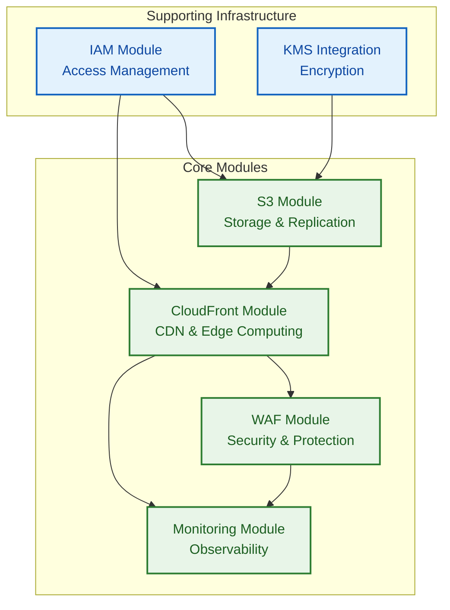

# Terraform Modules Reference

> **🎯 Target Audience**: Platform engineers, DevOps teams, infrastructure developers  
> **📊 Complexity**: ⭐⭐⭐ Advanced  
> **📋 Prerequisites**: Terraform experience, AWS knowledge, module development  
> **⏱️ Reading Time**: 25-30 minutes

## Overview

This document provides comprehensive reference documentation for all Terraform modules in the infrastructure. It consolidates module-specific implementation details, configuration options, usage patterns, and troubleshooting guides.

> **📋 Note**: This document consolidates module documentation from `terraform/modules/*/README.md` files for centralized reference management.

---

## Module Architecture Overview

The infrastructure is built using 4 core modules with clear separation of concerns:



---

## 🗄️ S3 Module

### Overview
Secure S3 bucket configuration for static website hosting with encryption, cross-region replication, and comprehensive security controls.

### Key Features
- **Security**: Server-side encryption with KMS, public access blocking, secure bucket policies
- **Availability**: Cross-region replication for disaster recovery
- **Cost Optimization**: Intelligent tiering and lifecycle management
- **Compliance**: ASVS L1/L2 requirements and AWS security best practices

### Basic Usage
```hcl
module "s3" {
  source = "./modules/s3"

  # Required
  project_name = "my-website"
  environment  = "prod"

  # Optional
  enable_cross_region_replication = true
  replication_region = "us-west-2"
  
  tags = {
    Environment = "production"
    Project     = "static-website"
    ManagedBy   = "terraform"
  }
}
```

### Key Variables

| Name | Type | Default | Description |
|------|------|---------|-------------|
| `project_name` | `string` | **Required** | Project identifier for resource naming |
| `environment` | `string` | **Required** | Environment name (dev, staging, prod) |
| `enable_cross_region_replication` | `bool` | `false` | Enable cross-region replication |
| `replication_region` | `string` | `"us-west-2"` | Secondary region for replication |
| `kms_key_id` | `string` | `null` | KMS key for encryption |
| `enable_versioning` | `bool` | `true` | Enable S3 versioning |
| `transition_to_ia_days` | `number` | `30` | Days to transition to IA storage |
| `expiration_days` | `number` | `365` | Days to expire objects |

### Key Outputs

| Name | Description |
|------|-------------|
| `bucket_id` | Primary S3 bucket ID |
| `bucket_arn` | Primary S3 bucket ARN |
| `bucket_domain_name` | Primary S3 bucket domain name |
| `replication_bucket_id` | Replication bucket ID (if enabled) |
| `kms_key_id` | KMS key ID used for encryption |

---

## 🌐 CloudFront Module

### Overview
Global content delivery network with edge computing capabilities, security headers, and performance optimization.

### Key Features
- **Global CDN**: 200+ edge locations worldwide
- **Security Headers**: Comprehensive security header injection
- **Performance**: Intelligent caching and compression
- **SSL/TLS**: Automatic HTTPS redirect and secure communications
- **Edge Computing**: CloudFront Functions for dynamic behavior

### Basic Usage
```hcl
module "cloudfront" {
  source = "./modules/cloudfront"

  # Required
  s3_bucket_domain_name = module.s3.bucket_domain_name
  s3_bucket_id         = module.s3.bucket_id
  
  # Optional
  domain_aliases = ["www.example.com", "example.com"]
  ssl_certificate_arn = "arn:aws:acm:us-east-1:123456789012:certificate/12345678-1234-1234-1234-123456789012"
  
  tags = {
    Environment = "production"
    Project     = "static-website"
  }
}
```

### Key Variables

| Name | Type | Default | Description |
|------|------|---------|-------------|
| `s3_bucket_domain_name` | `string` | **Required** | S3 bucket domain name for origin |
| `s3_bucket_id` | `string` | **Required** | S3 bucket ID for OAC configuration |
| `domain_aliases` | `list(string)` | `[]` | Custom domain names (CNAME) |
| `ssl_certificate_arn` | `string` | `null` | ACM certificate ARN (us-east-1) |
| `price_class` | `string` | `"PriceClass_100"` | CloudFront price class |
| `default_ttl` | `number` | `86400` | Default cache TTL (seconds) |
| `max_ttl` | `number` | `31536000` | Maximum cache TTL (seconds) |

### Key Outputs

| Name | Description |
|------|-------------|
| `distribution_id` | CloudFront distribution ID |
| `distribution_arn` | CloudFront distribution ARN |
| `distribution_domain_name` | CloudFront distribution domain name |
| `distribution_hosted_zone_id` | CloudFront distribution hosted zone ID |
| `oac_id` | Origin Access Control ID |

---

## 🛡️ WAF Module

### Overview
Web Application Firewall providing comprehensive protection against common web exploits and attacks.

### Key Features
- **OWASP Top 10**: Protection against common vulnerabilities
- **Rate Limiting**: Configurable rate limiting rules
- **Geo-blocking**: Country-based access control
- **Bot Protection**: Automated bot detection and mitigation
- **Custom Rules**: Flexible rule configuration

### Basic Usage
```hcl
module "waf" {
  source = "./modules/waf"

  # Required
  project_name = "my-website"
  environment  = "prod"
  
  # Optional
  rate_limit_requests = 2000
  blocked_countries = ["CN", "RU"]
  enable_bot_control = true
  
  tags = {
    Environment = "production"
    Project     = "static-website"
  }
}
```

### Key Variables

| Name | Type | Default | Description |
|------|------|---------|-------------|
| `project_name` | `string` | **Required** | Project identifier |
| `environment` | `string` | **Required** | Environment name |
| `rate_limit_requests` | `number` | `2000` | Rate limit (requests per 5 minutes) |
| `blocked_countries` | `list(string)` | `[]` | Countries to block (ISO codes) |
| `enable_bot_control` | `bool` | `false` | Enable AWS WAF Bot Control |
| `enable_reputation_list` | `bool` | `true` | Enable IP reputation list |

### Key Outputs

| Name | Description |
|------|-------------|
| `web_acl_id` | WAF Web ACL ID |
| `web_acl_arn` | WAF Web ACL ARN |
| `web_acl_capacity` | WAF Web ACL capacity units used |

---

## 📊 Monitoring Module

### Overview
Comprehensive monitoring and alerting setup with CloudWatch dashboards, alarms, and notification systems.

### Key Features
- **Real-time Dashboards**: Visual monitoring of all infrastructure components
- **Proactive Alerting**: Configurable alarms with SNS notifications
- **Performance Metrics**: Detailed performance and health metrics
- **Cost Monitoring**: Budget alerts and cost optimization insights
- **Security Monitoring**: Security event tracking and alerting

### Basic Usage
```hcl
module "monitoring" {
  source = "./modules/monitoring"

  # Required
  project_name = "my-website"
  environment  = "prod"
  
  # Resources to monitor
  cloudfront_distribution_id = module.cloudfront.distribution_id
  s3_bucket_name = module.s3.bucket_id
  waf_web_acl_id = module.waf.web_acl_id
  
  # Alerting
  alert_email_addresses = ["admin@example.com"]
  
  tags = {
    Environment = "production"
    Project     = "static-website"
  }
}
```

### Key Variables

| Name | Type | Default | Description |
|------|------|---------|-------------|
| `project_name` | `string` | **Required** | Project identifier |
| `environment` | `string` | **Required** | Environment name |
| `cloudfront_distribution_id` | `string` | **Required** | CloudFront distribution to monitor |
| `s3_bucket_name` | `string` | **Required** | S3 bucket to monitor |
| `waf_web_acl_id` | `string` | **Required** | WAF Web ACL to monitor |
| `alert_email_addresses` | `list(string)` | `[]` | Email addresses for alerts |
| `budget_limit` | `number` | `50` | Monthly budget limit (USD) |

### Key Outputs

| Name | Description |
|------|-------------|
| `dashboard_url` | CloudWatch dashboard URL |
| `sns_topic_arn` | SNS topic ARN for alerts |
| `budget_name` | Budget name for cost monitoring |

---

## 🔐 IAM Integration

### Overview
The infrastructure includes comprehensive IAM integration for secure access management and service integration.

### GitHub Actions OIDC
```hcl
# OIDC provider for GitHub Actions
resource "aws_iam_openid_connect_provider" "github" {
  url = "https://token.actions.githubusercontent.com"
  
  client_id_list = [
    "sts.amazonaws.com"
  ]
  
  thumbprint_list = [
    "6938fd4d98bab03faadb97b34396831e3780aea1"
  ]
}

# IAM role for GitHub Actions
resource "aws_iam_role" "github_actions" {
  name = "${var.project_name}-${var.environment}-github-actions"
  
  assume_role_policy = jsonencode({
    Version = "2012-10-17"
    Statement = [
      {
        Effect = "Allow"
        Principal = {
          Federated = aws_iam_openid_connect_provider.github.arn
        }
        Action = "sts:AssumeRoleWithWebIdentity"
        Condition = {
          StringEquals = {
            "token.actions.githubusercontent.com:aud" = "sts.amazonaws.com"
          }
          StringLike = {
            "token.actions.githubusercontent.com:sub" = "repo:${var.github_repository}:*"
          }
        }
      }
    ]
  })
}
```

---

## 🔍 Testing Strategy

### Unit Testing Framework
All modules include comprehensive unit testing using the zero-dependency testing framework:

```bash
# Test all modules
cd test/unit
./run-tests.sh

# Test specific module
./test-s3.sh
./test-cloudfront.sh  
./test-waf.sh
./test-monitoring.sh
```

### Test Coverage
- **S3 Module**: 49 test assertions
- **CloudFront Module**: 55 test assertions
- **WAF Module**: 50 test assertions
- **IAM Configuration**: 58 test assertions
- **Monitoring Module**: 57 test assertions
- **Total**: 269 comprehensive test assertions

### Test Architecture
```bash
test/
├── functions/
│   └── test-functions.sh      # Core testing utilities
└── unit/
    ├── run-tests.sh          # Test runner
    ├── test-s3.sh            # S3 module tests
    ├── test-cloudfront.sh    # CloudFront module tests
    ├── test-waf.sh           # WAF module tests
    ├── test-iam.sh           # IAM tests
    └── test-monitoring.sh    # Monitoring module tests
```

---

## 🚀 Deployment Patterns

### Environment-Specific Configuration
```hcl
# Development environment
module "s3" {
  source = "./modules/s3"
  
  project_name = "my-website"
  environment  = "dev"
  
  # Cost-optimized for development
  enable_cross_region_replication = false
  transition_to_ia_days = 7
  expiration_days = 30
  
  tags = local.dev_tags
}

# Production environment
module "s3" {
  source = "./modules/s3"
  
  project_name = "my-website"
  environment  = "prod"
  
  # Full features for production
  enable_cross_region_replication = true
  replication_region = "us-west-2"
  transition_to_ia_days = 30
  expiration_days = 2555  # 7 years
  
  tags = local.prod_tags
}
```

### Multi-Region Deployment
```hcl
# Primary region (us-east-1)
provider "aws" {
  alias  = "primary"
  region = "us-east-1"
}

# Secondary region (us-west-2)  
provider "aws" {
  alias  = "secondary"
  region = "us-west-2"
}

module "s3_primary" {
  source = "./modules/s3"
  
  providers = {
    aws = aws.primary
  }
  
  enable_cross_region_replication = true
  replication_region = "us-west-2"
}
```

---

## 🔧 Troubleshooting

### Common Module Issues

#### S3 Module Issues
```bash
# Check bucket configuration
aws s3api get-bucket-policy --bucket my-website-prod-content

# Verify replication status
aws s3api get-bucket-replication --bucket my-website-prod-content

# Check encryption settings
aws s3api get-bucket-encryption --bucket my-website-prod-content
```

#### CloudFront Module Issues
```bash
# Check distribution status
aws cloudfront get-distribution --id E1234567890123

# Verify origin access control
aws cloudfront get-origin-access-control --id E1234567890123

# Check invalidation status
aws cloudfront list-invalidations --distribution-id E1234567890123
```

#### WAF Module Issues
```bash
# Check Web ACL configuration
aws wafv2 get-web-acl --scope CLOUDFRONT --id 12345678-1234-1234-1234-123456789012

# Review WAF logs
aws logs describe-log-groups --log-group-name-prefix aws-waf-logs-

# Check rule metrics
aws cloudwatch get-metric-statistics --namespace AWS/WAFV2 --metric-name AllowedRequests
```

#### Monitoring Module Issues
```bash
# Check CloudWatch dashboard
aws cloudwatch list-dashboards

# Verify SNS topic
aws sns list-topics

# Check alarm status
aws cloudwatch describe-alarms --state-value ALARM
```

### Debug Commands
```bash
# Terraform debugging
export TF_LOG=DEBUG
export TF_LOG_PATH=./terraform-debug.log

# AWS CLI debugging  
aws configure set cli_follow_redirects false
aws configure set cli_read_timeout 30
aws configure set cli_connect_timeout 30

# Module validation
terraform validate
terraform plan -detailed-exitcode
terraform providers
```

---

## 📚 Module Development Guidelines

### Best Practices
1. **Variable Validation**: Include comprehensive input validation
2. **Output Documentation**: Document all outputs with descriptions
3. **Tagging Strategy**: Consistent tagging across all resources
4. **Security First**: Default to secure configurations
5. **Cost Awareness**: Include cost-optimization features

### Module Structure
```
modules/
├── <module-name>/
│   ├── main.tf          # Primary resource definitions
│   ├── variables.tf     # Input variable definitions
│   ├── outputs.tf       # Output value definitions
│   ├── README.md        # Module documentation
│   └── versions.tf      # Provider version constraints
```

### Variable Naming Conventions
- Use `snake_case` for variable names
- Prefix boolean variables with `enable_` or `disable_`
- Use descriptive names that indicate purpose
- Include comprehensive descriptions and examples

### Output Naming Conventions
- Use descriptive names that indicate the resource type
- Include both `id` and `arn` outputs where applicable
- Provide domain names and URLs for connectivity

---

## Related Documentation

### Architecture Documentation
- **Infrastructure Architecture**: [../architecture/infrastructure.md](../architecture/infrastructure.md)
- **Terraform Implementation**: [../architecture/terraform.md](../architecture/terraform.md)
- **Unit Testing**: [../architecture/unit-testing.md](../architecture/unit-testing.md)

### Implementation Guides
- **Deployment Guide**: [../guides/deployment-guide.md](../guides/deployment-guide.md)
- **Testing Guide**: [../guides/testing-guide.md](../guides/testing-guide.md)
- **Security Guide**: [../guides/security-guide.md](../guides/security-guide.md)

### Reference Materials
- **S3 Module Source**: `terraform/modules/s3/README.md`
- **Cost Estimation**: [cost-estimation.md](cost-estimation.md)
- **Monitoring Reference**: [monitoring.md](monitoring.md)

---

*This documentation consolidates all Terraform module documentation and is maintained alongside the module implementations.*