# 🛡️ Security Guide

Comprehensive security documentation for the AWS static website infrastructure. This guide covers all security features, setup procedures, and compliance standards.

## 📋 Executive Summary

**🎯 Purpose**: This guide provides comprehensive security implementation for an AWS static website demonstrating enterprise-grade security practices.

**👥 Target Audience**: Security engineers, compliance teams, and DevOps professionals implementing secure static websites.

**⏱️ Time Investment**: 
- **Quick Setup**: 15 minutes for basic security
- **Full Implementation**: 2-3 hours for enterprise security
- **Compliance Review**: 1 hour for ASVS L1/L2 validation

**🔑 Key Security Features**:
- **Multi-layer Defense**: WAF, security headers, encryption, access control
- **ASVS L1/L2 Compliance**: Application Security Verification Standard
- **Zero-Trust Architecture**: GitHub OIDC, least-privilege access
- **Automated Security**: Continuous scanning with Trivy and Checkov

**📊 Security Maturity**: 
- **Network Security**: ✅ WAF with OWASP Top 10 protection
- **Application Security**: ✅ Security headers and CSP
- **Data Security**: ✅ End-to-end encryption
- **Infrastructure Security**: ✅ OIDC authentication and IAM
- **Monitoring**: ✅ Real-time alerts and logging

**🚀 Quick Start**: Jump to [Quick Security Setup](#-quick-security-setup) for essential configuration.

---

## 🎯 Security Overview

This infrastructure implements defense-in-depth security with multiple layers:

```mermaid
graph TB
    %% Accessibility
    accTitle: Defense-in-Depth Security Layers
    accDescr: Shows five security layers in sequence: Network Security (WAF and CloudFront), Application Security (Headers and CSP), Data Security (Encryption and Access Control), Infrastructure Security (IAM and OIDC), and Monitoring Security (Logging and Alerts). Each layer builds upon the previous one for comprehensive protection.
    
    subgraph "Security Layers"
        L1[Network Security<br/>WAF + CloudFront]
        L2[Application Security<br/>Headers + CSP]
        L3[Data Security<br/>Encryption + Access Control]
        L4[Infrastructure Security<br/>IAM + OIDC]
        L5[Monitoring Security<br/>Logging + Alerts]
    end
    
    L1 --> L2 --> L3 --> L4 --> L5
    
    %% High-Contrast Styling for Accessibility
    classDef networkBox fill:#e3f2fd,stroke:#1565c0,stroke-width:3px,color:#0d47a1
    classDef appBox fill:#f8f9fa,stroke:#495057,stroke-width:3px,color:#212529
    classDef dataBox fill:#d4edda,stroke:#155724,stroke-width:3px,color:#155724
    classDef infraBox fill:#fff3cd,stroke:#856404,stroke-width:3px,color:#212529
    classDef monitorBox fill:#e8f5e8,stroke:#2e7d32,stroke-width:3px,color:#1b5e20
    
    class L1 networkBox
    class L2 appBox
    class L3 dataBox
    class L4 infraBox
    class L5 monitorBox
```



### 🏆 Security Standards

- ✅ **ASVS Level 1 & 2** compliance
- ✅ **OWASP Top 10** protection
- ✅ **AWS Well-Architected** security pillar
- ✅ **Zero-trust** architecture principles

---

## 🔒 Core Security Features

### 1. AWS WAF Protection

**Protects against:**
- OWASP Top 10 vulnerabilities
- DDoS attacks
- Rate limiting abuse
- Geographic restrictions
- Bot traffic

**Configuration:**
```hcl
# Rate limiting
waf_rate_limit = 2000  # requests per 5 minutes

# Geographic restrictions (optional)
waf_allowed_countries = ["US", "CA"]
```

### 2. Security Headers

**Applied via CloudFront Functions:**
```javascript
// Strict Transport Security
'strict-transport-security': 'max-age=31536000; includeSubDomains; preload'

// Content Security Policy
'content-security-policy': "default-src 'self'; script-src 'self' 'unsafe-inline'"

// Additional headers
'x-content-type-options': 'nosniff'
'x-frame-options': 'DENY'
'x-xss-protection': '1; mode=block'
'referrer-policy': 'strict-origin-when-cross-origin'
```

### 3. Data Encryption

**At Rest:**
- S3 server-side encryption with KMS
- DynamoDB encryption for state locks
- CloudWatch Logs encryption

**In Transit:**
- TLS 1.2+ only
- HTTP Strict Transport Security (HSTS)
- Perfect Forward Secrecy

### 4. Access Control

**S3 Security:**
- Origin Access Control (OAC) for CloudFront
- Public access completely blocked
- Bucket policies with least privilege
- Cross-region replication with encryption

**IAM Security:**
- GitHub OIDC for keyless authentication
- Role-based access with minimal permissions
- Conditional access policies

---

## 🚀 Quick Security Setup

### Essential Security Configuration

1. **Enable OIDC Authentication** (Recommended)
   ```bash
   # Deploy with OIDC support
   cd terraform
   tofu apply -var="enable_github_oidc=true"
   ```
   
   → [Complete OIDC Setup Guide](oidc-authentication.md)

2. **Configure Alert Email**
   ```hcl
   alert_email_addresses = ["security@yourcompany.com"]
   ```

3. **Review Security Settings**
   ```bash
   # Check security scan results
   trivy config terraform/
   
   # Validate configuration
   tofu validate && tofu plan
   ```

---

## 🔐 GitHub OIDC Authentication

### Why OIDC?

**Traditional Approach (❌ Insecure):**
- Long-lived AWS keys stored in repository
- Manual credential rotation required
- High compromise risk

**OIDC Approach (✅ Secure):**
- Short-lived tokens issued by GitHub
- No permanent credentials stored
- Automatic token rotation
- Granular permission control

### Quick OIDC Setup

1. **Deploy OIDC Infrastructure**
   ```bash
   cd terraform
   tofu apply -var="github_repository=your-username/your-repo"
   ```

2. **Configure GitHub Secrets**
   ```bash
   # Get role ARN from output
   AWS_ROLE_ARN=$(tofu output -raw github_actions_role_arn)
   
   # Add to GitHub repository secrets:
   # AWS_ROLE_ARN: arn:aws:iam::123456789012:role/github-actions-role
   # AWS_REGION: us-east-1
   ```

3. **Update Workflow**
   ```yaml
   - name: Configure AWS credentials
     uses: aws-actions/configure-aws-credentials@v4
     with:
       role-to-assume: ${{ secrets.AWS_ROLE_ARN }}
       role-session-name: github-actions
       aws-region: ${{ secrets.AWS_REGION }}
   ```

→ [Detailed OIDC Setup Guide](oidc-authentication.md)

---

## 🔍 Security Scanning & Compliance

### Automated Security Scanning

**Tools integrated:**
- **Trivy**: Infrastructure and container scanning
- **Checkov**: Policy compliance checking
- **OPA/Conftest**: Policy-as-code validation ([Policy Guide](policy-validation.md))

**Parallel Matrix Execution:**
The security scanning runs both tools simultaneously using GitHub Actions matrix strategy for faster execution:

```yaml
strategy:
  matrix:
    scanner: [checkov, trivy]
  fail-fast: false
```

This approach provides:
- **Faster execution**: Both scanners run in parallel
- **Comprehensive coverage**: Different tools catch different issues
- **Redundancy**: If one scanner fails, the other continues
- **Isolated results**: Each tool produces separate reports

**Security Thresholds:**
- **Critical**: 0 (Build fails if any critical issues found)
- **High**: 0 (Build fails if any high-severity issues found)
- **Medium**: 3 (Build fails if more than 3 medium-severity issues)
- **Low**: 10 (Build fails if more than 10 low-severity issues)

**CI/CD Integration:**
```yaml
- name: Security Scan
  env:
    CRITICAL_THRESHOLD: 0
    HIGH_THRESHOLD: 0
    MEDIUM_THRESHOLD: 3
    LOW_THRESHOLD: 10
  run: |
    trivy config terraform/
    checkov -d terraform/
```

**Monitor Security Scans:**
```bash
# View security scan results
gh run view --job security-scanning

# Download security reports
gh run download --name "build-123-security-checkov"
gh run download --name "build-123-security-trivy"

# Check current build status
gh run list --workflow=build.yml --json status,conclusion
```

### Security Exceptions

Some security findings are intentionally accepted due to AWS service requirements:

**Documented Exceptions:**
- **S3 Replication Wildcards**: Required by AWS S3 Cross-Region Replication
- **Access Logs Bucket**: Final logging destination doesn't need additional S3 logging

→ [Security Exceptions Documentation](../SECURITY_EXCEPTIONS.md)

### Compliance Standards

**ASVS L1 Requirements:**
- ✅ Authentication controls
- ✅ Session management
- ✅ Access control verification
- ✅ Input validation
- ✅ Cryptography controls

**ASVS L2 Requirements:**
- ✅ Advanced authentication
- ✅ Comprehensive logging
- ✅ Security configuration
- ✅ Malicious input protection
- ✅ API security

---

## 🔧 Security Hardening

### Production Security Checklist

#### Network Security
- [ ] WAF enabled with OWASP rules
- [ ] Rate limiting configured
- [ ] Geographic restrictions (if required)
- [ ] DDoS protection enabled

#### Application Security  
- [ ] Security headers configured
- [ ] Content Security Policy (CSP) implemented
- [ ] HTTPS-only access enforced
- [ ] HSTS enabled with preload

#### Data Security
- [ ] S3 encryption at rest enabled
- [ ] TLS 1.2+ enforced
- [ ] Public access blocked
- [ ] Versioning enabled

#### Infrastructure Security
- [ ] GitHub OIDC configured
- [ ] IAM roles with minimal permissions
- [ ] CloudTrail logging enabled
- [ ] Security monitoring configured

#### Monitoring & Alerting
- [ ] Security event alerts configured
- [ ] Failed authentication monitoring
- [ ] Unusual access pattern detection
- [ ] Budget and cost alerts

### Advanced Security Features

**Custom Domain Security:**
```hcl
# Enable custom domain with certificate
domain_aliases = ["www.example.com"]
acm_certificate_arn = "arn:aws:acm:us-east-1:123456789012:certificate/..."
create_route53_zone = true
```

**Enhanced WAF Rules:**
```hcl
# Additional WAF configuration
waf_rate_limit = 1000           # Stricter rate limiting
waf_allowed_countries = ["US"]  # Geographic restrictions
```

**Security Monitoring:**
```hcl
# Enhanced monitoring
enable_detailed_monitoring = true
security_alert_email = "security@company.com"
```

→ [Advanced Security Hardening Guide](oidc-security-hardening.md)

---

## 🚨 Security Incident Response

### Detection

**Automated Alerts for:**
- Unusual access patterns
- Failed authentication attempts
- WAF rule violations
- Cost anomalies
- Infrastructure changes

### Response Procedures

1. **Immediate Response**
   ```bash
   # Block suspicious traffic
   aws wafv2 update-web-acl --scope CLOUDFRONT --id <acl-id>
   
   # Review access logs
   aws logs filter-log-events --log-group-name /aws/cloudfront/access-logs
   ```

2. **Investigation**
   ```bash
   # Check CloudTrail logs
   aws logs filter-log-events --log-group-name CloudTrail/security-events
   
   # Review IAM activity
   aws iam get-credential-report
   ```

3. **Recovery**
   ```bash
   # Rotate credentials (if compromised)
   aws iam update-access-key --access-key-id <key> --status Inactive
   
   # Update security groups
   tofu apply -var="emergency_lockdown=true"
   ```

---

## 📊 Security Monitoring

### CloudWatch Security Metrics

**Key Metrics:**
- WAF blocked requests
- CloudFront 4xx/5xx errors
- Authentication failures
- Unusual access patterns

**Security Dashboard:**
```bash
# Access security dashboard
aws cloudwatch get-dashboard --dashboard-name SecurityOverview
```

### Logging & Auditing

**Log Sources:**
- CloudFront access logs → S3
- CloudTrail API logs → CloudWatch
- WAF logs → CloudWatch
- Application logs → CloudWatch

**Log Analysis:**
```bash
# Search access logs
aws logs filter-log-events \
  --log-group-name /aws/cloudfront/access-logs \
  --filter-pattern "ERROR"

# Check authentication events
aws logs filter-log-events \
  --log-group-name /aws/cloudtrail \
  --filter-pattern "{ $.eventName = AssumeRoleWithWebIdentity }"
```

---

## ⚠️ Common Security Issues

### Issue: WAF Not Blocking Attacks
**Cause:** WAF rules not properly configured
**Solution:**
```bash
# Verify WAF association
aws wafv2 get-web-acl --scope CLOUDFRONT --id <acl-id>

# Test WAF rules
curl -H "User-Agent: BadBot" https://your-site.com
```

### Issue: S3 Access Denied Errors
**Cause:** Bucket policy or OAC misconfiguration
**Solution:**
```bash
# Check bucket policy
aws s3api get-bucket-policy --bucket <bucket-name>

# Verify OAC configuration
aws cloudfront get-origin-access-control --id <oac-id>
```

### Issue: Certificate Validation Fails
**Cause:** ACM certificate not in us-east-1 region
**Solution:**
```bash
# Create certificate in correct region
aws acm request-certificate \
  --domain-name www.example.com \
  --region us-east-1
```

**Need help?** → [Troubleshooting Guide](troubleshooting.md)

---

## 📚 Additional Resources

- [OIDC Authentication Setup](oidc-authentication.md)
- [Advanced Security Hardening](oidc-security-hardening.md)
- [Security Exceptions](../SECURITY_EXCEPTIONS.md)
- [Compliance Documentation](compliance.md)

**Security Questions?** Contact: security@yourcompany.com