# Workflows Overview

GitHub Actions workflows implementing the BUILD → TEST → RUN pipeline for AWS Static Website Infrastructure.

## Pipeline Architecture

```mermaid
graph LR
    A["📝 Code Push"] --> B["🔨 BUILD<br/>~20s"]
    B --> C["🧪 TEST<br/>~35s"]
    C --> D["🚀 RUN<br/>~1m49s"]

    B1["🛡️ Security Scan"] --> B
    B2["📦 Artifact Creation"] --> B
    C1["📜 Policy Validation"] --> C
    C2["🔍 Config Check"] --> C
    D1["🏗️ Infrastructure"] --> D
    D2["🌐 Website"] --> D
```



## Workflow Files

| Workflow | File | Purpose | Trigger |
|----------|------|---------|---------|
| **BUILD** | `build.yml` | Security scanning & artifacts | Push to any branch |
| **TEST** | `test.yml` | Policy validation & compliance | After BUILD success |
| **RUN** | `run.yml` | Infrastructure & website deployment | After TEST success |
| **Bootstrap** | `bootstrap-distributed-backend.yml` | Environment initialization | Manual dispatch |

## Workflow Details

### BUILD Workflow
- **Purpose**: Security validation and artifact preparation
- **Duration**: ~20-23 seconds
- **Tools**: Checkov, Trivy, cost estimation
- **Triggers**: Push to any branch, manual dispatch
- **Output**: Security reports, deployment artifacts

### TEST Workflow
- **Purpose**: Policy validation and configuration checks
- **Duration**: ~35-50 seconds
- **Tools**: OPA/Rego policies, Terraform validation
- **Triggers**: BUILD completion, manual dispatch
- **Output**: Policy compliance reports

### RUN Workflow
- **Purpose**: Infrastructure and website deployment
- **Duration**: ~1m49s
- **Components**: OpenTofu deployment, S3 sync, validation
- **Triggers**: TEST completion, manual dispatch
- **Output**: Deployed infrastructure, live website

## Environment Routing

### Automatic Triggers
```yaml
# Branch-based environment routing
main branch → dev environment (automatic)
feature/* → dev environment (automatic)
```

### Manual Triggers
```yaml
# Manual environment selection
workflow_dispatch → user-selected environment
production → requires manual approval
```

## Workflow Status

### Current Status
- ✅ **BUILD**: Fully operational
- ✅ **TEST**: Enhanced policy reporting
- ✅ **RUN**: Complete deployment workflow
- ✅ **Bootstrap**: Distributed backend creation

### Performance Metrics
| Metric | Target | Current | Status |
|--------|--------|---------|--------|
| BUILD Duration | < 2min | ~20s | ✅ Exceeds |
| TEST Duration | < 1min | ~35s | ✅ Exceeds |
| RUN Duration | < 2min | ~1m49s | ✅ Meets |
| Success Rate | > 95% | ~98% | ✅ Exceeds |

For detailed command reference, see [Reference Guide](reference.md).
For troubleshooting workflow issues, see [Troubleshooting Guide](troubleshooting.md).