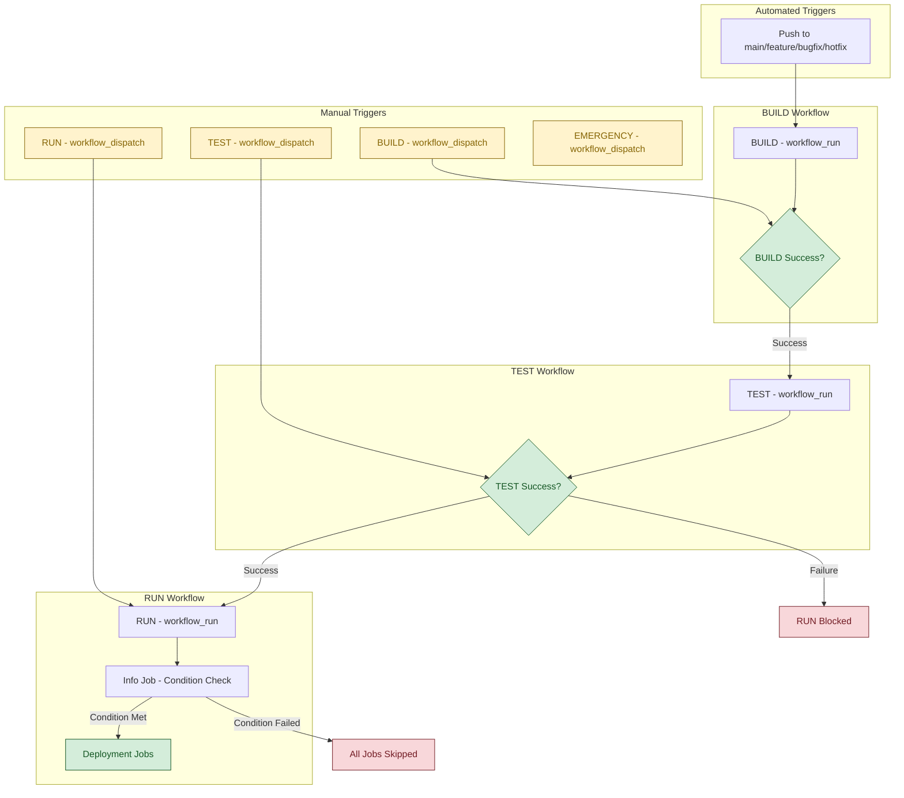
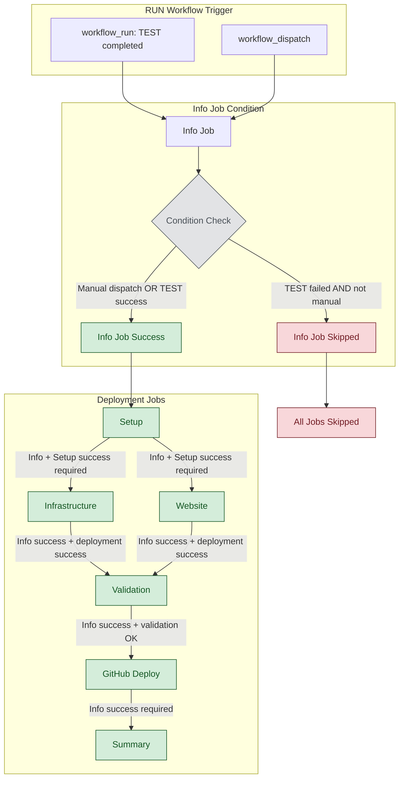
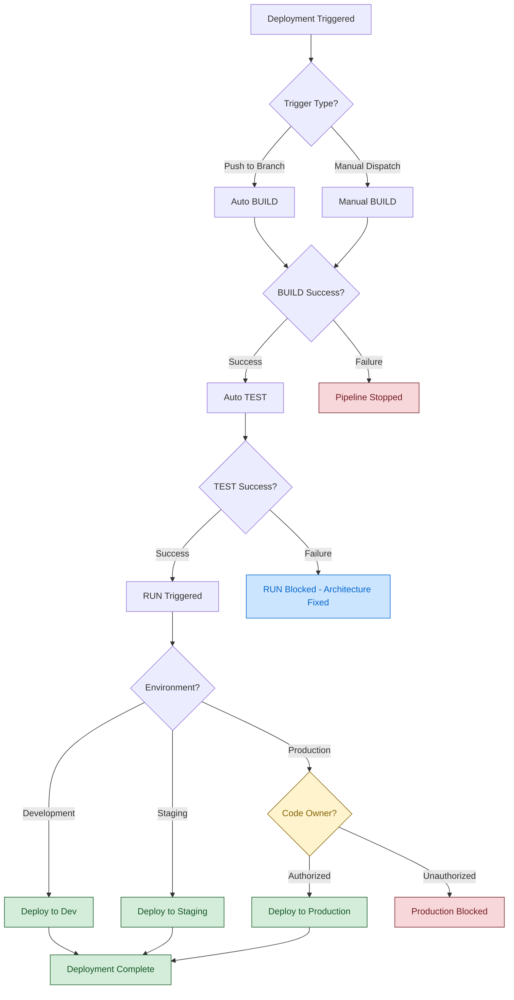

# Workflow Conditions and Dependencies

This document provides a comprehensive overview of all workflow conditions, dependencies, and execution logic in the static site deployment pipeline.

> **Note**: All Mermaid diagrams have been optimized for GitHub rendering by removing special characters, emojis, and complex HTML formatting that can cause parse errors.

## Pipeline Architecture Overview



## RUN Workflow Detailed Conditions

The RUN workflow has sophisticated conditional logic that was recently fixed to prevent deployments when tests fail.



## Job Execution Conditions Matrix

### BUILD Workflow
| Job | Condition | Purpose |
|-----|-----------|---------|
| Build Information | Always runs | Detect changes and set execution flags |
| Infrastructure Validation | `terraform changes OR force_build` | Validate Terraform syntax |
| Website Validation | `website changes OR force_build` | Validate HTML/CSS |
| Security Scans | `changes detected OR force_build` | Run Checkov/Trivy scans |
| Create Artifacts | Always runs after scans | Package build outputs |

### TEST Workflow  
| Job | Condition | Purpose |
|-----|-----------|---------|
| Test Information | Always runs | Detect changes and set test flags |
| Infrastructure Unit Tests | `terraform changes OR force_all_jobs OR skip_build_check` | Test infrastructure logic |
| Website Content Tests | `website changes OR force_all_jobs OR skip_build_check` | Test website content |
| Pre-Deployment Usability | `environment != dev OR force_all_jobs` | Run usability tests |
| Policy Validation | `terraform changes OR force_all_jobs OR skip_build_check` | Validate security policies |
| Test Summary | Always runs | Aggregate test results |

### RUN Workflow (Fixed Architecture)
| Job | Condition | Purpose |
|-----|-----------|---------|
| Info | `manual dispatch OR TEST success` | Environment detection |
| Authorization | `production AND needs.info.result == 'success'` | Code owner validation |
| Setup | `needs.info.result == 'success'` | AWS credentials setup |
| Infrastructure | `needs.info.result == 'success' AND setup success AND deploy_infrastructure == true` | Deploy infrastructure |
| Website | `needs.info.result == 'success' AND setup success AND deploy_website == true` | Deploy website |
| Validation | `needs.info.result == 'success' AND (infra OR website success)` | Post-deployment tests |
| GitHub Deploy | `needs.info.result == 'success' AND validation success/skipped` | Update deployment status |
| Summary | `needs.info.result == 'success'` | Generate deployment report |

## Critical Architectural Fix

### Before (Defective):
```yaml
if: always() && !failure()  # ❌ Bypassed TEST failure conditions
```

### After (Fixed):
```yaml
if: needs.info.result == 'success' && needs.setup.result == 'success'  # ✅ Explicit success requirements
```

## Deployment Flow Decision Tree



## Environment-Specific Conditions

### Development Environment
- **Trigger**: Feature/bugfix branches, manual dispatch
- **Authorization**: No code owner required
- **Tests**: Unit tests, basic validation
- **Deployment**: Automatic after TEST success

### Staging Environment  
- **Trigger**: Main branch, manual dispatch
- **Authorization**: No code owner required
- **Tests**: Full test suite including usability tests
- **Deployment**: Automatic after TEST success

### Production Environment
- **Trigger**: Manual dispatch only, hotfix branches
- **Authorization**: Code owner validation required
- **Tests**: Complete validation suite
- **Deployment**: Manual approval gate

## Manual Override Capabilities

All workflows support manual dispatch with various override options:

### BUILD Manual Options
- `force_build`: Force all validation jobs regardless of changes

### TEST Manual Options  
- `force_all_jobs`: Run all test jobs regardless of changes
- `skip_build_check`: Skip BUILD artifact dependency check

### RUN Manual Options
- `skip_test_check`: Bypass TEST success requirement
- `environment`: Target environment selection
- `deploy_infrastructure`: Infrastructure deployment toggle
- `deploy_website`: Website deployment toggle

## Security Gates

1. **Code Owner Validation**: Production deployments require code owner authorization
2. **TEST Success Gate**: RUN workflow blocked when tests fail (✅ Fixed)  
3. **Security Scanning**: Checkov and Trivy scans in BUILD phase
4. **Policy Validation**: OPA/Conftest validation in TEST phase
5. **OIDC Authentication**: Secure AWS access without stored credentials

This architecture ensures fail-fast behavior while providing necessary manual override capabilities for emergency scenarios.