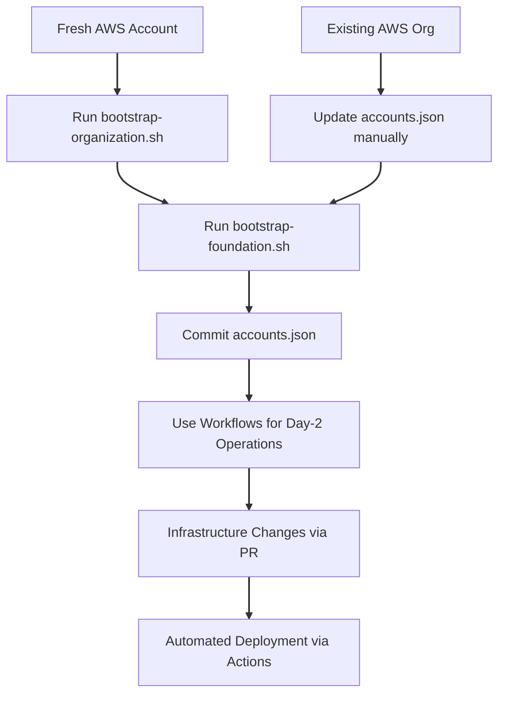

# Bootstrap Automation Framework

Automated bootstrap scripts for AWS multi-account infrastructure supporting GitHub Actions OIDC authentication.

## 📋 Overview

This framework automates the creation of foundational AWS infrastructure required for GitHub Actions CI/CD pipelines:

- **AWS Organizations** structure with member accounts
- **OIDC Providers** for GitHub Actions authentication
- **IAM Roles** for deployment access
- **Terraform State Backends** (S3 + DynamoDB + KMS)

## 🏗️ Architecture

```
Management Account
├── Workloads OU
│   └── <project-name> OU (derived from GITHUB_REPO)
│       ├── <project-name>-dev (Account)
│       ├── <project-name>-staging (Account)
│       └── <project-name>-prod (Account)
└── Bootstrap Resources
    ├── OIDC Providers (per account)
    ├── GitHub Actions Roles (per account)
    └── Terraform Backends (per account)
```

**Note**: The project OU and account names are dynamically derived from the `GITHUB_REPO` variable in `config.sh`. For example, `GITHUB_REPO="Celtikill/static-site"` creates an OU named "static-site" with accounts "static-site-dev", "static-site-staging", and "static-site-prod".

## 📁 Directory Structure

```
scripts/bootstrap/
├── config.sh                      # Central configuration
├── lib/                           # Function libraries
│   ├── common.sh                  # Logging and utilities
│   ├── aws.sh                     # AWS CLI wrappers
│   ├── organization.sh            # Organizations management
│   ├── oidc.sh                    # OIDC provider functions
│   ├── roles.sh                   # IAM role management
│   ├── backends.sh                # Terraform backend creation
│   └── verify.sh                  # Verification and testing
├── templates/                     # CloudFormation templates
│   └── oidc-stackset.yaml        # OIDC provider StackSet
├── output/                        # Generated files (git-ignored)
│   ├── backend-config-*.hcl      # Backend configurations
│   ├── terraform-*.log           # Terraform logs
│   └── verification-report.json  # Verification results
├── bootstrap-organization.sh      # Stage 1: Create org structure
├── bootstrap-foundation.sh        # Stage 2: Create OIDC/roles/backends
├── bootstrap-destroy.sh           # Cleanup bootstrap resources
├── accounts.json                  # Account IDs (auto-generated)
└── accounts.json.example          # Template file

## 🚀 Quick Start

### Prerequisites

1. **AWS CLI** installed and configured
2. **Terraform/OpenTofu** installed (v1.6+)
3. **AWS credentials** for management account (admin access)
4. **jq** installed for JSON processing

### Fresh AWS Account (Two-Stage Bootstrap)

```bash
# Stage 1: Create organization and member accounts
cd scripts/bootstrap
./bootstrap-organization.sh

# Stage 2: Create OIDC, roles, and backends
./bootstrap-foundation.sh
```

### Existing Organization (Single-Stage Bootstrap)

If you already have member accounts:

```bash
# 1. Create accounts.json manually
cat > scripts/bootstrap/accounts.json <<EOF
{
  "management": "223938610551",
  "dev": "YOUR_DEV_ACCOUNT_ID",
  "staging": "YOUR_STAGING_ACCOUNT_ID",
  "prod": "YOUR_PROD_ACCOUNT_ID"
}
EOF

# 2. Run foundation bootstrap
cd scripts/bootstrap
./bootstrap-foundation.sh
```

## 🤔 When to Use Bootstrap Scripts vs Workflows

**The bootstrap scripts and GitHub Actions workflows are complementary, not redundant.**

### Use Bootstrap Scripts if you:

- ✅ Have a **fresh AWS account** (greenfield deployment)
- ✅ Want to **run setup locally** without GitHub
- ✅ Need to **quickly teardown and rebuild** infrastructure
- ✅ Prefer **imperative CLI-based approach** with direct control
- ✅ Want **fast iteration** during development (no git push required)
- ✅ Need to **troubleshoot issues** with direct AWS access
- ✅ Are **setting up the initial organization** structure

### Use GitHub Actions Workflows if you:

- ✅ Have **existing AWS Organizations** infrastructure
- ✅ Want **GitOps workflow** with PR reviews and approval gates
- ✅ Need **audit trail** and compliance tracking
- ✅ Prefer **declarative Terraform** management with full state tracking
- ✅ Want **everything in version control** with change history
- ✅ Need **team collaboration** with code review process
- ✅ Are **managing ongoing operations** after initial setup

### Typical Usage Pattern



**Key Points:**

1. **Both use the same Terraform modules** (`terraform/bootstrap`)
2. **Scripts are for bootstrapping**, workflows are for ongoing management
3. **Scripts enable workflows** by creating necessary OIDC/IAM infrastructure
4. **You can use both** - scripts for initial setup, workflows for daily operations

## 📖 Usage Guide

### Stage 1: Organization Bootstrap

Creates AWS Organizations structure and member accounts.

```bash
./bootstrap-organization.sh [OPTIONS]

OPTIONS:
  -d, --dry-run      Simulate without making changes
  -v, --verbose      Enable detailed output
  -h, --help         Show help message

EXAMPLES:
  ./bootstrap-organization.sh              # Normal execution
  ./bootstrap-organization.sh --dry-run    # Preview changes
  ./bootstrap-organization.sh --verbose    # Detailed logging
```

**What it creates:**
- AWS Organization (if not exists)
- Workloads OU
- Project OU under Workloads (named from GITHUB_REPO)
- Three member accounts (dev, staging, prod)
- `accounts.json` file with account IDs

**Output:**
```
Management Account: 223938610551
Member Accounts:
  - Dev:     210987654321
  - Staging: 111222333444
  - Prod:    555666777888

Account IDs saved to: accounts.json
```

### Stage 2: Foundation Bootstrap

Creates OIDC providers, IAM roles, and Terraform backends.

```bash
./bootstrap-foundation.sh [OPTIONS]

OPTIONS:
  -d, --dry-run        Simulate without making changes
  -v, --verbose        Enable detailed output
  -s, --skip-verify    Skip verification steps (faster)
  -h, --help           Show help message

EXAMPLES:
  ./bootstrap-foundation.sh                 # Full bootstrap with verification
  ./bootstrap-foundation.sh --skip-verify   # Skip verification (faster)
  ./bootstrap-foundation.sh --dry-run       # Preview changes
```

**What it creates:**

1. **OIDC Providers** (per account):
   - `token.actions.githubusercontent.com`
   - Configured for GitHub Actions authentication

2. **GitHub Actions Roles** (per account):
   - `GitHubActions-<ProjectName>-Dev-Role`
   - `GitHubActions-<ProjectName>-Staging-Role`
   - `GitHubActions-<ProjectName>-Prod-Role`

   (Role names are derived from PROJECT_NAME in config.sh)

3. **Terraform Backends** (per account):
   - S3 bucket: `<project-name>-state-{env}-{account-id}`
   - DynamoDB table: `<project-name>-locks-{env}`
   - KMS key for encryption
   - Backend config files: `output/backend-config-{env}.hcl`

   (Bucket/table names use PROJECT_NAME from config.sh)

**Output:**
```
OIDC Providers: ✓
GitHub Actions Roles: ✓
Terraform Backends: ✓

Backend Configurations: output/backend-config-*.hcl
Verification Report: output/verification-report.json
```

### Destroy Bootstrap Resources

Remove all bootstrap resources (does NOT delete accounts).

```bash
./bootstrap-destroy.sh [OPTIONS]

OPTIONS:
  -d, --dry-run    Simulate without making changes
  -v, --verbose    Enable detailed output
  -f, --force      Skip confirmation prompts
  -h, --help       Show help message

EXAMPLES:
  ./bootstrap-destroy.sh --dry-run    # Preview what will be deleted
  ./bootstrap-destroy.sh              # Delete with confirmation
  ./bootstrap-destroy.sh --force      # Delete without confirmation
```

**⚠️ WARNING:** This will prevent GitHub Actions from deploying until you re-run bootstrap.

**What it destroys:**
- Terraform backends (S3, DynamoDB, KMS)
- GitHub Actions roles
- OIDC providers

**What it preserves:**
- AWS Organization structure
- Member accounts
- Application infrastructure

## 🔧 Configuration

### Environment Variables

```bash
# Execution modes
export DRY_RUN=true              # Simulate without changes
export VERBOSE=true              # Enable detailed logging
export SKIP_VERIFICATION=true    # Skip verification steps

# Custom output directory
export OUTPUT_DIR=/path/to/output
```

### Project Configuration

Edit `config.sh` to customize:

```bash
readonly PROJECT_NAME="<your-project-name>"     # Used for resource naming
readonly GITHUB_REPO="<org>/<repo>"            # GitHub repository (e.g., "Celtikill/static-site")
readonly EXTERNAL_ID="github-actions-<project>" # External ID for IAM roles
readonly AWS_DEFAULT_REGION="us-east-1"         # AWS region
readonly MANAGEMENT_ACCOUNT_ID="<account-id>"   # Management account ID
```

**Important**: PROJECT_NAME should match your repository name for consistency. The project OU and account names will be derived from GITHUB_REPO.

### Account Emails

Default account creation emails (modify in `lib/organization.sh`):
```bash
# Pattern: aws+<project-name>-<env>@example.com
Dev:     aws+<project-name>-dev@example.com
Staging: aws+<project-name>-staging@example.com
Prod:    aws+<project-name>-prod@example.com
```

## 🧪 Verification

### Run Full Verification

```bash
# Included in bootstrap-foundation.sh by default
./bootstrap-foundation.sh

# Or run verification separately
source config.sh
source lib/common.sh
source lib/aws.sh
source lib/verify.sh
run_full_verification
```

### Verification Checks

1. ✅ Organization structure (OUs, accounts)
2. ✅ OIDC providers in all accounts
3. ✅ GitHub Actions roles in all accounts
4. ✅ Terraform backends (S3, DynamoDB)
5. ✅ Cross-account role assumption
6. ✅ Backend write access
7. ✅ GitHub repository access (if `gh` CLI available)

### Verification Report

JSON report generated at `output/verification-report.json`:

```json
{
  "timestamp": "2025-10-07T12:00:00Z",
  "organization": {
    "id": "o-abc123def456",
    "master_account": "<management-account-id>"
  },
  "accounts": {
    "dev": { "id": "<dev-account-id>", "status": "ACTIVE" },
    "staging": { "id": "<staging-account-id>", "status": "ACTIVE" },
    "prod": { "id": "<prod-account-id>", "status": "ACTIVE" }
  },
  "backends": {
    "dev": "<project-name>-state-dev-<dev-account-id>",
    "staging": "<project-name>-state-staging-<staging-account-id>",
    "prod": "<project-name>-state-prod-<prod-account-id>"
  }
}
```

## 🔐 Security Considerations

### IAM Permissions Required

The bootstrap scripts require the following permissions in the management account:

- `organizations:*` - Create/manage organization and accounts
- `iam:*` - Create OIDC providers and roles
- `s3:*` - Create state buckets
- `dynamodb:*` - Create lock tables
- `kms:*` - Create encryption keys
- `sts:AssumeRole` - Cross-account access

### Direct OIDC Trust Policy

GitHub Actions roles trust the GitHub OIDC provider **directly** using `AssumeRoleWithWebIdentity`:

```json
{
  "Version": "2012-10-17",
  "Statement": [
    {
      "Effect": "Allow",
      "Principal": {
        "Federated": "arn:aws:iam::ACCOUNT_ID:oidc-provider/token.actions.githubusercontent.com"
      },
      "Action": "sts:AssumeRoleWithWebIdentity",
      "Condition": {
        "StringEquals": {
          "token.actions.githubusercontent.com:aud": "sts.amazonaws.com"
        },
        "StringLike": {
          "token.actions.githubusercontent.com:sub": "repo:<org>/<repo>:*"
        }
      }
    }
  ]
}
```

**Key Security Features:**
- ✅ **No centralized role** - Each environment role is accessed directly
- ✅ **Repository scoping** - Only your specific repository can assume the role
- ✅ **Per-account isolation** - Each account has its own OIDC provider and roles
- ✅ **No long-lived credentials** - Tokens expire after workflow completion
- ✅ **AWS-recommended pattern** (2025 best practices)

### Cross-Account Access

Bootstrap uses `OrganizationAccountAccessRole` for cross-account operations:
- Auto-created when accounts are created via AWS Organizations
- Provides admin access from management account
- **Used only during bootstrap**, not by GitHub Actions
- GitHub Actions workflows use direct OIDC (no cross-account role assumption needed)

## 🛠️ Troubleshooting

### Common Issues

**Error: "accounts.json not found"**
```bash
# Solution: Run stage 1 first
./bootstrap-organization.sh
```

**Error: "Failed to assume OrganizationAccountAccessRole"**
```bash
# Wait 30-60 seconds for role propagation
sleep 60
./bootstrap-foundation.sh
```

**Error: "Terraform plan failed"**
```bash
# Check Terraform logs
cat output/terraform-plan-dev.log

# Verify Terraform is installed
terraform version
```

**Error: "OIDC provider already exists"**
```bash
# This is OK - bootstrap is idempotent
# Continue execution, existing resources will be skipped
```

### Dry-Run Mode

Always test with dry-run first:

```bash
./bootstrap-organization.sh --dry-run
./bootstrap-foundation.sh --dry-run
./bootstrap-destroy.sh --dry-run
```

### Debug Mode

Enable verbose logging:

```bash
export VERBOSE=true
./bootstrap-foundation.sh
```

### Manual Cleanup

If scripts fail, manual cleanup:

```bash
# List OIDC providers
aws iam list-open-id-connect-providers

# Delete OIDC provider
aws iam delete-open-id-connect-provider \
  --open-id-connect-provider-arn <arn>

# List roles
aws iam list-roles | grep GitHubActions

# Delete role (must remove policies first)
aws iam delete-role --role-name GitHubActions-StaticSite-Dev-Role
```

## 🔄 Recovery Scenarios

### After Running destroy-all-infrastructure.sh

If you've destroyed all infrastructure including bootstrap resources:

```bash
# Re-bootstrap foundation (accounts still exist)
./bootstrap-foundation.sh
```

### Fresh Start (New AWS Account)

```bash
# Full two-stage bootstrap
./bootstrap-organization.sh
./bootstrap-foundation.sh
```

### Partial Failure Recovery

Bootstrap scripts are idempotent - safe to re-run:

```bash
# Re-run failed stage
./bootstrap-foundation.sh

# Existing resources will be detected and skipped
# Only missing resources will be created
```

## 📊 Cost Estimates

### Monthly Costs

| Resource | Cost | Notes |
|----------|------|-------|
| S3 Buckets (3) | ~$0.03 | State files only (~1KB each) |
| DynamoDB Tables (3) | ~$0.00 | On-demand, minimal usage |
| KMS Keys (3) | ~$3.00 | $1/month per key |
| OIDC Providers | $0.00 | Free |
| IAM Roles | $0.00 | Free |
| **Total** | **~$3/month** | Plus minimal request costs |

### One-Time Costs

- AWS Organizations: Free
- Account creation: Free
- CloudFormation StackSets: Free

## 🔗 Integration with GitHub Actions

### Workflow Configuration

After bootstrap, your GitHub Actions workflows can authenticate **directly** to each environment:

```yaml
- name: Configure AWS Credentials (Direct OIDC)
  uses: aws-actions/configure-aws-credentials@v4
  with:
    role-to-assume: arn:aws:iam::${{ vars.AWS_ACCOUNT_ID_DEV }}:role/GitHubActions-StaticSite-Dev-Role
    role-session-name: github-actions-dev-${{ github.run_id }}
    aws-region: us-east-1
    audience: sts.amazonaws.com
```

**Important**: This is a **single-step** direct OIDC authentication. No centralized role is needed.

### GitHub Variables (Not Secrets!)

Set up repository **variables** (not secrets, as account IDs are not sensitive):

```bash
# Using GitHub CLI
gh variable set AWS_ACCOUNT_ID_DEV --body "210987654321"
gh variable set AWS_ACCOUNT_ID_STAGING --body "111222333444"
gh variable set AWS_ACCOUNT_ID_PROD --body "555666777888"
gh variable set AWS_DEFAULT_REGION --body "us-east-1"
gh variable set OPENTOFU_VERSION --body "1.8.8"
```

**No AWS credentials needed** - OIDC handles authentication automatically.

### Backend Configuration

Use generated backend configs in Terraform:

```bash
terraform init -backend-config=../scripts/bootstrap/output/backend-config-dev.hcl
```

## 📚 Additional Resources

- [Main Documentation](../../docs/README.md)
- [Deployment Guide](../../DEPLOYMENT.md)
- [CI/CD Pipeline Guide](../../docs/ci-cd.md)
- [IAM Deep Dive](../../docs/iam-deep-dive.md)
- [Troubleshooting Guide](../../docs/troubleshooting.md)

## 🤝 Support

- **Issues**: [GitHub Issues](https://github.com/Celtikill/static-site/issues)
- **Discussions**: [GitHub Discussions](https://github.com/Celtikill/static-site/discussions)
- **Security**: See [SECURITY.md](../../SECURITY.md)

## 📝 License

This bootstrap framework is part of the static-site project.
See the main repository for license information.

---

**Last Updated**: 2025-10-07
**Bootstrap Version**: 1.0.0
