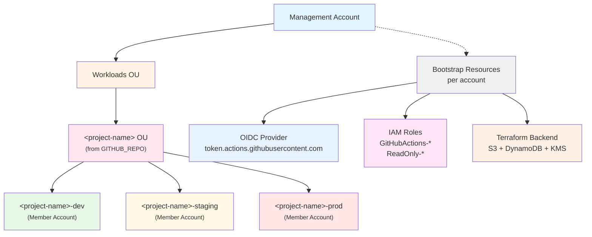
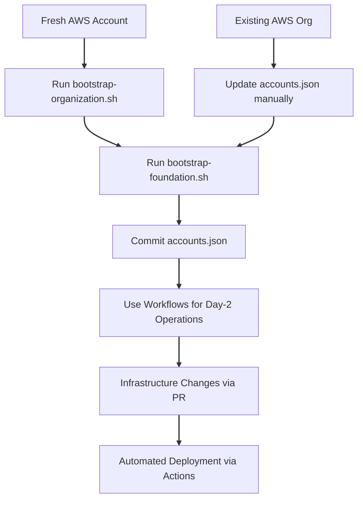

# Bootstrap Automation Framework

Automated bootstrap scripts for AWS multi-account infrastructure supporting GitHub Actions OIDC authentication.

## TL;DR

**For fresh AWS accounts**:
```bash
cd scripts/bootstrap
./bootstrap-organization.sh      # ~8 min - creates accounts
./bootstrap-foundation.sh         # ~12 min - creates OIDC/roles/backends
./configure-github.sh            # ~2 min - configures GitHub repo (optional)
```

**For existing AWS Organizations**: See [Existing Organization](#existing-organization-single-stage-bootstrap)

**Jump to**: [Prerequisites](#prerequisites) | [Configuration](#configuration) | [Security](#security-considerations) | [Troubleshooting](#troubleshooting)

---

## Script Directory Navigation

**📍 You are here**: `scripts/bootstrap/`

**Workflow**: Bootstrap → Demo → Destroy
- **[Bootstrap](../bootstrap/)** - Create AWS infrastructure **(you are here)**
- **[Demo](../demo/)** - Prepare and execute live demonstrations
- **[Destroy](../destroy/)** - Clean up AWS resources

**Related Documentation**:
- [Project README](../../README.md)
- [Deployment Guide](../../DEPLOYMENT.md)
- [Architecture Docs](../../docs/architecture.md)

---

## 📋 Overview

This framework automates the creation of foundational AWS infrastructure required for GitHub Actions CI/CD pipelines:

- **AWS Organizations** structure with member accounts
- **OIDC Providers** for GitHub Actions authentication
- **IAM Roles** for deployment access
- **Terraform State Backends** (S3 + DynamoDB + KMS)

## 🏗️ Architecture



**Note**: The project OU and account names are dynamically derived from the `GITHUB_REPO` variable in `config.sh`. For example, `GITHUB_REPO="Celtikill/static-site"` creates an OU named "static-site" with accounts "static-site-dev", "static-site-staging", and "static-site-prod".

## 📁 Directory Structure

```
scripts/bootstrap/
├── config.sh                      # Central configuration
├── lib/                           # Function libraries
│   ├── common.sh                  # Logging, progress, user interaction
│   ├── aws.sh                     # AWS CLI wrappers with retry logic
│   ├── organization.sh            # Organizations, OUs, accounts, SCPs
│   ├── oidc.sh                    # OIDC provider functions
│   ├── roles.sh                   # IAM role creation
│   ├── policies.sh                # IAM policy document generation
│   ├── metadata.sh                # AWS account metadata management
│   ├── backends.sh                # Terraform state backends (S3, DynamoDB, KMS)
│   └── verify.sh                  # Verification and validation
├── templates/                     # CloudFormation templates
│   └── oidc-stackset.yaml        # OIDC provider StackSet
├── output/                        # Generated files (git-ignored)
│   ├── backend-config-*.hcl      # Backend configurations
│   ├── backend-*.tfplan          # Terraform plan files
│   └── bootstrap-report.json     # Bootstrap execution report
├── bootstrap-organization.sh      # Step 1: Create org structure
├── bootstrap-foundation.sh        # Step 2: Create OIDC/roles/backends
├── configure-github.sh            # Step 3: Configure GitHub repository (optional)
├── update-role-policy.sh          # Maintenance: Update IAM deployment policies
├── destroy-foundation.sh          # Cleanup bootstrap resources (granular options)
├── accounts.json                  # Account IDs (auto-generated)
└── accounts.json.example          # Template file

## 🚀 Quick Start

### Prerequisites

| Tool | Minimum Version | Installation |
|------|----------------|--------------|
| **AWS CLI** | 2.0+ | `brew install awscli` or [AWS Docs](https://aws.amazon.com/cli/) |
| **Terraform/OpenTofu** | 1.6+ | `brew install opentofu` or [Download](https://opentofu.org/docs/intro/install/) |
| **jq** | 1.6+ | `brew install jq` |
| **GitHub CLI** (Step 3 only) | 2.0+ | `brew install gh` or [GitHub Docs](https://cli.github.com/) |

**Verify installation**:
```bash
aws --version    # Should show 2.x
tofu version     # Should show 1.6+
jq --version     # Should show 1.6+
gh --version     # Should show 2.x (optional)
```

**AWS Credentials**: You must have admin access to the management account. Configure with `aws configure` or use AWS SSO.

### Fresh AWS Account (Three-Step Bootstrap)

```bash
# Step 1: Create organization and member accounts
cd scripts/bootstrap
./bootstrap-organization.sh

# Step 2: Create OIDC, roles, and backends
./bootstrap-foundation.sh

# Step 3 (Optional): Configure GitHub repository for CI/CD
./configure-github.sh
```

**Note:** Step 3 requires GitHub CLI (`gh`) and repository permissions. Skip if not using GitHub Actions.

### Existing Organization (Single-Stage Bootstrap)

If you already have member accounts:

```bash
# 1. Create accounts.json manually
cat > scripts/bootstrap/accounts.json <<EOF
{
  "management": "223938610551",
  "dev": "YOUR_DEV_ACCOUNT_ID",
  "staging": "YOUR_STAGING_ACCOUNT_ID",
  "prod": "YOUR_PROD_ACCOUNT_ID"
}
EOF

# 2. Run foundation bootstrap
cd scripts/bootstrap
./bootstrap-foundation.sh
```

## 🤔 When to Use Bootstrap Scripts vs Workflows

**The bootstrap scripts and GitHub Actions workflows are complementary, not redundant.**

### Use Bootstrap Scripts if you:

- ✅ Have a **fresh AWS account** (greenfield deployment)
- ✅ Want to **run setup locally** without GitHub
- ✅ Need to **quickly teardown and rebuild** infrastructure
- ✅ Prefer **imperative CLI-based approach** with direct control
- ✅ Want **fast iteration** during development (no git push required)
- ✅ Need to **troubleshoot issues** with direct AWS access
- ✅ Are **setting up the initial organization** structure

### Use GitHub Actions Workflows if you:

- ✅ Have **existing AWS Organizations** infrastructure
- ✅ Want **GitOps workflow** with PR reviews and approval gates
- ✅ Need **audit trail** and compliance tracking
- ✅ Prefer **declarative Terraform** management with full state tracking
- ✅ Want **everything in version control** with change history
- ✅ Need **team collaboration** with code review process
- ✅ Are **managing ongoing operations** after initial setup

### Typical Usage Pattern



**Key Points:**

1. **Both use the same Terraform modules** (`terraform/bootstrap`)
2. **Scripts are for bootstrapping**, workflows are for ongoing management
3. **Scripts enable workflows** by creating necessary OIDC/IAM infrastructure
4. **You can use both** - scripts for initial setup, workflows for daily operations

## 📖 Usage Guide

### Stage 1: Organization Bootstrap

Creates AWS Organizations structure and member accounts.

```bash
./bootstrap-organization.sh [OPTIONS]

OPTIONS:
  -d, --dry-run      Simulate without making changes
  -v, --verbose      Enable detailed output
  -h, --help         Show help message

EXAMPLES:
  ./bootstrap-organization.sh              # Normal execution
  ./bootstrap-organization.sh --dry-run    # Preview changes
  ./bootstrap-organization.sh --verbose    # Detailed logging
```

**What it creates:**
- AWS Organization (if not exists)
- Workloads OU
- Project OU under Workloads (named from GITHUB_REPO)
- Three member accounts (dev, staging, prod)
- `accounts.json` file with account IDs

**Output:**
```
Management Account: 223938610551
Member Accounts:
  - Dev:     210987654321
  - Staging: 111222333444
  - Prod:    555666777888

Account IDs saved to: accounts.json
```

### Stage 2: Foundation Bootstrap

Creates OIDC providers, IAM roles, and Terraform backends.

```bash
./bootstrap-foundation.sh [OPTIONS]

OPTIONS:
  -d, --dry-run        Simulate without making changes
  -v, --verbose        Enable detailed output
  -s, --skip-verify    Skip verification steps (faster)
  -h, --help           Show help message

EXAMPLES:
  ./bootstrap-foundation.sh                 # Full bootstrap with verification
  ./bootstrap-foundation.sh --skip-verify   # Skip verification (faster)
  ./bootstrap-foundation.sh --dry-run       # Preview changes
```

**What it creates:**

1. **OIDC Providers** (per account):
   - `token.actions.githubusercontent.com`
   - Configured for GitHub Actions authentication

2. **IAM Deployment Roles** (per account):
   - `GitHubActions-Static-site-dev`
   - `GitHubActions-Static-site-staging`
   - `GitHubActions-Static-site-prod`

   These roles allow GitHub Actions workflows to deploy infrastructure via Direct OIDC authentication.

3. **IAM Console Access Roles** (per account):
   - `static-site-ReadOnly-dev`
   - `static-site-ReadOnly-staging`
   - `static-site-ReadOnly-prod`

   These roles allow engineers to access AWS console with read-only permissions.

4. **Console SwitchRole URLs** (per account):
   - Pre-configured URLs for quick console access
   - Include project name in display (e.g., "StaticSite-Dev-ReadOnly")
   - Saved to `output/console-urls.txt`

5. **Terraform Backends** (per account):
   - S3 bucket: `{project-name}-state-{env}-{account-id}`
   - DynamoDB table: `{project-name}-locks-{env}`
   - KMS key for encryption
   - Backend config files: `output/backend-config-{env}.hcl`

**Output:**
```
OIDC Providers: ✓
GitHub Actions Deployment Roles: ✓
Console Access Roles: ✓
Terraform Backends: ✓

Backend Configurations: output/backend-config-*.hcl
Console URLs: output/console-urls.txt
Bootstrap Report: output/bootstrap-report.json

=== AWS Console Access URLs ===

Dev Environment:
https://signin.aws.amazon.com/switchrole?account=210987654321&roleName=static-site-ReadOnly-dev&displayName=StaticSite-Dev-ReadOnly

Staging Environment:
https://signin.aws.amazon.com/switchrole?account=111222333444&roleName=static-site-ReadOnly-staging&displayName=StaticSite-Staging-ReadOnly

Production Environment:
https://signin.aws.amazon.com/switchrole?account=555666777888&roleName=static-site-ReadOnly-prod&displayName=StaticSite-Prod-ReadOnly
```

### Configure GitHub Repository (Optional)

Configure GitHub repository secrets and variables for CI/CD workflows.

```bash
./configure-github.sh [OPTIONS]

OPTIONS:
  --dry-run              Preview what would be configured
  -v, --verbose          Enable detailed output
  -h, --help             Show help message

EXAMPLES:
  ./configure-github.sh                # Interactive configuration
  ./configure-github.sh --dry-run      # Preview without making changes
  ./configure-github.sh --verbose      # Detailed logging
```

**Prerequisites:**
- GitHub CLI (`gh`) installed and authenticated
- Repository permissions to set secrets/variables
- Bootstrap scripts completed (accounts.json must exist)

**What it configures:**

1. **GitHub Secrets:**
   - None required! Direct OIDC authentication eliminates the need for stored AWS credentials

2. **GitHub Variables:**
   - AWS account IDs (management, dev, staging, prod)
   - AWS regions (configured in config.sh - default: us-east-2 primary, us-west-2 replica)
   - Infrastructure settings (OpenTofu version, budget limits, alert emails, etc.)

**Interactive Flow:**
1. Validates prerequisites (gh CLI, accounts.json)
2. Shows current GitHub configuration
3. Prompts for confirmation
4. Configures all secrets and variables
5. Verifies configuration

**Note:** This step is optional. Skip if not using GitHub Actions, or configure variables manually for other CI/CD platforms.

### Destroy Bootstrap Resources

Remove all or specific bootstrap resources. Optionally close member AWS accounts.

```bash
./destroy-foundation.sh [OPTIONS]

OPTIONS:
  -d, --dry-run              Simulate without making changes
  -v, --verbose              Enable detailed output
  -f, --force                Skip confirmation prompts
  -h, --help                 Show help message

GRANULAR DESTRUCTION OPTIONS:
  --backends-only            Only destroy Terraform backends (S3 + DynamoDB)
  --roles-only               Only destroy GitHub Actions IAM roles
  --oidc-only                Only destroy OIDC providers
  --central-bucket-only      Only destroy central foundation state bucket
  --close-accounts           Close member AWS accounts (PERMANENT - 90 day recovery)
  --accounts LIST            Comma-separated list of accounts (dev,staging,prod)
  --s3-timeout SECONDS       S3 bucket emptying timeout (default: 180)

EXAMPLES:
  ./destroy-foundation.sh --dry-run                        # Preview full destruction
  ./destroy-foundation.sh --force                          # Destroy all resources
  ./destroy-foundation.sh --backends-only --accounts dev   # Only dev backends
  ./destroy-foundation.sh --roles-only --s3-timeout 300    # Only roles (5min timeout)
  ./destroy-foundation.sh --close-accounts --accounts dev --force  # Close dev account
  ./destroy-foundation.sh --force --close-accounts         # Close ALL member accounts (EXTREME)
```

**⚠️ WARNING:** This will prevent GitHub Actions from deploying until you re-run bootstrap.

**What it destroys (by default):**
- Terraform backends (S3, DynamoDB, KMS)
- GitHub Actions roles
- OIDC providers
- Central foundation state bucket

**What it can optionally destroy:**
- **Member accounts** (with `--close-accounts` flag)
  - ⚠️ **PERMANENT ACTION** - Accounts enter PENDING_CLOSURE for 90 days
  - Accounts can be reopened via AWS Support during recovery period
  - AWS limits: Can only close 10% of member accounts per rolling 30-day period
  - All AWS Marketplace subscriptions must be canceled first
  - Outstanding charges and Reserved Instance fees continue
  - See: https://docs.aws.amazon.com/cli/latest/reference/organizations/close-account.html

**What it preserves (by default):**
- AWS Organization structure
- Member accounts (unless `--close-accounts` is used)
- Application infrastructure

### Update IAM Role Policies (Maintenance)

Update IAM deployment policies for existing GitHub Actions roles after policy definition changes.

```bash
./update-role-policy.sh [OPTIONS]

OPTIONS:
  -e, --environment ENV    Target environment (dev, staging, prod, all)
  -d, --dry-run           Preview policy changes without applying
  -v, --verbose           Enable detailed output
  -h, --help              Show help message

EXAMPLES:
  ./update-role-policy.sh --environment staging        # Update staging role policy
  ./update-role-policy.sh --environment all            # Update all environments
  ./update-role-policy.sh --environment dev --dry-run  # Preview dev policy changes
```

**When to use:**
- After modifying IAM policy definitions in `lib/roles.sh`
- When deployment permissions need to be updated
- After AWS service changes require policy adjustments
- To align existing roles with updated security requirements

**What it does:**
- Retrieves current deployment policy from IAM role
- Generates new policy from templates in `lib/roles.sh`
- Compares policies and shows differences
- Updates role with new policy (unless `--dry-run`)
- Validates policy update succeeded

**Safety features:**
- Dry-run mode shows policy diff before applying
- Preserves role trust relationships (only updates permissions)
- Validates syntax before applying changes
- Can target specific environment to limit blast radius

**Output:**
```
Updating deployment policy for environment: staging
Current policy version: v1
Generated new policy from templates

Policy differences:
+ Added: s3:PutBucketPolicy
+ Added: cloudfront:CreateInvalidation
- Removed: s3:DeleteBucket

Apply policy update? [y/N]: y
Policy updated successfully
Validation: ✓ Role can be assumed
```

## 🔧 Configuration

### Configuration Methods (Pick One)

This project supports multiple configuration approaches:

**1. Environment Variables** (Recommended for forks):
```bash
cp .env.example .env
# Edit .env with your values
source .env
```

**2. Interactive Prompts** (Easiest for first-time setup):
```bash
# Scripts will prompt for missing values
./bootstrap-organization.sh
```

**3. Direct Export** (For automation):
```bash
export GITHUB_REPO="YourOrg/your-repo"
export PROJECT_SHORT_NAME="your-project"
export PROJECT_NAME="yourorg-your-project"
```

See [.env.example](../../.env.example) for all available options.

### Required Variables

| Variable | Description | Example |
|----------|-------------|---------|
| `GITHUB_REPO` | Repository in owner/repo format | `"Celtikill/static-site"` |
| `PROJECT_SHORT_NAME` | Abbreviated name for IAM roles | `"static-site"` |
| `PROJECT_NAME` | Full name for S3 buckets (must be globally unique) | `"celtikill-static-site"` |

### Optional Variables

All optional variables have sensible defaults. See [.env.example](../../.env.example) for the complete list:

- `AWS_DEFAULT_REGION` - AWS region (default: `us-east-1`)
- `MANAGEMENT_ACCOUNT_ID` - Auto-detected if not set
- Account IDs - Loaded from `accounts.json` after organization bootstrap

### Execution Mode Overrides

```bash
# Override behavior without editing config
export DRY_RUN=true              # Simulate without changes
export VERBOSE=true              # Enable detailed logging
export SKIP_VERIFICATION=true    # Skip verification steps
export OUTPUT_DIR=/custom/path   # Custom output directory
```

### Account Emails

Account creation emails (modify in `lib/organization.sh` if needed):
```bash
# Default pattern: aws+<project-name>-<env>@example.com
Dev:     aws+<project-name>-dev@example.com
Staging: aws+<project-name>-staging@example.com
Prod:    aws+<project-name>-prod@example.com
```

## 🧪 Verification

### Run Full Verification

```bash
# Included in bootstrap-foundation.sh by default
./bootstrap-foundation.sh

# Or run verification separately
source config.sh
source lib/common.sh
source lib/aws.sh
source lib/verify.sh
run_full_verification
```

### Verification Checks

1. ✅ Organization structure (OUs, accounts)
2. ✅ OIDC providers in all accounts
3. ✅ GitHub Actions roles in all accounts
4. ✅ Terraform backends (S3, DynamoDB)
5. ✅ Cross-account role assumption
6. ✅ Backend write access
7. ✅ GitHub repository access (if `gh` CLI available)

### Verification Report

JSON report generated at `output/bootstrap-report.json`:

```json
{
  "timestamp": "2025-10-07T12:00:00Z",
  "organization": {
    "id": "o-abc123def456",
    "master_account": "<management-account-id>"
  },
  "accounts": {
    "dev": { "id": "<dev-account-id>", "status": "ACTIVE" },
    "staging": { "id": "<staging-account-id>", "status": "ACTIVE" },
    "prod": { "id": "<prod-account-id>", "status": "ACTIVE" }
  },
  "backends": {
    "dev": "<project-name>-state-dev-<dev-account-id>",
    "staging": "<project-name>-state-staging-<staging-account-id>",
    "prod": "<project-name>-state-prod-<prod-account-id>"
  }
}
```

## 🔐 Security Considerations

### IAM Permissions Required

The bootstrap scripts require the following permissions in the management account:

- `organizations:*` - Create/manage organization and accounts
- `iam:*` - Create OIDC providers and roles
- `s3:*` - Create state buckets
- `dynamodb:*` - Create lock tables
- `kms:*` - Create encryption keys
- `sts:AssumeRole` - Cross-account access

### Direct OIDC Trust Policy

GitHub Actions roles trust the GitHub OIDC provider **directly** using `AssumeRoleWithWebIdentity`:

```json
{
  "Version": "2012-10-17",
  "Statement": [
    {
      "Effect": "Allow",
      "Principal": {
        "Federated": "arn:aws:iam::ACCOUNT_ID:oidc-provider/token.actions.githubusercontent.com"
      },
      "Action": "sts:AssumeRoleWithWebIdentity",
      "Condition": {
        "StringEquals": {
          "token.actions.githubusercontent.com:aud": "sts.amazonaws.com"
        },
        "StringLike": {
          "token.actions.githubusercontent.com:sub": "repo:<org>/<repo>:*"
        }
      }
    }
  ]
}
```

**Key Security Features:**
- ✅ **No centralized role** - Each environment role is accessed directly
- ✅ **Repository scoping** - Only your specific repository can assume the role
- ✅ **Per-account isolation** - Each account has its own OIDC provider and roles
- ✅ **No long-lived credentials** - Tokens expire after workflow completion
- ✅ **[AWS-recommended pattern](https://docs.aws.amazon.com/IAM/latest/UserGuide/id_roles_providers_oidc.html)** for OIDC authentication

### Cross-Account Access

Bootstrap uses `OrganizationAccountAccessRole` for cross-account operations:
- Auto-created when accounts are created via AWS Organizations
- Provides admin access from management account
- **Used only during bootstrap**, not by GitHub Actions
- GitHub Actions workflows use direct OIDC (no cross-account role assumption needed)

## 🛠️ Troubleshooting

### Common Issues

**Error: "accounts.json not found"**
```bash
# Solution: Run stage 1 first
./bootstrap-organization.sh
```

**Error: "Failed to assume OrganizationAccountAccessRole"**
```bash
# Wait 30-60 seconds for role propagation
sleep 60
./bootstrap-foundation.sh
```

**Error: "Terraform plan failed"**
```bash
# Check Terraform logs
cat output/terraform-plan-dev.log

# Verify Terraform is installed
terraform version
```

**Error: "OIDC provider already exists"**
```bash
# This is OK - bootstrap is idempotent
# Continue execution, existing resources will be skipped
```

### Dry-Run Mode

Always test with dry-run first:

```bash
./bootstrap-organization.sh --dry-run
./bootstrap-foundation.sh --dry-run
./destroy-foundation.sh --dry-run
```

### Debug Mode

Enable verbose logging:

```bash
export VERBOSE=true
./bootstrap-foundation.sh
```

### Manual Cleanup

If scripts fail, manual cleanup:

```bash
# List OIDC providers
aws iam list-open-id-connect-providers

# Delete OIDC provider
aws iam delete-open-id-connect-provider \
  --open-id-connect-provider-arn <arn>

# List roles
aws iam list-roles | grep GitHubActions

# Delete role (must remove policies first)
aws iam delete-role --role-name GitHubActions-StaticSite-Dev-Role
```

## 🔄 Recovery Scenarios

### After Running destroy-all-infrastructure.sh

If you've destroyed all infrastructure including bootstrap resources:

```bash
# Re-bootstrap foundation (accounts still exist)
./bootstrap-foundation.sh
```

### Fresh Start (New AWS Account)

```bash
# Full two-stage bootstrap
./bootstrap-organization.sh
./bootstrap-foundation.sh
```

### Partial Failure Recovery

Bootstrap scripts are idempotent - safe to re-run:

```bash
# Re-run failed stage
./bootstrap-foundation.sh

# Existing resources will be detected and skipped
# Only missing resources will be created
```

## 📊 Cost Estimates

### Monthly Costs

| Resource | Cost | Notes |
|----------|------|-------|
| S3 Buckets (3) | ~$0.03 | State files only (~1KB each) |
| DynamoDB Tables (3) | ~$0.00 | On-demand, minimal usage |
| KMS Keys (3) | ~$3.00 | $1/month per key |
| OIDC Providers | $0.00 | Free |
| IAM Roles | $0.00 | Free |
| **Total** | **~$3/month** | Plus minimal request costs |

### One-Time Costs

- AWS Organizations: Free
- Account creation: Free
- CloudFormation StackSets: Free

## 🔗 Integration with GitHub Actions

### Workflow Configuration

After bootstrap, your GitHub Actions workflows can authenticate **directly** to each environment:

```yaml
- name: Configure AWS Credentials (Direct OIDC)
  uses: aws-actions/configure-aws-credentials@v4
  with:
    role-to-assume: arn:aws:iam::${{ vars.AWS_ACCOUNT_ID_DEV }}:role/GitHubActions-Static-site-dev
    role-session-name: github-actions-dev-${{ github.run_id }}
    aws-region: us-east-2  # See config.sh for region configuration
    audience: sts.amazonaws.com
```

**Important**: This is a **single-step** direct OIDC authentication. No centralized role is needed.

### GitHub Variables (Not Secrets!)

Set up repository **variables** (not secrets, as account IDs are not sensitive):

```bash
# Using GitHub CLI (or use ./configure-github.sh to set from config.sh)
gh variable set AWS_ACCOUNT_ID_DEV --body "210987654321"
gh variable set AWS_ACCOUNT_ID_STAGING --body "111222333444"
gh variable set AWS_ACCOUNT_ID_PROD --body "555666777888"
gh variable set AWS_DEFAULT_REGION --body "us-east-2"  # Should match config.sh AWS_DEFAULT_REGION
gh variable set OPENTOFU_VERSION --body "1.8.8"
```

**No AWS credentials needed** - OIDC handles authentication automatically.

### Backend Configuration

Use generated backend configs in Terraform:

```bash
terraform init -backend-config=../scripts/bootstrap/output/backend-config-dev.hcl
```

## 🌐 AWS Console Access

### Console SwitchRole URLs

The bootstrap process generates pre-configured console URLs that allow you to quickly switch to read-only roles in each environment. These URLs are displayed at the end of `bootstrap-foundation.sh` and saved to `output/console-urls.txt`.

### Using Console URLs

**From Bootstrap Output:**
1. Run `./bootstrap-foundation.sh`
2. Copy the console URL for your target environment
3. Paste into your browser
4. AWS will switch you to the read-only role automatically

**From Saved File:**
```bash
# View all console URLs
cat scripts/bootstrap/output/console-urls.txt

# Open directly (macOS)
open "$(grep 'Dev Environment' -A1 scripts/bootstrap/output/console-urls.txt | tail -1)"

# Open directly (Linux with xdg-open)
xdg-open "$(grep 'Dev Environment' -A1 scripts/bootstrap/output/console-urls.txt | tail -1)"
```

### URL Format

Console URLs follow this format:
```
https://signin.aws.amazon.com/switchrole?account={ACCOUNT_ID}&roleName={ROLE_NAME}&displayName={DISPLAY_NAME}
```

**Components:**
- **account**: AWS account ID (e.g., `210987654321`)
- **roleName**: IAM role name (e.g., `static-site-ReadOnly-dev`)
- **displayName**: Friendly name in console (e.g., `StaticSite-Dev-ReadOnly`)

**Display Name Benefits:**
- Includes project name for multi-project scenarios
- Makes it easy to identify which role you're using
- Shows environment (Dev, Staging, Prod) clearly

### Read-Only Access

The console roles provide full read-only access via AWS managed policy `ReadOnlyAccess`:

**What you can do:**
- ✅ View all resources (S3 buckets, CloudFront distributions, IAM roles, etc.)
- ✅ Read CloudWatch logs and metrics
- ✅ View CloudTrail audit trails
- ✅ Inspect security group rules
- ✅ Review cost and usage reports

**What you cannot do:**
- ❌ Create, modify, or delete resources
- ❌ Change IAM policies
- ❌ Modify security settings
- ❌ Deploy infrastructure

### Trust Policy

Console roles trust the management account, allowing IAM users and roles in the management account to assume them:

```json
{
  "Version": "2012-10-17",
  "Statement": [
    {
      "Effect": "Allow",
      "Principal": {
        "AWS": "arn:aws:iam::MANAGEMENT_ACCOUNT_ID:root"
      },
      "Action": "sts:AssumeRole"
    }
  ]
}
```

**Access Requirements:**
- Must be authenticated to management account
- No MFA required (managed at management account level)
- Session duration: 1 hour (configurable)

### Multi-Project Workflow

For engineers working on multiple projects, the display name includes the project name to avoid confusion:

**Example Console Role Menu:**
- StaticSite-Dev-ReadOnly ← Current project
- StaticSite-Staging-ReadOnly
- OtherProject-Dev-ReadOnly ← Different project
- OtherProject-Prod-ReadOnly

This naming makes it clear which project and environment you're accessing.

## 📚 Additional Resources

- [Main Documentation](../../docs/README.md)
- [Deployment Guide](../../DEPLOYMENT.md)
- [CI/CD Pipeline Guide](../../docs/ci-cd.md)
- [IAM Deep Dive](../../docs/iam-deep-dive.md)
- [Troubleshooting Guide](../../docs/troubleshooting.md)

## 🤝 Support

- **Issues**: [GitHub Issues](https://github.com/Celtikill/static-site/issues)
- **Discussions**: [GitHub Discussions](https://github.com/Celtikill/static-site/discussions)
- **Security**: See [SECURITY.md](../../SECURITY.md)

## 📝 License

This bootstrap framework is part of the static-site project.
See the main repository for license information.

---

**Last Updated**: 2025-11-04
**Bootstrap Version**: 1.1.0 (Added console URL documentation)
