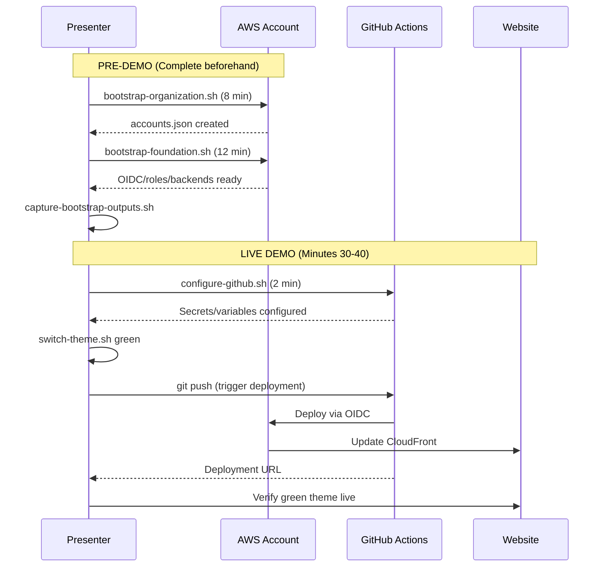

# Demo Scripts

This directory contains demo-specific scripts for preparing and executing live demonstrations of the AWS multi-account static site infrastructure.

## TL;DR

**Quick demo setup**:
```bash
# 1. Before demo - validate and capture reference
./scripts/demo/capture-bootstrap-outputs.sh

# 2. During demo - switch theme for visual impact
./scripts/demo/switch-theme.sh green

# 3. Trigger deployment
git add src/index.html && git commit -m "demo: green theme" && git push
```

**Available scripts**: [capture-bootstrap-outputs.sh](#capture-bootstrap-outputssh) | [switch-theme.sh](#switch-themesh) | [repair-terraform-state.sh](#repair-terraform-statesh)

**Jump to**: [Demo Workflow](#demo-workflow) | [Security](#security-considerations) | [Troubleshooting](#troubleshooting)

---

## Script Directory Navigation

**📍 You are here**: `scripts/demo/`

**Workflow**: Bootstrap → Demo → Destroy
- **[Bootstrap](../bootstrap/)** - Create AWS infrastructure
- **[Demo](../demo/)** - Prepare and execute live demonstrations **(you are here)**
- **[Destroy](../destroy/)** - Clean up AWS resources

**Related Documentation**:
- [Demo Agenda](../../DEMO_AGENDA.md)
- [Deployment Guide](../../DEPLOYMENT.md)
- [Bootstrap Scripts](../bootstrap/README.md)

---

## Overview

These scripts help presenters prepare for professional technical demos by:
- Validating that bootstrap infrastructure is ready
- Generating presenter reference materials
- Providing consistent, repeatable demo workflows

**Note:** GitHub configuration has been moved to the bootstrap suite. See `../bootstrap/configure-github.sh` for Step 3 of the bootstrap process.

## Scripts

### `capture-bootstrap-outputs.sh`

**Purpose**: Pre-demo validation and reference generation

**When to run**: After bootstrap is complete, before starting the demo

**What it does**:
- Validates that all bootstrap steps completed successfully
- Checks for accounts.json and backend configurations
- Generates `demo-reference.txt` with infrastructure summary
- Creates talking points and key metrics for presenter

**Usage**:
```bash
./scripts/demo/capture-bootstrap-outputs.sh
```

**Output**: Creates `scripts/demo/demo-reference.txt` (local file, never committed)

**Example output validation**:
```
✓ accounts.json found
✓ All account IDs present (4 accounts)
✓ Output directory found
✓ backend-config-dev.hcl exists
✓ backend-config-staging.hcl exists
✓ backend-config-prod.hcl exists
✓ Demo reference file created
```

---

### `switch-theme.sh`

**Purpose**: Easily switch between website themes for visual demo impact

**When to run**: During demos to show live deployment updates with visible changes

**What it does**:
- Detects current website theme (blue or green)
- Switches between `index-blog-v1.html` (blue) and `index-blog-v2.html` (green)
- Creates backup of current `index.html`
- Provides next steps for committing and deploying

**Usage**:
```bash
# Check current theme
./scripts/demo/switch-theme.sh status

# Switch to green theme
./scripts/demo/switch-theme.sh green

# Switch to blue theme
./scripts/demo/switch-theme.sh blue
```

**Output**:
```
✅ Successfully switched to GREEN theme!

📝 Next steps:
  1. Commit the change: git add src/index.html && git commit -m 'Switch to green theme'
  2. Push to trigger deployment: git push
  3. Wait for GitHub Actions to deploy (~2-3 minutes)
  4. Visit the website URL from the workflow summary

💡 The updated workflow now:
  • Sets cache-control headers for instant updates
  • Waits for CloudFront invalidation to complete
  • Provides cache-busting URLs in the summary
```

**Theme colors**:
- Blue theme: `#2563eb` (index-blog-v1.html)
- Green theme: `#059669` (index-blog-v2.html)

**Demo impact**: Visual color changes make deployments immediately obvious to demo participants, eliminating confusion about whether the deployment actually updated.

---

### `destroy-website-buckets.sh`

**Purpose**: Fast cleanup of website S3 buckets during demos

**Status**: ⚠️ **Deprecated** - Use `../destroy/destroy-environment.sh` instead

**What it does**:
- Empties and deletes S3 website buckets
- Handles versioned buckets
- Faster than full infrastructure destroy

**When to use**:
- Quick cleanup between demo runs
- Resetting website without destroying all infrastructure

**Migration path**:
```bash
# Old way (deprecated):
./scripts/demo/destroy-website-buckets.sh

# New way (recommended):
./scripts/destroy/destroy-environment.sh dev --force
```

**Why deprecated**: The destroy scripts provide better safety features, comprehensive logging, cross-account support, and proper validation.

---

### `repair-terraform-state.sh`

**Purpose**: Import existing AWS resources into Terraform state

**Status**: ✅ **Active** - Use when state is out of sync with infrastructure

**What it does**:
- Detects existing AWS resources (S3 buckets, IAM roles, OIDC providers)
- Compares with Terraform state
- Imports missing resources into state
- Fixes "EntityAlreadyExists" errors

**When to use**:
- After deleting Terraform state but AWS resources still exist
- Getting "EntityAlreadyExists" errors during deployment
- Need to sync state with actual infrastructure
- Recovery after manual AWS Console changes

**Usage**:
```bash
# Import missing resources into Terraform state
./scripts/demo/repair-terraform-state.sh
```

**Important**: This script performs actual imports. Review the output carefully before proceeding.

**Example output**:
```
Scanning for existing AWS resources...
✓ Found S3 bucket: myproject-state-dev-123456789
✓ Found IAM role: GitHubActions-myproject-dev
✗ OIDC provider not in Terraform state

Importing resources:
  terraform import module.state.aws_s3_bucket.state myproject-state-dev-123456789
  terraform import module.roles.aws_iam_role.github_actions GitHubActions-myproject-dev

Import complete! State is now synchronized.
```

**Safety**: Read-only operations, doesn't delete anything. Safe to run with `--dry-run` first.

---

### `cleanup-infrastructure.sh`

**Purpose**: Cross-account infrastructure cleanup for demos

**Status**: ⚠️ **Deprecated** - Use `../destroy/destroy-infrastructure.sh` instead

**What it does**:
- Assumes cross-account roles from management account
- Destroys S3 buckets and Terraform state
- Supports dev, staging, prod, and all environments

**When to use**:
- Cleaning up after demos
- Resetting all environments

**Migration path**:
```bash
# Old way (deprecated):
./scripts/demo/cleanup-infrastructure.sh all

# New way (recommended):
./scripts/destroy/destroy-infrastructure.sh --force
```

**Why deprecated**: The newer destroy scripts provide:
- Better safety features (dry-run mode, confirmation prompts)
- Comprehensive logging and reporting
- Proper validation and error handling
- Multi-region support
- Service-specific destruction phases
- Post-destruction verification

**Note**: If you need this functionality, use the destroy framework in `../destroy/` which provides enterprise-grade safety and logging.

---

## GitHub Configuration (Moved to Bootstrap Suite)

**GitHub configuration is now part of the bootstrap process** and has been relocated to:

```bash
../bootstrap/configure-github.sh
```

This script is now Step 3 of the bootstrap suite:
1. `bootstrap-organization.sh` - Create AWS Organization and accounts
2. `bootstrap-foundation.sh` - Create OIDC providers, IAM roles, and Terraform backends
3. **`configure-github.sh`** - Configure GitHub repository for CI/CD workflows

**For demo presentations**, use the relocated script:
```bash
./scripts/bootstrap/configure-github.sh
```

**What it configures:**
- AWS account IDs as GitHub variables
- OIDC role ARNs as GitHub secrets
- Infrastructure settings (regions, versions, budgets)

See `../bootstrap/configure-github.sh --help` for full documentation.

---

## Local-Only Files

These files are generated by the scripts but **never committed to git**:

```
scripts/demo/
└── demo-reference.txt          # Infrastructure summary for presenter
scripts/bootstrap/
├── accounts.json               # AWS account IDs
└── output/
    ├── backend-config-*.hcl    # Terraform backend configurations
    └── *.log                   # Bootstrap execution logs
```

All these paths are in `.gitignore` to prevent accidental commits of sensitive data.

---

## Demo Workflow

### Visual Demo Flow



---

### Pre-Demo Setup (Complete beforehand)

1. **Bootstrap infrastructure**:
   ```bash
   # Create AWS Organization and accounts (~8 minutes)
   ./scripts/bootstrap/bootstrap-organization.sh

   # Create OIDC, roles, and backends (~12 minutes)
   ./scripts/bootstrap/bootstrap-foundation.sh
   ```

2. **Capture outputs for reference**:
   ```bash
   # Generate demo reference materials
   ./scripts/demo/capture-bootstrap-outputs.sh

   # Review the reference file
   cat scripts/demo/demo-reference.txt
   ```

3. **Review demo agenda**:
   ```bash
   # Read the full demo agenda
   cat DEMO_AGENDA.md
   ```

### During Demo (Live execution)

1. **Configure GitHub (minute 30-32)**:
   ```bash
   # Run interactively during demo (Step 3 of bootstrap)
   ./scripts/bootstrap/configure-github.sh
   ```

2. **Create feature branch and switch theme (minute 32-34)**:
   ```bash
   # Create timestamped feature branch
   git checkout -b feature/demo-$(date +%Y%m%d-%H%M)

   # Switch to green theme for visual impact
   ./scripts/demo/switch-theme.sh green

   # Alternative: Make a small visible change
   # echo "<!-- Demo: $(date '+%Y-%m-%d %H:%M:%S') -->" >> src/index.html
   ```

3. **Trigger deployment (minute 34-38)**:
   ```bash
   # Commit and push
   git add src/index.html
   git commit -m "demo: add timestamp $(date +%H:%M)"
   git push origin feature/demo-*

   # Watch deployment in real-time
   gh run watch
   ```

4. **Verify deployment (minute 38-40)**:
   ```bash
   # Get deployment URL from workflow logs or README
   gh run view --log | grep "Website URL"

   # Test the website
   curl -I <website-url>
   ```

---

## Prerequisites

All scripts require:
- **Bash 4.0+**
- **jq** - JSON processor (`brew install jq`)
- **GitHub CLI** - Authenticated (`gh auth login`)
- **AWS CLI** - For infrastructure queries (optional)

---

## Security Considerations

### Account ID Protection

Account IDs are AWS-sensitive information. These scripts:
- ✅ Read from local `accounts.json` (never committed)
- ✅ Display masked account IDs in logs (e.g., `1234****5678`)
- ✅ Generate reference files that are local-only
- ✅ Never expose full account IDs in public repositories

### GitHub Secrets Management

The secrets configuration script:
- ✅ Uses OIDC (no long-lived AWS credentials)
- ✅ Sets secrets via GitHub CLI (encrypted at rest)
- ✅ Verifies configuration without exposing values
- ✅ Provides audit trail via gh CLI authentication

### Best Practices

1. **Never commit**:
   - `accounts.json`
   - `demo-reference.txt`
   - Any `scripts/bootstrap/output/*` files

2. **Always verify**:
   - `.gitignore` includes local files before committing
   - Scripts run with your own credentials (not shared)
   - Account IDs are masked in screen recordings

3. **Clean up after demo**:
   - Consider running destroy scripts after demo
   - Rotate credentials if accidentally exposed
   - Review CloudTrail logs for unexpected activity

### Live Demo Security Checklist

Before presenting to an audience:

**Credential Protection**:
- [ ] Use temporary AWS credentials (expire within 1 hour)
- [ ] Clear shell history: `history -c`
- [ ] Use incognito/private browser windows
- [ ] Close unrelated browser tabs
- [ ] Set terminal font size large enough to read, small enough to hide full ARNs

**Account ID Masking**:
- [ ] Configure terminal to mask account IDs in output
- [ ] Use environment variables instead of hardcoded IDs
- [ ] Prepare screenshots with masked IDs beforehand
- [ ] Review `demo-reference.txt` is not screen-shared

**Screen Recording Risks**:
- [ ] Account IDs visible in URLs, outputs, logs
- [ ] AWS console shows account ID in top-right corner
- [ ] Terraform outputs may include sensitive ARNs
- [ ] Git history may show account IDs in commits

**Post-Demo Cleanup**:
- [ ] Rotate any credentials shown on screen
- [ ] Review recording for accidental exposure before publishing
- [ ] Run `../destroy/destroy-infrastructure.sh` if using temporary accounts

---

## Troubleshooting

### "accounts.json not found"

**Cause**: Bootstrap scripts haven't been run yet

**Solution**:
```bash
./scripts/bootstrap/bootstrap-organization.sh
./scripts/bootstrap/bootstrap-foundation.sh
```

---

### "GitHub CLI not authenticated"

**Cause**: Not logged in to GitHub CLI

**Solution**:
```bash
gh auth login
# Follow prompts to authenticate
```

---

### "Backend configs missing"

**Cause**: Foundation bootstrap didn't complete successfully

**Solution**:
```bash
# Check bootstrap logs
ls -la scripts/bootstrap/output/

# Re-run foundation bootstrap
./scripts/bootstrap/bootstrap-foundation.sh
```

---

### "Secret already exists" warning

**Cause**: Secrets were previously configured

**Solution**: This is normal. The script will update existing secrets with new values. No action needed.

---

## Related Documentation

- **[DEMO_AGENDA.md](../../DEMO_AGENDA.md)** - Complete 60-minute demo agenda
- **[DEPLOYMENT.md](../../DEPLOYMENT.md)** - Full deployment guide
- **[docs/secrets-and-variables.md](../../docs/secrets-and-variables.md)** - Detailed secrets documentation
- **[scripts/bootstrap/README.md](../bootstrap/README.md)** - Bootstrap scripts documentation

---

## Contributing

When adding new demo scripts:
1. Follow existing naming conventions (`verb-noun.sh`)
2. Include comprehensive help text
3. Add validation and error handling
4. Update this README with usage documentation
5. Add generated files to `.gitignore` if they contain sensitive data

---

**Note**: These scripts are designed for demonstration purposes. For production deployments, follow the full deployment guide in [DEPLOYMENT.md](../../DEPLOYMENT.md).
