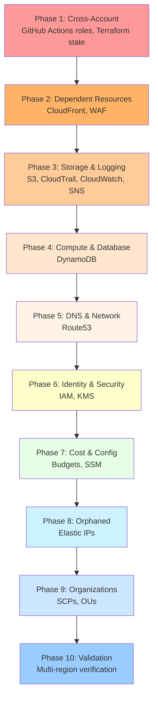

# Infrastructure Destruction Framework

Modular framework for comprehensive AWS infrastructure destruction with safety features, cross-account support, and detailed reporting.

---

⚠️ **DANGER ZONE** ⚠️

These scripts **permanently delete AWS resources**. There is no undo.

**Before proceeding**:
1. ✅ Read this entire README
2. ✅ Run with `--dry-run` first
3. ✅ Verify you're in the correct AWS account
4. ✅ Have backups of critical data
5. ✅ Get approval for production destruction

**Quick Reference**:
- **Reset dev environment preserving bootstrap**: `./destroy-environment.sh dev --force`
- **Preview full destruction**: `./destroy-infrastructure.sh --dry-run`
- **Full teardown**: `./destroy-infrastructure.sh --force` (⚠️ DESTRUCTIVE)

**Jump to**: [Decision Guide](#scripts-overview) | [Safety Features](#security--safety) | [Examples](#common-scenarios)

---

## Script Directory Navigation

**📍 You are here**: `scripts/destroy/`

**Workflow**: Bootstrap → Demo → Destroy
- **[Bootstrap](../bootstrap/)** - Create AWS infrastructure
- **[Demo](../demo/)** - Prepare and execute live demonstrations
- **[Destroy](../destroy/)** - Clean up AWS resources **(you are here)**

**Related Documentation**:
- [Testing Guide](TESTING.md)
- [Deployment Guide](../../DEPLOYMENT.md)
- [Bootstrap Scripts](../bootstrap/README.md)

---

## 📋 Overview

This framework provides safe, organized destruction of all AWS resources created by the static-site repository:

- **15+ AWS Services** - S3, CloudFront, DynamoDB, KMS, IAM, Route53, CloudWatch, SNS, WAF, Budgets, SSM, CloudTrail, Organizations
- **Cross-Account Support** - Destroy resources across multiple AWS accounts
- **Multi-Region** - Scans and destroys resources across all US regions
- **Safety Features** - Dry-run mode, confirmations, account filtering, detailed logging
- **Modular Design** - Service-specific libraries for targeted destruction

## 🏗️ Architecture

```
scripts/destroy/
├── config.sh                      # Central configuration
├── destroy-infrastructure.sh      # Full infrastructure orchestrator
├── destroy-environment.sh         # Environment-specific workload destroy
├── lib/                           # Service-specific libraries
│   ├── common.sh                  # Logging, progress, user interaction
│   ├── aws.sh                     # AWS CLI wrappers
│   ├── s3.sh                      # S3 bucket destruction
│   ├── cloudfront.sh              # CloudFront distributions
│   ├── dynamodb.sh                # DynamoDB tables
│   ├── kms.sh                     # KMS keys and aliases
│   ├── iam.sh                     # IAM roles, policies, users, groups, OIDC
│   ├── cloudwatch.sh              # CloudWatch logs, alarms, dashboards
│   ├── route53.sh                 # Route53 zones, health checks
│   ├── sns.sh                     # SNS topics
│   ├── waf.sh                     # WAFv2 Web ACLs
│   ├── budgets.sh                 # AWS Budgets
│   ├── ssm.sh                     # SSM Parameter Store
│   ├── cloudtrail.sh              # CloudTrail trails
│   ├── organizations.sh           # AWS Organizations (SCPs, OUs)
│   ├── terraform.sh               # Terraform state cleanup
│   ├── orphaned.sh                # Orphaned resources (Elastic IPs)
│   └── validation.sh              # Post-destruction validation
└── output/                        # Generated reports (git-ignored)
    ├── destroy-report.json        # Destruction results
    └── /tmp/destroy-infrastructure-*.log  # Detailed logs
```

## 🚀 Quick Start

### Prerequisites

1. **AWS CLI** installed and configured
2. **jq** installed for JSON processing
3. **AWS credentials** with appropriate permissions
4. **Management account access** (for cross-account features, infrastructure script only)

### Scripts Overview

This framework provides two destruction scripts for different use cases:

#### destroy-infrastructure.sh - Full Infrastructure Teardown
**Purpose**: Complete destruction of all AWS resources across all accounts and regions

**Use cases**:
- Complete cleanup before account closure
- Multi-account infrastructure teardown
- Full reset of all environments

**Scope**:
- ✅ All AWS services (15+ services)
- ✅ Multi-region (scans all US regions)
- ✅ Cross-account (dev, staging, prod)
- ✅ Bootstrap + Workload resources

**Example**:
```bash
# Preview full destruction
./destroy-infrastructure.sh --dry-run

# Execute full destruction
./destroy-infrastructure.sh --force
```

#### destroy-environment.sh - Environment-Specific Workload Destroy
**Purpose**: Destroy workload resources in a single environment while preserving bootstrap infrastructure

**Use cases**:
- Dev environment reset during development
- Clean up test deployments
- Environment-specific teardown without affecting state backend

**Scope**:
- ✅ S3 website buckets (main, access logs, replicas)
- ✅ CloudFront distributions
- ✅ CloudWatch dashboards and alarms
- ✅ SNS topics
- ✅ Workload KMS keys
- ❌ Terraform state backend (PRESERVED)
- ❌ DynamoDB lock table (PRESERVED)
- ❌ IAM roles and OIDC providers (PRESERVED)
- ❌ Bootstrap KMS keys (PRESERVED)

**Example**:
```bash
# Preview dev environment workload destruction
./destroy-environment.sh dev --dry-run

# Execute dev environment workload destruction
./destroy-environment.sh dev --force
```

### Decision Guide: Which Script to Use?

| Scenario | Use Script | Reason |
|----------|------------|--------|
| Reset dev environment for testing | `destroy-environment.sh dev` | Preserves state backend, faster |
| Clean up after feature development | `destroy-environment.sh dev` | Workload only, keeps bootstrap |
| Prepare for account closure | `destroy-infrastructure.sh` | Full cleanup including bootstrap |
| Multi-account teardown | `destroy-infrastructure.sh` | Cross-account support |
| Emergency rollback | `destroy-environment.sh <env>` | Fast, preserves ability to redeploy |
| Complete project shutdown | `destroy-infrastructure.sh` then `../bootstrap/destroy-foundation.sh --close-accounts` | Everything including accounts |

## 📖 Usage Guide

### Command-Line Options

#### destroy-infrastructure.sh

```bash
./destroy-infrastructure.sh [OPTIONS]

OPTIONS:
  --dry-run                 Preview destruction without making changes
  --force                   Skip all confirmation prompts
  --account-filter IDS      Limit to specific AWS account IDs (comma-separated)
  --region REGION           AWS region (default: us-east-1)
  --no-cross-account        Disable cross-account role destruction
  --no-terraform-cleanup    Disable Terraform state cleanup
  -h, --help               Show help message

NOTE: To close AWS member accounts, use scripts/bootstrap/destroy-foundation.sh --close-accounts
```

#### destroy-environment.sh

```bash
./destroy-environment.sh ENVIRONMENT [OPTIONS]

ARGUMENTS:
  ENVIRONMENT              Environment to destroy: dev, staging, or prod

OPTIONS:
  --dry-run               Preview destruction without making changes
  --force                 Skip all confirmation prompts
  --verbose               Enable verbose output
  -h, --help             Show help message
```

### Environment Variables

```bash
# Execution modes
export DRY_RUN=true                    # Simulate without changes
export FORCE_DESTROY=true              # Skip confirmations
export VERBOSE=true                    # Enable verbose logging

# Scope control
export ACCOUNT_FILTER="822529998967,927588814642"
export INCLUDE_CROSS_ACCOUNT=false
export CLEANUP_TERRAFORM_STATE=false
export CLOSE_MEMBER_ACCOUNTS=true      # DANGEROUS!

# Custom paths
export OUTPUT_DIR=/path/to/output
export LOG_FILE=/path/to/logfile.log
```

### Common Scenarios

#### 1. Preview All Destruction (Recommended First Step)

```bash
./destroy-infrastructure.sh --dry-run
```

This generates a detailed report of all resources that would be destroyed without making any actual changes.

#### 2. Destroy Everything (Current Account Only)

```bash
./destroy-infrastructure.sh --force --no-cross-account
```

Destroys all resources in the current AWS account without touching cross-account resources.

#### 3. Destroy Specific Accounts Only

```bash
./destroy-infrastructure.sh --account-filter "822529998967" --dry-run
./destroy-infrastructure.sh --account-filter "822529998967" --force
```

#### 4. Full Cross-Account Destruction

```bash
# Must run from management account (223938610551)
./destroy-infrastructure.sh --force
```

Destroys resources across all member accounts (dev, staging, prod).

#### 5. Nuclear Option (Everything + Account Closure)

```bash
# Step 1: Destroy all infrastructure
./destroy-infrastructure.sh --force

# Step 2: Close member accounts (PERMANENT - 90 day recovery period!)
cd ../bootstrap
./destroy-foundation.sh --close-accounts --force
```

**Note:** Account closure has been moved to `destroy-foundation.sh` for better architectural separation.

#### 6. Environment-Specific Workload Destroy (Recommended for Development)

```bash
# Preview dev environment workload destruction
./destroy-environment.sh dev --dry-run

# Destroy dev workload, preserve bootstrap
./destroy-environment.sh dev --force

# Destroy staging workload with confirmation
./destroy-environment.sh staging
```

**Note**: `destroy-environment.sh` uses Terraform destroy after preparing S3 buckets. It preserves:
- Terraform state S3 bucket
- DynamoDB lock table
- IAM roles and OIDC providers
- Bootstrap KMS keys

This allows rapid environment reset without needing to re-bootstrap.

## 🔧 Configuration

### Project Configuration

Edit `config.sh` to customize:

```bash
readonly PROJECT_NAME="static-site"
readonly GITHUB_REPO="Celtikill/static-site"
readonly MANAGEMENT_ACCOUNT_ID="223938610551"

# Resource matching patterns
readonly PROJECT_PATTERNS=(
    "static-site"
    "StaticSite"
    "terraform-state"
    "GitHubActions"
    "cloudtrail-logs"
)

# Member account IDs
readonly MEMBER_ACCOUNT_IDS=(
    "822529998967"  # dev
    "927588814642"  # staging
    "546274483801"  # prod
)
```

## 📊 Destruction Phases

The framework executes destruction in dependency order to handle resource relationships:



### Phase Details

| Phase | Description | Services |
|-------|-------------|----------|
| 1 | Cross-account cleanup | GitHub Actions roles, Terraform state |
| 2 | Dependent resources | CloudFront, WAF |
| 3 | Storage & logging | S3 (multi-region), CloudTrail, CloudWatch, SNS |
| 4 | Compute & database | DynamoDB |
| 5 | DNS & network | Route53 zones, health checks |
| 6 | Identity & security | IAM roles/users/groups/OIDC, KMS |
| 7 | Cost & configuration | Budgets, SSM Parameters |
| 8 | Orphaned resources | Elastic IPs |
| 9 | Organizations | SCPs, OUs (management account only) |
| 10 | Validation | Multi-region verification |

**Note:** For member account closure, use `scripts/bootstrap/destroy-foundation.sh --close-accounts`

## 🔐 Security & Safety

### Built-in Safety Features

1. **Dry-Run Mode** - Preview all changes before execution
2. **Pattern Matching** - Only destroys resources matching project patterns
3. **Confirmations** - Individual confirmation for each resource type (unless `--force`)
4. **Account Filtering** - Limit scope to specific AWS accounts
5. **Logging** - Comprehensive logs of all actions
6. **Validation** - Post-destruction verification across all regions

### Cross-Account Access

The framework uses `OrganizationAccountAccessRole` for cross-account operations:
- Auto-created when accounts are created via AWS Organizations
- Provides admin access from management account
- Only used during destruction, requires management account credentials

### Required IAM Permissions

The destruction framework requires broad permissions:

```json
{
  "Version": "2012-10-17",
  "Statement": [
    {
      "Effect": "Allow",
      "Action": [
        "s3:*", "cloudfront:*", "dynamodb:*", "kms:*",
        "iam:*", "logs:*", "route53:*", "sns:*",
        "wafv2:*", "budgets:*", "ssm:*", "cloudtrail:*",
        "organizations:*", "sts:AssumeRole", "ec2:DescribeRegions",
        "ec2:DescribeAddresses", "ec2:ReleaseAddress"
      ],
      "Resource": "*"
    }
  ]
}
```

## 🧪 Validation & Reporting

### Post-Destruction Validation

The framework automatically validates complete destruction:

```bash
Phase 11: Post-destruction validation...
🔍 Validating complete destruction across all regions...
Validating region: us-east-1
Validating region: us-east-2
Validating region: us-west-1
Validating region: us-west-2
✅ Complete destruction validated - no remaining resources found
```

### Reports Generated

1. **Destroy Report** (`output/destroy-report.json`):
   ```json
   {
     "timestamp": "2025-10-07T12:00:00Z",
     "status": "success",
     "duration_seconds": 1234,
     "resources_destroyed": 45,
     "resources_failed": 0,
     "dry_run": false,
     "force_mode": true
   }
   ```

2. **Detailed Log** (`/tmp/destroy-infrastructure-YYYYMMDD-HHMMSS.log`):
   - Every AWS CLI command executed
   - Resource-by-resource destruction results
   - Errors and warnings
   - Timing information

3. **Cost Estimate**:
   ```
   💰 ESTIMATED MONTHLY COST SAVINGS:
   S3 Buckets (10): ~$50/month
   CloudFront (2): ~$20/month
   DynamoDB: ~$5/month
   KMS Keys: ~$10/month
   Total: ~$85/month
   ```

## 🛠️ Library Reference

### Core Libraries

#### `lib/common.sh`
- Logging functions: `log_info`, `log_success`, `log_error`, `log_warn`, `log_action`
- Progress tracking: `set_steps`, `step`, `start_timer`, `end_timer`
- User interaction: `confirm`, `confirm_destruction`
- Output formatting: `print_header`, `print_summary`, `print_danger_banner`

#### `lib/aws.sh`
- AWS CLI wrapper with retry logic: `aws_cmd`
- Verification: `verify_aws_cli`, `get_caller_identity`
- Cross-account: `assume_role`, `clear_assumed_role`
- Resource checks: `s3_bucket_exists`, `iam_role_exists`, `kms_key_exists`

### Service Libraries

Each service library exports destruction functions:

```bash
# S3
destroy_s3_buckets()
destroy_replica_s3_buckets()
destroy_all_s3_buckets()

# CloudFront
destroy_cloudfront_distributions()

# DynamoDB
destroy_dynamodb_tables()

# KMS
destroy_kms_keys()

# IAM
destroy_cross_account_roles()
destroy_iam_roles()
destroy_iam_policies()
destroy_oidc_providers()
destroy_iam_users()
destroy_iam_groups()
destroy_iam_resources()

# CloudWatch
destroy_cloudwatch_resources()
destroy_cloudwatch_dashboards()

# Route53
destroy_route53_resources()

# SNS
destroy_sns_resources()

# WAF
destroy_waf_resources()

# Budgets
destroy_aws_budgets()

# SSM
destroy_ssm_parameters()

# CloudTrail
destroy_cloudtrail_resources()

# Organizations
destroy_organizations_resources()
close_member_accounts()

# Terraform
cleanup_terraform_state()

# Orphaned
cleanup_orphaned_resources()

# Validation
validate_complete_destruction()
generate_cost_estimate()
generate_dry_run_report()
```

---

### Using Libraries in Custom Scripts

The destroy framework libraries can be imported into custom scripts for targeted destruction tasks.

**Example: Destroy S3 buckets matching pattern**
```bash
#!/bin/bash
set -euo pipefail

SCRIPT_DIR="$(cd "$(dirname "${BASH_SOURCE[0]}")" && pwd)"
source "${SCRIPT_DIR}/lib/common.sh"
source "${SCRIPT_DIR}/lib/aws.sh"
source "${SCRIPT_DIR}/lib/s3.sh"

# Initialize logging
log_info "Starting S3 bucket cleanup..."

# Destroy all buckets matching project pattern
destroy_s3_buckets

log_success "S3 cleanup complete"
```

**Example: Cross-account destruction**
```bash
#!/bin/bash
set -euo pipefail

SCRIPT_DIR="$(cd "$(dirname "${BASH_SOURCE[0]}")" && pwd)"
source "${SCRIPT_DIR}/lib/common.sh"
source "${SCRIPT_DIR}/lib/aws.sh"

# Assume role in dev account
DEV_ACCOUNT_ID="123456789012"
assume_role "arn:aws:iam::${DEV_ACCOUNT_ID}:role/OrganizationAccountAccessRole" "cleanup-session"

# Perform operations in dev account
log_info "Operating in dev account: $(get_caller_identity)"
aws s3 ls

# Clear role assumption
clear_assumed_role
log_info "Returned to original identity: $(get_caller_identity)"
```

**Example: Custom service destruction with progress tracking**
```bash
#!/bin/bash
set -euo pipefail

SCRIPT_DIR="$(cd "$(dirname "${BASH_SOURCE[0]}")" && pwd)"
source "${SCRIPT_DIR}/lib/common.sh"
source "${SCRIPT_DIR}/lib/aws.sh"

destroy_custom_resources() {
    log_info "Scanning for custom resources..."

    # Use aws_cmd for automatic retry logic
    local resources
    resources=$(aws_cmd customservice list-resources --query 'Resources[].Id' --output text)

    # Count total for progress tracking
    local total=$(echo "$resources" | wc -w)
    set_steps "$total"

    log_info "Found $total resources to destroy"

    # Iterate with progress updates
    for resource in $resources; do
        step "Deleting $resource"
        if [[ "$DRY_RUN" != "true" ]]; then
            aws_cmd customservice delete-resource --id "$resource"
        else
            log_info "[DRY RUN] Would delete: $resource"
        fi
    done

    log_success "Custom resource destruction complete"
}

# Execute
destroy_custom_resources
```

**Example: Dry-run mode with validation**
```bash
#!/bin/bash
set -euo pipefail

SCRIPT_DIR="$(cd "$(dirname "${BASH_SOURCE[0]}")" && pwd)"
source "${SCRIPT_DIR}/lib/common.sh"
source "${SCRIPT_DIR}/lib/aws.sh"
source "${SCRIPT_DIR}/lib/s3.sh"

# Parse arguments
DRY_RUN="${DRY_RUN:-true}"  # Default to dry-run for safety

if [[ "$DRY_RUN" == "true" ]]; then
    log_warning "Running in DRY-RUN mode - no changes will be made"
fi

# Destroy resources (respects DRY_RUN)
destroy_s3_buckets

# Generate report
if [[ "$DRY_RUN" == "true" ]]; then
    log_info "Dry-run complete. Review output above."
    log_info "To execute: DRY_RUN=false $0"
fi
```

See [Extending the Framework](#extending-the-framework) for guidance on creating new service libraries.

---

## 🔄 Extending the Framework

### Adding a New Service

1. Create a new library file: `lib/newservice.sh`

```bash
#!/bin/bash
# New Service Destruction Functions
# Description of what this service handles

destroy_newservice_resources() {
    log_info "🔍 Scanning for NewService resources..."

    local resources
    resources=$(aws newservice list-resources --output text 2>/dev/null || true)

    if [[ -z "$resources" ]]; then
        log_info "No NewService resources found"
        return 0
    fi

    local destroyed=0
    local failed=0

    for resource in $resources; do
        if matches_project "$resource"; then
            if confirm_destruction "NewService Resource" "$resource"; then
                log_action "Delete NewService resource: $resource"

                if [[ "$DRY_RUN" != "true" ]]; then
                    if aws newservice delete-resource --id "$resource" 2>/dev/null; then
                        log_success "Deleted NewService resource: $resource"
                        ((destroyed++))
                    else
                        log_error "Failed to delete NewService resource: $resource"
                        ((failed++))
                    fi
                fi
            fi
        fi
    done

    log_info "NewService resources: $destroyed destroyed, $failed failed"
}
```

2. Source the library in `destroy-infrastructure.sh`:
```bash
source "${SCRIPT_DIR}/lib/newservice.sh"
```

3. Call the function in the appropriate phase in `main()`:
```bash
log_info "Phase X: Destroying NewService resources..."
destroy_newservice_resources
```

## 🐛 Troubleshooting

### Common Issues

**Error: "AWS CLI is not configured"**
```bash
# Solution: Configure AWS CLI
aws configure
# Or set credentials via environment variables
export AWS_ACCESS_KEY_ID=...
export AWS_SECRET_ACCESS_KEY=...
```

**Error: "Failed to assume OrganizationAccountAccessRole"**
```bash
# Solution: Ensure running from management account
aws sts get-caller-identity
# Account ID should be 223938610551
```

**Resources Not Being Destroyed**
```bash
# Check if resources match project patterns
# Add debug output in config.sh matches_project()
# Or modify PROJECT_PATTERNS array
```

**Timeout Errors**
```bash
# Increase timeout in aws_cmd() function
# Or run destruction in smaller batches using --account-filter
```

### Debug Mode

Enable verbose logging:

```bash
export VERBOSE=true
./destroy-infrastructure.sh --dry-run
```

Check detailed logs:

```bash
tail -f /tmp/destroy-infrastructure-*.log
```

## 📚 Comparison with Bootstrap

This framework mirrors the modular bootstrap framework:

| Aspect | Bootstrap | Destroy |
|--------|-----------|---------|
| **Purpose** | Create resources | Destroy resources |
| **Architecture** | Modular (config + libs) | Modular (config + libs) |
| **Libraries** | 7 libs | 15 libs |
| **Orchestrator** | bootstrap-foundation.sh | destroy-infrastructure.sh |
| **Safety** | Dry-run, verification | Dry-run, validation, confirmations |
| **Cross-Account** | ✅ Yes | ✅ Yes |
| **Logging** | Comprehensive | Comprehensive |
| **Idempotent** | ✅ Yes | ⚠️ No (one-way) |

## 🧪 Testing & Validation

Before running destruction scripts in production:

1. **Read the testing guide**: [TESTING.md](TESTING.md)
2. **Always start with dry-run**: `./destroy-infrastructure.sh --dry-run`
3. **Test in dev first**: `./destroy-environment.sh dev --dry-run`
4. **Review logs**: Check `/tmp/destroy-infrastructure-*.log`
5. **Validate results**: Framework auto-validates complete destruction

**Testing Checklist** (see [TESTING.md](TESTING.md) for full checklist):
- [ ] Backup critical data
- [ ] Run with `--dry-run` flag
- [ ] Review resources identified for destruction
- [ ] Verify preserved resources are excluded
- [ ] Test in dev before staging/prod

**Known Issues**: See [TESTING.md#bug-tracking](TESTING.md#bug-tracking) for recently fixed issues and current limitations.

---

## ⚠️ Important Warnings

1. **Data Loss is Permanent** - Destroyed resources cannot be recovered
2. **S3 Versioning** - All versions of all objects are deleted
3. **KMS Keys** - Scheduled for 7-day deletion (cannot be recovered)
4. **Account Closure** - 90-day waiting period before account can be reused
5. **Cross-Account** - Requires management account access
6. **Multi-Region** - Scans all US regions, may take time

## 📝 Best Practices

1. ✅ **Always run --dry-run first**
2. ✅ **Review logs before proceeding**
3. ✅ **Use --account-filter for testing**
4. ✅ **Keep backups of critical data**
5. ✅ **Test in dev/staging before prod**
6. ✅ **Document what was destroyed**
7. ✅ **Verify destruction completed**
8. ❌ **Never use --force without review**
9. ❌ **Never close accounts without approval**
10. ❌ **Never run in production first**

## 🤝 Related Documentation

- [Bootstrap Framework](../bootstrap/README.md) - Creating infrastructure
- [Main Documentation](../../docs/README.md) - Project overview
- [IAM Deep Dive](../../docs/iam-deep-dive.md) - IAM permissions
- [Troubleshooting](../../docs/troubleshooting.md) - Common issues

---

**Last Updated**: 2025-10-20
**Framework Version**: 1.0.0
**Refactored**: Modular design following bootstrap pattern
**Recent Changes**: Added destroy-environment.sh for workload-specific destruction
