# Cross-Account Admin Role Module

Creates administrative IAM roles in workload accounts that can be assumed by human operators from the management account, with optional MFA enforcement and read-only role creation.

---

## 📋 Overview

This module enables **human administrators** (not automation) to access workload accounts (dev, staging, prod) from a central management account. It implements AWS multi-account security best practices including:

- **MFA enforcement** for production access (default: enabled)
- **External ID validation** for additional security (optional)
- **Role switching URLs** for one-click console access
- **Read-only roles** for junior administrators (optional)
- **Session duration limits** (1-12 hours)
- **Flexible permission model** (AdministratorAccess or custom policies)

**Use Case**: Allow your operations team to manage workload accounts without creating IAM users in every account.

---

## 🏗️ Architecture

### Role Assumption Flow

```mermaid
graph LR
    A[👤 Human Admin] -->|Login + MFA| B[Management Account]
    B -->|AssumeRole<br/>+ External ID| C[Workload Account<br/>Admin Role]
    C -->|Manage| D[💾 S3 + ☁️ CloudFront<br/>+ 🛡️ WAF + All Services]

    style A fill:#2088ff,stroke:#1168d8,color:#fff
    style B fill:#ff6b35,stroke:#d9551f,color:#fff
    style C fill:#4ecdc4,stroke:#3db5ad,color:#fff
    style D fill:#95e1d3,stroke:#7dd4c6,color:#333
```



### Security Layers

```
┌─────────────────────────────────────────────────────────┐
│ Layer 1: AWS Console Login                              │
│ • IAM user in management account                        │
│ • Username + password authentication                    │
└──────────────────┬──────────────────────────────────────┘
                   ↓
┌─────────────────────────────────────────────────────────┐
│ Layer 2: Multi-Factor Authentication (MFA)              │
│ • Hardware token or virtual MFA app                     │
│ • Time-based one-time password (TOTP)                   │
└──────────────────┬──────────────────────────────────────┘
                   ↓
┌─────────────────────────────────────────────────────────┐
│ Layer 3: Cross-Account Role Assumption                  │
│ • Trust relationship from management account            │
│ • Optional: External ID validation                      │
│ • Session duration: 1-12 hours                          │
└──────────────────┬──────────────────────────────────────┘
                   ↓
┌─────────────────────────────────────────────────────────┐
│ Layer 4: Administrative Permissions                     │
│ • AdministratorAccess (default)                         │
│ • OR custom IAM policy                                  │
│ • OR additional managed policies                        │
└─────────────────────────────────────────────────────────┘
```

---

## 🚀 Usage

### Basic Example (Production with MFA)

```hcl
module "cross_account_admin_prod" {
  source = "../../modules/iam/cross-account-admin-role"

  management_account_id = "223938610551"
  account_environment   = "prod"
  require_mfa           = true  # REQUIRED for production
  max_session_duration  = 14400 # 4 hours
}

output "prod_admin_role_url" {
  value       = module.cross_account_admin_prod.role_switching_url
  description = "Click this URL to switch to prod admin role"
}
```

### Development Environment (No MFA)

```hcl
module "cross_account_admin_dev" {
  source = "../../modules/iam/cross-account-admin-role"

  management_account_id = "223938610551"
  account_environment   = "dev"
  require_mfa           = false  # MFA optional for dev
  max_session_duration  = 28800  # 8 hours
}
```

### Advanced: Read-Only Role for Junior Admins

```hcl
module "cross_account_admin_prod" {
  source = "../../modules/iam/cross-account-admin-role"

  management_account_id = "223938610551"
  account_environment   = "prod"
  require_mfa           = true

  # Create additional read-only role
  create_readonly_role = true
}

output "prod_admin_urls" {
  value = {
    admin_role    = module.cross_account_admin_prod.role_switching_url
    readonly_role = module.cross_account_admin_prod.readonly_role_switching_url
  }
}
```

### Advanced: External ID for Extra Security

```hcl
module "cross_account_admin_prod" {
  source = "../../modules/iam/cross-account-admin-role"

  management_account_id = "223938610551"
  account_environment   = "prod"
  require_mfa           = true
  external_id           = "prod-unique-id-abc123def456"  # Share this with authorized admins only

  # Custom role name
  role_name = "ProductionAdminRole"
}
```

### Advanced: Custom Permissions (No AdministratorAccess)

```hcl
data "aws_iam_policy_document" "custom_admin" {
  statement {
    effect = "Allow"
    actions = [
      "s3:*",
      "cloudfront:*",
      "wafv2:*",
      "cloudwatch:*"
    ]
    resources = ["*"]
  }
}

module "cross_account_admin_staging" {
  source = "../../modules/iam/cross-account-admin-role"

  management_account_id     = "223938610551"
  account_environment       = "staging"
  use_administrator_access  = false
  custom_admin_policy       = data.aws_iam_policy_document.custom_admin.json
}
```

### Multi-Environment Deployment

```hcl
locals {
  environments = {
    dev = {
      require_mfa          = false
      max_session_duration = 28800  # 8 hours
    }
    staging = {
      require_mfa          = true
      max_session_duration = 14400  # 4 hours
    }
    prod = {
      require_mfa          = true
      max_session_duration = 7200   # 2 hours
    }
  }
  management_account_id = "223938610551"
}

module "cross_account_admin_roles" {
  source = "../../modules/iam/cross-account-admin-role"

  for_each = local.environments

  management_account_id = local.management_account_id
  account_environment   = each.key
  require_mfa           = each.value.require_mfa
  max_session_duration  = each.value.max_session_duration
}

output "role_switching_urls" {
  value = {
    for env, role in module.cross_account_admin_roles : env => role.role_switching_url
  }
  description = "Copy these URLs to your bookmarks for quick role switching"
}
```

---

## 📥 Inputs

| Name | Description | Type | Default | Required |
|------|-------------|------|---------|:--------:|
| `management_account_id` | AWS account ID of the management account that will assume this role | `string` | n/a | yes |
| `account_environment` | Environment name for this account (dev, staging, prod) | `string` | n/a | yes |
| `admin_group_name` | Name of the IAM group in the management account that can assume this role | `string` | `"CrossAccountAdmins"` | no |
| `admin_group_path` | Path of the IAM group in the management account | `string` | `"/admins/"` | no |
| `role_name` | Name of the cross-account admin role | `string` | `"CrossAccountAdminRole"` | no |
| `role_path` | Path for the IAM role | `string` | `"/cross-account/"` | no |
| `role_description` | Description for the cross-account admin role | `string` | `"Cross-account administrative access from management account"` | no |
| `external_id` | External ID for additional security when assuming the role (optional) | `string` | `null` | no |
| `max_session_duration` | Maximum session duration for the role (in seconds, 3600-43200) | `number` | `3600` | no |
| `require_mfa` | Whether to require MFA for role assumption | `bool` | `true` | no |
| `use_administrator_access` | Whether to attach the AdministratorAccess managed policy | `bool` | `true` | no |
| `custom_admin_policy` | Custom IAM policy document for administrative permissions (JSON string) | `string` | `null` | no |
| `additional_policy_arns` | List of additional managed policy ARNs to attach to the role | `list(string)` | `[]` | no |
| `create_readonly_role` | Whether to create an additional read-only cross-account role | `bool` | `false` | no |
| `create_instance_profile` | Whether to create an instance profile for EC2 access | `bool` | `false` | no |
| `tags` | Additional tags to apply to resources | `map(string)` | `{}` | no |

---

## 📤 Outputs

| Name | Description |
|------|-------------|
| `admin_role_arn` | ARN of the cross-account admin role |
| `admin_role_name` | Name of the cross-account admin role |
| `admin_role_id` | ID of the cross-account admin role |
| `admin_role_unique_id` | Unique ID of the cross-account admin role |
| `readonly_role_arn` | ARN of the cross-account read-only role (if created) |
| `readonly_role_name` | Name of the cross-account read-only role (if created) |
| `instance_profile_arn` | ARN of the instance profile (if created) |
| `instance_profile_name` | Name of the instance profile (if created) |
| `account_id` | AWS account ID where the role was created |
| `role_switching_url` | Pre-configured URL for AWS console role switching |
| `readonly_role_switching_url` | Pre-configured URL for AWS console read-only role switching (if created) |
| `role_details` | Comprehensive role details for integration (sensitive) |

---

## 🔐 Security Best Practices

### 1. Always Require MFA for Production

**Why**: MFA prevents unauthorized access even if an attacker steals a user's password.

```hcl
# ✅ Good: MFA required for production
module "cross_account_admin_prod" {
  source      = "../../modules/iam/cross-account-admin-role"
  environment = "prod"
  require_mfa = true  # Enforces MFA
}

# ❌ Bad: No MFA for production
module "cross_account_admin_prod" {
  source      = "../../modules/iam/cross-account-admin-role"
  environment = "prod"
  require_mfa = false  # DANGEROUS!
}
```

### 2. Use External ID for Additional Security

**What**: External ID is a secret shared between you and AWS to prevent "confused deputy" attacks.

**When to Use**: When you want an extra layer of security beyond MFA.

```hcl
module "cross_account_admin_prod" {
  source      = "../../modules/iam/cross-account-admin-role"
  environment = "prod"
  external_id = "prod-unique-secret-abc123"  # Share only with authorized admins
}
```

**Important**: If you set an external ID, you **must** provide it when assuming the role:

```bash
aws sts assume-role \
  --role-arn arn:aws:iam::ACCOUNT_ID:role/CrossAccountAdminRole \
  --role-session-name my-session \
  --external-id prod-unique-secret-abc123
```

### 3. Limit Session Duration for Production

Shorter sessions reduce the window of exposure if credentials are compromised.

```hcl
# Production: 2-hour sessions
max_session_duration = 7200

# Development: 8-hour sessions
max_session_duration = 28800
```

### 4. Use Read-Only Roles for Junior Admins

Grant full admin access only to senior engineers. Junior engineers get read-only access.

```hcl
module "cross_account_admin_prod" {
  source               = "../../modules/iam/cross-account-admin-role"
  environment          = "prod"
  create_readonly_role = true  # Creates CrossAccountAdminRoleReadOnly
}

# Senior admins use: CrossAccountAdminRole
# Junior admins use: CrossAccountAdminRoleReadOnly
```

### 5. Avoid AdministratorAccess When Possible

Use custom policies with only required permissions:

```hcl
use_administrator_access = false
custom_admin_policy      = jsonencode({
  Version = "2012-10-17"
  Statement = [
    {
      Effect   = "Allow"
      Action   = ["s3:*", "cloudfront:*", "wafv2:*"]
      Resource = "*"
    }
  ]
})
```

---

## 🖥️ Console Access

### Quick Role Switching

1. Deploy the module and capture the `role_switching_url` output
2. Bookmark the URL in your browser
3. Click the bookmark to instantly switch to the role

**Example URL**:
```
https://signin.aws.amazon.com/switchrole?account=123456789012&roleName=CrossAccountAdminRole&displayName=Prod-Admin
```

### Manual Role Switching

1. Sign in to AWS Console as IAM user in management account
2. Click your username in top-right corner
3. Click "Switch Role"
4. Enter:
   - **Account**: `123456789012` (workload account ID)
   - **Role**: `CrossAccountAdminRole`
   - **Display Name**: `Prod-Admin` (optional)
5. Click "Switch Role"

---

## 💻 CLI Access

### Assuming the Role

```bash
# 1. Authenticate to management account
aws sts get-caller-identity

# 2. Assume the cross-account role
aws sts assume-role \
  --role-arn arn:aws:iam::WORKLOAD_ACCOUNT_ID:role/CrossAccountAdminRole \
  --role-session-name my-admin-session

# 3. Export credentials (from assume-role output)
export AWS_ACCESS_KEY_ID=ASIA...
export AWS_SECRET_ACCESS_KEY=...
export AWS_SESSION_TOKEN=...

# 4. Verify you're in the workload account
aws sts get-caller-identity
```

### With External ID

```bash
aws sts assume-role \
  --role-arn arn:aws:iam::WORKLOAD_ACCOUNT_ID:role/CrossAccountAdminRole \
  --role-session-name my-admin-session \
  --external-id prod-unique-secret-abc123
```

### Using AWS Profiles

Create a profile in `~/.aws/config`:

```ini
[profile prod-admin]
role_arn = arn:aws:iam::WORKLOAD_ACCOUNT_ID:role/CrossAccountAdminRole
source_profile = management
region = us-east-1
mfa_serial = arn:aws:iam::MANAGEMENT_ACCOUNT_ID:mfa/your-username
# external_id = prod-unique-secret-abc123  # Uncomment if using external ID
```

Use the profile:

```bash
aws s3 ls --profile prod-admin
```

---

## 🔧 Troubleshooting

### Error: "User is not authorized to perform: sts:AssumeRole"

**Cause**: Your IAM user/role in the management account doesn't have permission to assume this role.

**Solution**: Add this policy to your management account IAM user/group:

```json
{
  "Version": "2012-10-17",
  "Statement": [
    {
      "Effect": "Allow",
      "Action": "sts:AssumeRole",
      "Resource": "arn:aws:iam::*:role/CrossAccountAdminRole"
    }
  ]
}
```

### Error: "MultiFactorAuthentication failed"

**Cause**: MFA is required but not provided.

**Solution**: Ensure you're authenticated with MFA in the management account before assuming the role.

```bash
aws sts get-session-token --serial-number arn:aws:iam::ACCOUNT_ID:mfa/USERNAME --token-code 123456
```

### Error: "ExternalId mismatch"

**Cause**: The external ID you provided doesn't match the role's trust policy.

**Solution**: Verify the external ID:

```bash
# Check the role's trust policy
aws iam get-role --role-name CrossAccountAdminRole --query 'Role.AssumeRolePolicyDocument'
```

### Console Role Switching Fails Silently

**Cause**: Your IAM user doesn't have `sts:AssumeRole` permission.

**Solution**: Same as "User is not authorized" error above.

---

## 📚 Related Documentation

- **Deployment Role**: [../deployment-role/README.md](../deployment-role/README.md) (for GitHub Actions automation)
- **IAM Security Model**: [../../../docs/iam-deep-dive.md](../../../docs/iam-deep-dive.md)
- **AWS Organizations**: [../../aws-organizations/README.md](../../aws-organizations/README.md)
- **Cross-Account Roles Module**: [../../cross-account-roles/README.md](../../cross-account-roles/README.md) (orchestrates multiple environments)

---

## 🆚 Deployment Role vs. Cross-Account Admin Role

| Feature | Deployment Role | Cross-Account Admin Role |
|---------|----------------|-------------------------|
| **Purpose** | Automated infrastructure deployment | Human operator access |
| **Authentication** | GitHub OIDC | IAM user + MFA |
| **Permissions** | Least-privilege (specific services) | AdministratorAccess (by default) |
| **Session Duration** | 1 hour (default) | 1-12 hours (configurable) |
| **MFA Required** | No (OIDC auth) | Yes (recommended for prod) |
| **External ID** | Always (prevents confused deputy) | Optional (extra security) |
| **Use Case** | CI/CD pipelines | Emergency fixes, debugging, manual operations |

---

## 💰 Cost Impact

**This module has ZERO direct cost** (IAM roles are free).

---

## 🧪 Testing

### Manual Role Assumption Test

```bash
# 1. Authenticate to management account with MFA
aws sts get-caller-identity --profile management

# 2. Assume the cross-account role
aws sts assume-role \
  --profile management \
  --role-arn arn:aws:iam::WORKLOAD_ACCOUNT:role/CrossAccountAdminRole \
  --role-session-name test-session

# 3. Should return credentials if successful
```

### Terraform Validation

```bash
cd terraform/foundations/iam-management
tofu init
tofu validate
tofu plan
```

---

## 🔄 Version History

- **v1.0.0**: Initial implementation with MFA support
- **v1.1.0**: Added external ID support
- **v1.2.0**: Added read-only role creation
- **v1.3.0**: Added instance profile support
- **v1.4.0**: Added role switching URL output

---

## 🤝 Contributing

When modifying this module:

1. **Security first**: Never weaken MFA or external ID requirements without explicit approval
2. **Test thoroughly**: Verify role assumption works from management account
3. **Document changes**: Update examples and troubleshooting sections
4. **Validate**:
   ```bash
   tofu fmt -recursive
   tofu validate
   ```

---

## 📝 License

See [LICENSE](../../../../LICENSE) in repository root.
