# IAM Deployment Role Module

> ⚠️ **DEPRECATED**: This module implements a two-step authentication pattern (central role → workload role) which is **no longer recommended** as of 2025.
>
> **Recommended Alternative**: Use **direct OIDC authentication** where GitHub Actions authenticates directly to environment-specific roles using `AssumeRoleWithWebIdentity`. This is simpler, more secure, and follows AWS best practices.
>
> **Migration Path**: See [Direct OIDC Setup](#-migration-to-direct-oidc) below.

Environment-specific IAM role for GitHub Actions to deploy static website infrastructure with least-privilege permissions and external ID validation.

---

## 📋 Overview

This module creates an environment-specific IAM role that can be assumed by a central GitHub Actions role in the management account. It implements AWS security best practices including:

- **External ID validation** for secure cross-account role assumption
- **Least-privilege permissions** scoped to specific resources
- **Separate policies** for Terraform state and infrastructure management
- **Session duration limits** (default: 1 hour)
- **Resource-based constraints** to prevent over-permissioning

**Use Case**: Deploy static website infrastructure (S3, CloudFront, WAF, CloudWatch) from GitHub Actions without storing AWS credentials.

---

## 🏗️ Architecture

### Role Assumption Flow

```mermaid
graph LR
    A[👤 GitHub Actions] -->|OIDC Auth| B[Central Role<br/>Management Account]
    B -->|AssumeRole +<br/>ExternalID| C[Deployment Role<br/>Workload Account]
    C -->|Deploy| D[📦 S3 + ☁️ CloudFront<br/>+ 🛡️ WAF]

    style A fill:#2088ff,stroke:#1168d8,color:#fff
    style B fill:#ff6b35,stroke:#d9551f,color:#fff
    style C fill:#4ecdc4,stroke:#3db5ad,color:#fff
    style D fill:#95e1d3,stroke:#7dd4c6,color:#333
```



### Security Model

```
┌─────────────────────────────────────────────────────────┐
│ Layer 1: OIDC Authentication                            │
│ • GitHub → AWS trust (no stored credentials)            │
│ • Repository and branch restrictions                    │
└──────────────────┬──────────────────────────────────────┘
                   ↓
┌─────────────────────────────────────────────────────────┐
│ Layer 2: Cross-Account Role Assumption                  │
│ • Central role in management account                    │
│ • External ID validation (github-actions-static-site)   │
└──────────────────┬──────────────────────────────────────┘
                   ↓
┌─────────────────────────────────────────────────────────┐
│ Layer 3: Environment-Specific Deployment Role           │
│ • Resource-scoped permissions                           │
│ • Separate state and infrastructure policies            │
│ • Session duration: 1 hour max                          │
└─────────────────────────────────────────────────────────┘
```

---

## 🚀 Usage

### Basic Example

```hcl
module "deployment_role_dev" {
  source = "../../modules/iam/deployment-role"

  environment       = "dev"
  central_role_arn  = "arn:aws:iam::223938610551:role/GitHubActions-CentralRole"
  external_id       = "github-actions-static-site"
  session_duration  = 3600 # 1 hour
}

output "dev_role_arn" {
  value = module.deployment_role_dev.deployment_role_arn
}
```

### Advanced Example with Additional Permissions

```hcl
module "deployment_role_prod" {
  source = "../../modules/iam/deployment-role"

  environment       = "prod"
  central_role_arn  = "arn:aws:iam::223938610551:role/GitHubActions-CentralRole"
  external_id       = "prod-external-id-change-me"
  session_duration  = 7200 # 2 hours for prod deployments

  # Additional S3 buckets for cross-region replication
  additional_s3_bucket_patterns = [
    "arn:aws:s3:::static-website-prod-replica-*",
    "arn:aws:s3:::static-website-prod-replica-*/*"
  ]

  # Additional managed policies (e.g., for Route 53)
  additional_policies = [
    "arn:aws:iam::aws:policy/AmazonRoute53DomainsFullAccess"
  ]
}
```

### Multi-Environment Deployment

```hcl
# Create deployment roles for all environments
locals {
  environments = ["dev", "staging", "prod"]
  central_role_arn = "arn:aws:iam::223938610551:role/GitHubActions-CentralRole"
}

module "deployment_roles" {
  source = "../../modules/iam/deployment-role"

  for_each = toset(local.environments)

  environment      = each.key
  central_role_arn = local.central_role_arn
  external_id      = "github-actions-static-site"
}

output "deployment_role_arns" {
  value = {
    for env, role in module.deployment_roles : env => role.deployment_role_arn
  }
}
```

---

## 📥 Inputs

| Name | Description | Type | Default | Required |
|------|-------------|------|---------|:--------:|
| `environment` | Environment name (dev, staging, prod) | `string` | n/a | yes |
| `central_role_arn` | ARN of the central GitHub Actions role in management account | `string` | n/a | yes |
| `external_id` | External ID for additional security when assuming this role | `string` | `"github-actions-static-site"` | no |
| `session_duration` | Maximum session duration for role assumption (in seconds, 900-43200) | `number` | `3600` | no |
| `additional_policies` | Additional IAM policy ARNs to attach to the deployment role | `list(string)` | `[]` | no |
| `additional_s3_bucket_patterns` | Additional S3 bucket name patterns to allow access to | `list(string)` | `[]` | no |
| `state_bucket_account_id` | AWS account ID where the Terraform state bucket is located | `string` | `"223938610551"` | no |
| `state_bucket_region` | AWS region where the Terraform state bucket is located | `string` | `"us-east-1"` | no |

---

## 📤 Outputs

| Name | Description |
|------|-------------|
| `deployment_role_arn` | ARN of the deployment role (use in GitHub Actions workflows) |
| `deployment_role_name` | Name of the deployment role |
| `terraform_state_policy_arn` | ARN of the Terraform state access policy |
| `static_website_policy_arn` | ARN of the static website infrastructure policy |
| `role_assumption_command` | AWS CLI command to assume this role from central role |
| `github_actions_config` | Configuration object for GitHub Actions workflow |

---

## 🔐 Permissions Breakdown

### Terraform State Policy

Grants access to:
- **S3 State Buckets**:
  - Legacy: `static-site-terraform-state-us-east-1`
  - Modern: `static-site-state-{env}-*`
- **DynamoDB Lock Table**: `static-site-locks-{env}`

**Actions**: `s3:GetObject`, `s3:PutObject`, `s3:DeleteObject`, `s3:ListBucket`, `dynamodb:GetItem`, `dynamodb:PutItem`, `dynamodb:DeleteItem`

### Static Website Infrastructure Policy

Grants permissions for:

1. **S3 Buckets** (`static-website-{env}-*`):
   - Create/delete buckets
   - Configure versioning, encryption, lifecycle, replication
   - Upload/delete objects
   - Manage bucket policies and public access blocks

2. **CloudFront** (global, but restricted to `us-east-1`):
   - Create/update/delete distributions
   - Manage Origin Access Control (OAC)
   - Tag resources

3. **WAF v2** (restricted to `us-east-1` for CloudFront):
   - Create/update/delete Web ACLs
   - Manage rule groups
   - Tag resources

4. **CloudWatch**:
   - Create/delete alarms and dashboards
   - Manage log groups and retention policies
   - Read metrics and logs

5. **KMS** (scoped to account keys):
   - Encrypt/decrypt with account-specific keys
   - Generate data keys
   - List aliases and keys

6. **Read-Only Access**:
   - `sts:GetCallerIdentity`
   - `iam:Get*`, `iam:List*` (for Terraform state refresh)
   - `ec2:Describe*`
   - `budgets:View*`, `budgets:Get*`, `budgets:List*`
   - `sns:Get*`, `sns:List*`

---

## 🛡️ Security Best Practices

### 1. External ID Validation

**Why**: Prevents the "confused deputy" problem where an attacker tricks AWS into assuming roles on their behalf.

**Implementation**:
```json
{
  "Condition": {
    "StringEquals": {
      "sts:ExternalId": "github-actions-static-site"
    }
  }
}
```

**Best Practice**: Change the default external ID for production environments.

```hcl
# Production with unique external ID
module "deployment_role_prod" {
  source      = "../../modules/iam/deployment-role"
  environment = "prod"
  external_id = "prod-unique-id-$(uuidgen | tr '[:upper:]' '[:lower:]')"
}
```

### 2. Least-Privilege Scoping

All resource ARNs are constrained to environment-specific patterns:

```hcl
# ✅ Good: Environment-scoped
"Resource": "arn:aws:s3:::static-website-dev-*"

# ❌ Bad: Wildcard access
"Resource": "*"
```

**Exceptions**: Some AWS services require wildcard resources for service-level operations (e.g., `cloudfront:ListDistributions`, `kms:ListAliases`). These are explicitly documented in the code.

### 3. Session Duration Limits

Default: 1 hour (3600 seconds)
Maximum: 12 hours (43200 seconds)

**Recommendation**: Use shorter durations for production to limit exposure window.

```hcl
session_duration = 1800 # 30 minutes for extra security
```

### 4. Cross-Account Access Pattern

This role **must** be assumed from the central GitHub Actions role in the management account. Direct assumption from GitHub OIDC is not allowed.

**Why**: Centralized authentication point, easier to audit and revoke access.

---

## 🔧 Troubleshooting

### Error: "Access Denied" when assuming role

**Cause**: External ID mismatch or missing trust relationship.

**Solution**:
1. Verify external ID matches in both:
   - Central role's `AssumeRole` call
   - This role's trust policy
2. Check central role ARN is correct:
   ```bash
   aws iam get-role --role-name GitHubActions-CentralRole --query 'Role.Arn'
   ```

### Error: "Session duration too long"

**Cause**: Requested session duration exceeds maximum.

**Solution**: Reduce `session_duration` variable:
```hcl
session_duration = 3600 # Max allowed by this role
```

### Error: "User is not authorized to perform: cloudfront:CreateDistribution"

**Cause**: CloudFront operations must be performed in `us-east-1` region.

**Solution**: Ensure GitHub Actions workflow specifies correct region:
```yaml
- name: Configure AWS Credentials
  uses: aws-actions/configure-aws-credentials@v4
  with:
    role-to-assume: ${{ secrets.AWS_DEPLOYMENT_ROLE_ARN }}
    aws-region: us-east-1
```

### Error: "Access denied for dynamodb:GetItem on state lock table"

**Cause**: State bucket is in a different account than expected.

**Solution**: Update `state_bucket_account_id` variable:
```hcl
state_bucket_account_id = "123456789012" # Your management account ID
```

---

## 📚 Related Documentation

- **Central OIDC Role**: See `foundations/github-oidc/` for GitHub OIDC provider setup
- **IAM Security Model**: [../../../docs/iam-deep-dive.md](../../../docs/iam-deep-dive.md)
- **Cross-Account Admin Role**: [../cross-account-admin-role/README.md](../cross-account-admin-role/README.md)
- **GitHub Actions Integration**: See `.github/workflows/` for usage examples

---

## 🧪 Testing

### Manual Role Assumption Test

```bash
# 1. Assume central role (via OIDC or MFA)
aws sts assume-role \
  --role-arn arn:aws:iam::223938610551:role/GitHubActions-CentralRole \
  --role-session-name test-session

# 2. Export credentials from step 1
export AWS_ACCESS_KEY_ID=...
export AWS_SECRET_ACCESS_KEY=...
export AWS_SESSION_TOKEN=...

# 3. Assume deployment role
aws sts assume-role \
  --role-arn arn:aws:iam::WORKLOAD_ACCOUNT:role/GitHubActions-StaticSite-Dev-Role \
  --role-session-name github-actions-dev \
  --external-id github-actions-static-site

# 4. Verify access
aws s3 ls s3://static-website-dev-example-bucket
```

### Terraform Validation

```bash
cd terraform/foundations/iam-management
tofu init
tofu validate
tofu plan
```

---

## 💰 Cost Impact

**This module has ZERO direct cost** (IAM roles are free).

**Indirect costs**:
- Resources created by this role (S3, CloudFront, WAF) have their own costs
- See module READMEs for service-specific pricing

---

## 🔄 Version History

- **v1.0.0**: Initial implementation with least-privilege permissions
- **v1.1.0**: Added KMS and CloudWatch support
- **v1.2.0**: Added read-only permissions for Terraform state refresh
- **v1.3.0**: Added configurable session duration and external ID

---

## 🤝 Contributing

When modifying this module:

1. **Add permissions judiciously**: Follow least-privilege principle
2. **Document resource constraints**: Explain why wildcards are needed (if any)
3. **Update examples**: Show new variables in action
4. **Test cross-account**: Verify role assumption from central role works
5. **Run validation**:
   ```bash
   tofu fmt -recursive
   tofu validate
   ```

---

## 🔄 Migration to Direct OIDC

### Why Migrate?

The two-step authentication pattern (this module) has several limitations:

1. **Complexity**: Requires two role assumptions instead of one
2. **Maintenance**: More IAM roles and policies to manage
3. **Security**: External ID is an outdated security pattern
4. **Best Practices**: AWS now recommends direct OIDC for GitHub Actions (2025)

### Direct OIDC Pattern

Instead of:
```
GitHub Actions → Central Role (OIDC) → Deployment Role (AssumeRole + External ID)
```

Use:
```
GitHub Actions → Deployment Role (Direct OIDC via AssumeRoleWithWebIdentity)
```

### Migration Steps

1. **Create OIDC Providers** in each environment account:
   ```bash
   cd scripts/bootstrap
   ./bootstrap-foundation.sh
   ```

2. **Update GitHub Actions workflows**:
   ```yaml
   # OLD (deprecated)
   - name: Configure AWS Credentials
     uses: aws-actions/configure-aws-credentials@v4
     with:
       role-to-assume: ${{ secrets.AWS_ASSUME_ROLE_CENTRAL }}
       aws-region: us-east-1

   - name: Assume Environment Role
     run: |
       aws sts assume-role \
         --role-arn ${{ secrets.AWS_DEPLOYMENT_ROLE_ARN }} \
         --external-id github-actions-static-site

   # NEW (recommended)
   - name: Configure AWS Credentials (Direct OIDC)
     uses: aws-actions/configure-aws-credentials@v4
     with:
       role-to-assume: arn:aws:iam::${{ vars.AWS_ACCOUNT_ID_DEV }}:role/GitHubActions-StaticSite-Dev-Role
       role-session-name: github-actions-dev-${{ github.run_id }}
       aws-region: us-east-1
       audience: sts.amazonaws.com
   ```

3. **Update GitHub secrets/variables**:
   ```bash
   # Remove old secrets
   gh secret delete AWS_ASSUME_ROLE_CENTRAL
   gh secret delete AWS_DEPLOYMENT_ROLE_ARN

   # Add new variables (not secrets!)
   gh variable set AWS_ACCOUNT_ID_DEV --body "822529998967"
   gh variable set AWS_ACCOUNT_ID_STAGING --body "927588814642"
   gh variable set AWS_ACCOUNT_ID_PROD --body "546274483801"
   ```

4. **Cleanup old resources** (after migration):
   ```bash
   # Remove central role and deployment roles
   # (Only after confirming direct OIDC works!)
   ```

### Resources

- [Bootstrap Scripts](../../../../scripts/bootstrap/) - Automated OIDC setup
- [Workflow README](../../../../.github/workflows/README.md) - Direct OIDC examples
- [AWS Best Practices](https://docs.aws.amazon.com/IAM/latest/UserGuide/id_roles_providers_oidc.html)

---

## 📝 License

See [LICENSE](../../../../LICENSE) in repository root.
