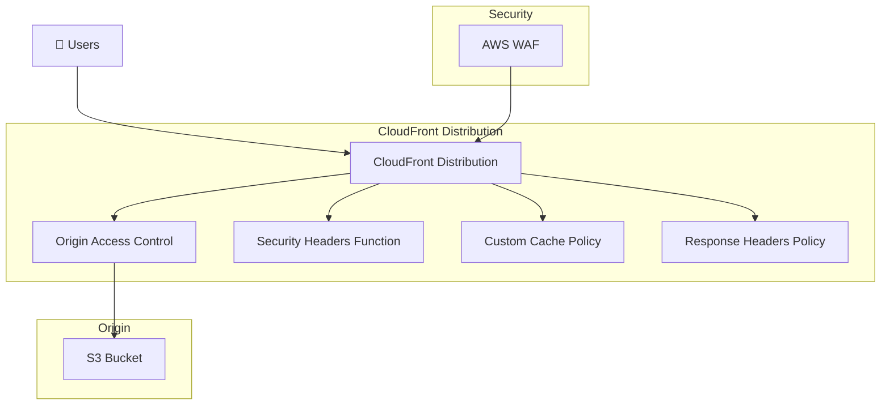

# CloudFront Module

A secure, high-performance CloudFront distribution module for static website hosting with comprehensive security features and global content delivery optimization.

## Features

- **🌍 Global CDN**: Worldwide content distribution with edge locations
- **🔒 Security First**: Origin Access Control (OAC), security headers, WAF integration
- **⚡ Performance**: HTTP/2, HTTP/3, Brotli compression, custom caching policies
- **🛡️ Protection**: Security headers via CloudFront Functions, custom error pages
- **📊 Monitoring**: Real-time metrics and CloudWatch integration

## Architecture



## Usage

### Basic Example

```hcl
module "cloudfront" {
  source = "./modules/networking/cloudfront"
  
  # Required variables
  distribution_name         = "my-static-website"
  s3_bucket_id             = module.s3.bucket_id
  s3_bucket_domain_name    = module.s3.bucket_domain_name
  
  # Optional customization
  distribution_comment     = "My Static Website CDN"
  price_class             = "PriceClass_100"  # US, Canada, Europe
  web_acl_id              = module.waf.web_acl_id
  waf_web_acl_dependency  = module.waf.web_acl
  
  # Performance settings
  default_root_object     = "index.html"
  
  # Common tags
  common_tags = {
    Environment = "production"
    Project     = "my-website"
  }
}
```

### Advanced Configuration

```hcl
module "cloudfront_advanced" {
  source = "./modules/networking/cloudfront"
  
  distribution_name         = "advanced-website"
  distribution_comment     = "Production website with advanced features"
  s3_bucket_id             = module.s3.bucket_id
  s3_bucket_domain_name    = module.s3.bucket_domain_name
  
  # Global distribution for maximum performance
  price_class             = "PriceClass_All"
  
  # Security integration
  web_acl_id              = module.waf.web_acl_id
  waf_web_acl_dependency  = module.waf.web_acl
  
  # Custom error handling
  custom_error_responses = [
    {
      error_code         = 404
      response_code      = 200
      response_page_path = "/404.html"
    }
  ]
  
  common_tags = {
    Environment = "production"
    Project     = "advanced-website"
    CostCenter  = "engineering"
  }
}
```

## Inputs

| Name | Description | Type | Default | Required |
|------|-------------|------|---------|----------|
| `distribution_name` | Name of the CloudFront distribution | `string` | n/a | yes |
| `s3_bucket_id` | S3 bucket ID for the origin | `string` | n/a | yes |
| `s3_bucket_domain_name` | S3 bucket domain name for the origin | `string` | n/a | yes |
| `distribution_comment` | Comment for the CloudFront distribution | `string` | `"Static website CloudFront distribution"` | no |
| `default_root_object` | Default root object for the distribution | `string` | `"index.html"` | no |
| `price_class` | Price class for the distribution | `string` | `"PriceClass_100"` | no |
| `web_acl_id` | WAF Web ACL ID to associate with the distribution | `string` | `null` | no |
| `waf_web_acl_dependency` | WAF Web ACL resource for dependency management | `any` | `null` | no |
| `allowed_methods` | HTTP methods allowed for the default cache behavior | `list(string)` | `["DELETE", "GET", "HEAD", "OPTIONS", "PATCH", "POST", "PUT"]` | no |
| `cached_methods` | HTTP methods that are cached | `list(string)` | `["GET", "HEAD"]` | no |
| `compress` | Enable compression for the distribution | `bool` | `true` | no |
| `is_ipv6_enabled` | Enable IPv6 for the distribution | `bool` | `true` | no |
| `min_ttl` | Minimum amount of time for objects to stay in CloudFront caches | `number` | `0` | no |
| `default_ttl` | Default amount of time for objects to stay in CloudFront caches | `number` | `86400` | no |
| `max_ttl` | Maximum amount of time for objects to stay in CloudFront caches | `number` | `31536000` | no |
| `common_tags` | Common tags to be applied to all resources | `map(string)` | `{}` | no |

### Price Class Options

- `PriceClass_All`: Global distribution (highest cost, best performance)
- `PriceClass_200`: US, Canada, Europe, Asia, Middle East, Africa
- `PriceClass_100`: US, Canada, Europe (lowest cost)

## Outputs

| Name | Description |
|------|-------------|
| `distribution_id` | ID of the CloudFront distribution |
| `distribution_arn` | ARN of the CloudFront distribution |
| `distribution_domain_name` | Domain name of the CloudFront distribution |
| `distribution_hosted_zone_id` | CloudFront hosted zone ID |
| `distribution_status` | Current status of the distribution |
| `origin_access_control_id` | ID of the CloudFront Origin Access Control |
| `cache_policy_id` | ID of the custom cache policy |
| `response_headers_policy_id` | ID of the response headers policy |
| `security_headers_function_arn` | ARN of the security headers CloudFront function |

## Security Features

### Origin Access Control (OAC)

Modern replacement for Origin Access Identity (OAI) with enhanced security:

- **Signed Requests**: All requests to S3 are cryptographically signed
- **SigV4 Protocol**: Uses AWS Signature Version 4 for authentication
- **S3 Bucket Policy Integration**: Restricts direct access to S3 bucket

### Security Headers Function

CloudFront Function that adds security headers to all responses:

```javascript
// Automatically added headers:
"Strict-Transport-Security": "max-age=63072000; includeSubdomains; preload"
"Content-Type-Options": "nosniff"
"X-Frame-Options": "DENY"
"Content-Security-Policy": "default-src 'self'; img-src 'self' data: https:; style-src 'self' 'unsafe-inline'"
```

### WAF Integration

- **Automatic Association**: Links with AWS WAF Web ACL when provided
- **OWASP Top 10 Protection**: Blocks common web attacks
- **Rate Limiting**: Configurable request rate limits
- **Dependency Management**: Ensures proper resource ordering

## Performance Optimizations

### HTTP/2 and HTTP/3 Support

- **Modern Protocols**: Supports latest HTTP standards
- **Multiplexing**: Multiple requests over single connection
- **Server Push**: Proactive resource delivery
- **Binary Protocol**: More efficient than HTTP/1.1

### Caching Strategy

```hcl
# Optimized caching for static content
cache_policy_settings = {
  default_ttl = 86400    # 1 day
  max_ttl     = 31536000 # 1 year
  min_ttl     = 0        # No minimum
}

# Cache based on query strings and headers
cache_key_policy = {
  query_strings = ["v", "version"]  # Cache versioned assets
  headers       = ["CloudFront-Viewer-Country"]
}
```

### Compression

- **Brotli and Gzip**: Automatic compression for text-based content
- **Content Types**: HTML, CSS, JavaScript, JSON, XML automatically compressed
- **Bandwidth Savings**: Up to 80% reduction in transfer size

## Custom Error Pages

Configure custom error responses for better user experience:

```hcl
custom_error_response {
  error_code         = 404
  response_code      = 200
  response_page_path = "/404.html"
}

custom_error_response {
  error_code         = 403
  response_code      = 200
  response_page_path = "/403.html"
}
```

## Monitoring and Logging

### CloudWatch Metrics

Automatic metrics collection:

- **Request Metrics**: Count, error rates, cache hit ratio
- **Data Transfer**: Bytes downloaded/uploaded
- **Performance**: Origin latency, viewer request time
- **Geographic**: Requests by country/region

### Real-time Logs

Optional real-time logging to Kinesis Data Streams:

```hcl
# Configure real-time logs (optional)
real_time_log_config = {
  enabled = true
  fields  = ["timestamp", "c-ip", "sc-status", "cs-method", "cs-uri-stem"]
}
```

## Dependencies

### Required Providers

```hcl
terraform {
  required_providers {
    aws = {
      source  = "hashicorp/aws"
      version = "~> 5.0"
    }
    random = {
      source  = "hashicorp/random"
      version = "~> 3.4"
    }
  }
}
```

### Module Dependencies

This module integrates with:

- **S3 Storage Module**: Requires S3 bucket for origin
- **WAF Security Module**: Optional WAF Web ACL integration
- **Monitoring Module**: CloudWatch dashboards and alarms

## Examples

See the [examples directory](../../../examples/) for complete usage examples:

- [Basic Static Website](../../../examples/basic-website/)
- [Multi-Environment Setup](../../../examples/multi-environment/)
- [Advanced Security Configuration](../../../examples/advanced-security/)

## Testing

Run the module tests:

```bash
# Unit tests
cd test/unit
./test-cloudfront.sh

# Integration tests
cd test/integration
./test-cloudfront-integration.sh
```

## Cost Considerations

### Pricing Factors

- **Requests**: $0.0075 per 10,000 requests (first 10 billion)
- **Data Transfer**: $0.085 per GB (first 10 TB)
- **Geographic Distribution**: Price class affects edge location coverage
- **Features**: Real-time logs, Lambda@Edge incur additional costs

### Cost Optimization

```hcl
# Development environment - cost optimized
price_class = "PriceClass_100"  # US/Canada/Europe only

# Production environment - performance optimized
price_class = "PriceClass_All"  # Global distribution
```

## Troubleshooting

### Common Issues

**Distribution Not Updating**
```bash
# CloudFront distributions take 15-20 minutes to deploy changes
# Check status: aws cloudfront get-distribution --id <distribution-id>
```

**403 Errors from S3**
```bash
# Verify OAC is properly configured and S3 bucket policy allows CloudFront access
# Check: aws s3api get-bucket-policy --bucket <bucket-name>
```

**Security Headers Not Applied**
```bash
# CloudFront Functions may take a few minutes to propagate globally
# Test headers: curl -I https://your-domain.com
```

### Debugging Commands

```bash
# View distribution configuration
aws cloudfront get-distribution-config --id <distribution-id>

# Check cache behavior
aws cloudfront get-cache-policy --id <cache-policy-id>

# Verify security headers function
aws cloudfront describe-function --name <function-name>
```

## License

This module is released under the MIT License. See [LICENSE](../../../../LICENSE) for details.

## Support

For issues and questions:

1. Check [Common Issues](#common-issues)
2. Review [AWS CloudFront Documentation](https://docs.aws.amazon.com/cloudfront/)
3. Open an issue in the project repository

---

**Note**: This module follows AWS Well-Architected Framework principles for performance, security, cost optimization, and reliability.