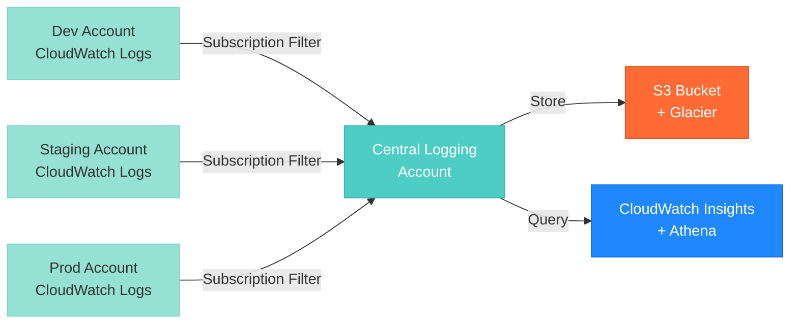

# Centralized Logging Module

⚠️ **Status**: Placeholder module - Implementation pending

---

## 📋 Overview

This module will provide centralized log aggregation across multiple AWS accounts, enabling unified log search, analysis, and retention management.

**Planned Use Case**: Aggregate CloudWatch Logs, VPC Flow Logs, and application logs from workload accounts (dev, staging, prod) to a central logging account for security analysis and compliance.

---

## 🎯 Planned Features

### 1. Cross-Account Log Aggregation



### 2. Planned Capabilities

- **Log Forwarding**: CloudWatch Logs subscription filters to Kinesis Data Firehose
- **S3 Storage**: Long-term retention in S3 with Glacier lifecycle
- **Log Analytics**: CloudWatch Insights and Athena for querying
- **Log Encryption**: KMS encryption at rest
- **Compliance**: 90-day retention for auditing
- **Cost Optimization**: Automatic transition to Glacier after 30 days

### 3. Planned Log Sources

| Source | Description | Retention |
|--------|-------------|-----------|
| CloudWatch Logs | Application and system logs | 90 days (hot) → Glacier |
| VPC Flow Logs | Network traffic metadata | 30 days (hot) → Glacier |
| S3 Access Logs | Object access patterns | 90 days (hot) → Glacier |
| CloudFront Logs | CDN request logs | 90 days (hot) → Glacier |
| CloudTrail Logs | API call audit trail | Organization-level (see aws-organizations module) |

---

## 🚧 Implementation Status

**Current State**: Module structure created, no resources defined

**Next Steps**:
1. Design centralized logging architecture
2. Implement Kinesis Data Firehose for log delivery
3. Configure S3 bucket for log storage
4. Set up CloudWatch subscription filters
5. Create Athena tables for log querying
6. Add example configurations

**Expected Completion**: Q1 2026

---

## 📥 Planned Inputs

*(Not yet implemented)*

```hcl
variable "logging_account_id" {
  description = "AWS account ID for centralized logging"
  type        = string
}

variable "source_accounts" {
  description = "List of account IDs to aggregate logs from"
  type        = list(string)
}

variable "log_retention_days" {
  description = "Number of days to retain logs in CloudWatch"
  type        = number
  default     = 90
}

variable "enable_vpc_flow_logs" {
  description = "Enable VPC flow log aggregation"
  type        = bool
  default     = false
}
```

---

## 📤 Planned Outputs

*(Not yet implemented)*

```hcl
output "central_log_bucket_arn" {
  description = "ARN of the central logging S3 bucket"
  value       = aws_s3_bucket.central_logs.arn
}

output "kinesis_firehose_arn" {
  description = "ARN of the Kinesis Firehose delivery stream"
  value       = aws_kinesis_firehose_delivery_stream.logs.arn
}
```

---

## 💰 Estimated Cost Impact

**When Implemented**:
- **Kinesis Data Firehose**: ~$0.029/GB ingested
- **S3 Storage**: ~$0.023/GB/month (Standard) → $0.004/GB/month (Glacier)
- **CloudWatch Logs**: $0.50/GB ingested
- **Athena Queries**: $5 per TB scanned

**Estimated Monthly Cost** (moderate traffic):
- Development: $5-10/month
- Staging: $15-25/month
- Production: $50-100/month

---

## 🔗 Related Modules

- **aws-organizations**: Implements organization-wide CloudTrail
- **monitoring**: Implements CloudWatch dashboards and alarms
- **cost-projection**: Estimates infrastructure costs

---

## 📚 References

- **AWS Architecture**: [Centralized Logging Best Practices](https://docs.aws.amazon.com/prescriptive-guidance/latest/centralized-logging/)
- **CloudWatch Logs Insights**: [Query Syntax](https://docs.aws.amazon.com/AmazonCloudWatch/latest/logs/CWL_QuerySyntax.html)
- **Athena for Logs**: [Query CloudWatch Logs](https://docs.aws.amazon.com/athena/latest/ug/cloudwatch-logs.html)

---

## 🤝 Contributing

To implement this module:

1. Review AWS centralized logging best practices
2. Design multi-account log aggregation architecture
3. Implement Kinesis Firehose + S3 + Athena stack
4. Add comprehensive examples
5. Update this README with actual usage documentation
6. Submit pull request

**Questions?** See [../../../docs/architecture.md](../../../docs/architecture.md) for architecture guidance.

---

## 📝 License

See [LICENSE](../../../../LICENSE) in repository root.
