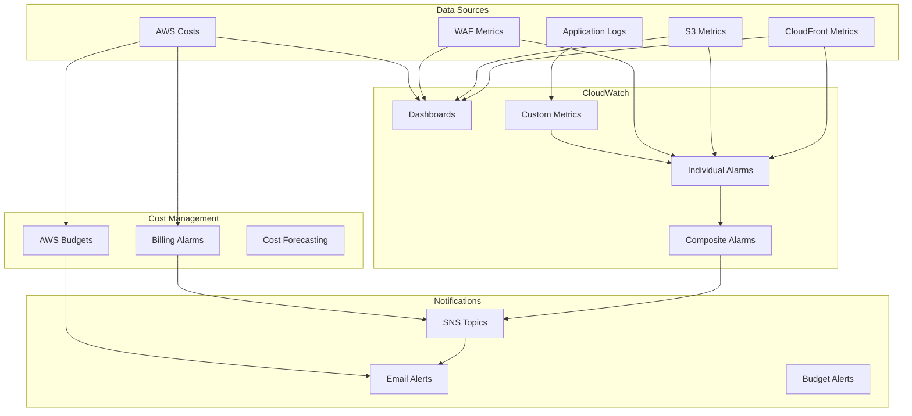

# Monitoring and Observability Module

Comprehensive monitoring and alerting solution for static website infrastructure with CloudWatch dashboards, alarms, cost management, and operational insights.

## Features

- **📊 Comprehensive Dashboards**: Real-time CloudWatch dashboards for all services
- **🚨 Intelligent Alerting**: Multi-layered alarm system with SNS notifications
- **💰 Cost Monitoring**: Budget alerts and cost projection with thresholds
- **📈 Performance Tracking**: CloudFront, S3, and WAF metrics with trend analysis
- **🔍 Log Analysis**: Centralized logging with metric filters and custom metrics
- **📧 Multi-channel Alerts**: Email notifications with escalation policies
- **🎯 Composite Alarms**: Website health overview with dependency mapping

## Architecture



## Monitoring Coverage

### CloudFront Metrics
- **Traffic**: Requests, bytes transferred, cache hit ratio
- **Performance**: Origin latency, response time percentiles
- **Errors**: 4xx/5xx error rates, origin errors
- **Security**: WAF blocked requests, security violations
- **Geographic**: Regional traffic distribution

### S3 Storage Metrics  
- **Storage**: Bucket size, object count, storage class distribution
- **Requests**: GET/PUT request counts, error rates
- **Performance**: Request latency, data retrieval time
- **Costs**: Storage costs by class, request charges

### WAF Security Metrics
- **Protection**: Allowed vs blocked requests
- **Threats**: Rule-specific blocks, attack patterns
- **Performance**: Rule evaluation time, capacity usage
- **Geographic**: Blocked requests by country

### Cost Monitoring
- **Budgets**: Monthly spending limits with forecasting
- **Service Costs**: Per-service cost breakdown
- **Trending**: Cost trends and anomaly detection
- **Forecasting**: Projected monthly costs

## Usage

### Basic Monitoring Setup

```hcl
module "monitoring" {
  source = "./modules/observability/monitoring"
  
  # Required identifiers
  project_name              = "my-website"
  cloudfront_distribution_id = module.cloudfront.distribution_id
  s3_bucket_name           = module.s3.bucket_name
  waf_web_acl_name         = module.waf.web_acl_name
  
  # Notification settings
  alert_email_addresses = [
    "ops-team@company.com",
    "admin@company.com"
  ]
  
  # Regional settings
  aws_region = "us-east-1"
  
  # Common tags
  common_tags = {
    Environment = "production"
    Project     = "my-website"
  }
}
```

### Advanced Monitoring Configuration

```hcl
module "monitoring_advanced" {
  source = "./modules/observability/monitoring"
  
  project_name              = "enterprise-website"
  cloudfront_distribution_id = module.cloudfront.distribution_id
  s3_bucket_name           = module.s3.bucket_name
  waf_web_acl_name         = module.waf.web_acl_name
  
  # Alert contacts
  alert_email_addresses = [
    "sre-team@company.com",
    "security-team@company.com", 
    "finance-team@company.com"
  ]
  
  # Performance thresholds
  cloudfront_error_rate_threshold  = 5.0    # 5% error rate
  cache_hit_rate_threshold        = 85.0   # 85% cache hit rate
  waf_blocked_requests_threshold  = 1000   # 1000 blocked requests
  
  # Cost management
  monthly_budget_limit    = 500.00
  s3_billing_threshold    = 50.00
  cloudfront_billing_threshold = 200.00
  
  # Enhanced features
  enable_deployment_metrics = true
  log_retention_days       = 90
  kms_key_arn             = aws_kms_key.monitoring.arn
  
  # Performance monitoring
  enable_detailed_monitoring = true
  custom_metrics_namespace  = "Custom/EnterpriseWebsite"
  
  common_tags = {
    Environment   = "production"
    Project      = "enterprise-website"
    Team         = "sre"
    CostCenter   = "engineering"
    Compliance   = "required"
  }
}
```

### Multi-Environment Setup

```hcl
module "monitoring_prod" {
  source = "./modules/observability/monitoring"
  
  project_name = "website-prod"
  # ... other configuration
  
  # Production-specific thresholds
  cloudfront_error_rate_threshold = 2.0   # Strict error rate
  monthly_budget_limit = 1000.00          # Higher budget
  
  common_tags = {
    Environment = "production"
    Criticality = "high"
  }
}

module "monitoring_staging" {
  source = "./modules/observability/monitoring"
  
  project_name = "website-staging"
  # ... other configuration
  
  # Staging-specific thresholds  
  cloudfront_error_rate_threshold = 10.0  # Relaxed error rate
  monthly_budget_limit = 100.00           # Lower budget
  
  common_tags = {
    Environment = "staging"
    Criticality = "medium"
  }
}
```

## Inputs

| Name | Description | Type | Default | Required |
|------|-------------|------|---------|----------|
| `project_name` | Name of the project for resource naming | `string` | n/a | yes |
| `cloudfront_distribution_id` | CloudFront distribution ID to monitor | `string` | n/a | yes |
| `s3_bucket_name` | S3 bucket name to monitor | `string` | n/a | yes |
| `waf_web_acl_name` | WAF Web ACL name to monitor | `string` | n/a | yes |
| `aws_region` | AWS region for S3 monitoring | `string` | `"us-east-1"` | no |
| `alert_email_addresses` | List of email addresses to receive alerts | `list(string)` | `[]` | no |
| `kms_key_arn` | KMS key ARN for encrypting SNS topics and logs | `string` | `null` | no |
| `cloudfront_error_rate_threshold` | Threshold for CloudFront 4xx error rate alarm (percentage) | `number` | `10.0` | no |
| `cache_hit_rate_threshold` | Threshold for CloudFront cache hit rate alarm (percentage) | `number` | `80.0` | no |
| `waf_blocked_requests_threshold` | Threshold for WAF blocked requests alarm | `number` | `500` | no |
| `s3_billing_threshold` | Threshold for S3 billing alarm (USD) | `number` | `25.0` | no |
| `cloudfront_billing_threshold` | Threshold for CloudFront billing alarm (USD) | `number` | `50.0` | no |
| `monthly_budget_limit` | Monthly budget limit (USD) | `number` | `100.0` | no |
| `enable_deployment_metrics` | Enable deployment success/failure metrics | `bool` | `false` | no |
| `log_retention_days` | CloudWatch log retention period in days | `number` | `30` | no |
| `enable_detailed_monitoring` | Enable detailed CloudWatch monitoring | `bool` | `false` | no |
| `custom_metrics_namespace` | Namespace for custom application metrics | `string` | `"Custom/StaticWebsite"` | no |
| `common_tags` | Common tags to apply to all resources | `map(string)` | `{}` | no |

### Threshold Guidelines

| Environment | Error Rate | Cache Hit | Budget | Use Case |
|-------------|------------|-----------|---------|----------|
| Development | 15% | 70% | $25 | Testing environment |
| Staging | 10% | 80% | $100 | Pre-production validation |
| Production | 5% | 85% | $500+ | Production workload |
| Enterprise | 2% | 90% | $1000+ | Mission-critical |

## Outputs

| Name | Description |
|------|-------------|
| `dashboard_url` | URL of the CloudWatch dashboard |
| `sns_topic_arn` | ARN of the SNS topic for alerts |
| `website_health_alarm_arn` | ARN of the composite website health alarm |
| `budget_name` | Name of the AWS Budget |
| `log_group_name` | Name of the CloudWatch log group for custom metrics |
| `all_alarms` | List of all created alarm ARNs |

## Dashboard Features

### Main Dashboard

The monitoring module creates a comprehensive CloudWatch dashboard with:

#### CloudFront Traffic Panel
- Request count and volume trends
- Bytes downloaded/uploaded metrics
- Geographic distribution heat map
- Cache performance metrics

#### Error Monitoring Panel  
- 4xx and 5xx error rates over time
- Error rate by geographic region
- Top error-generating URLs
- Origin response time correlation

#### S3 Storage Panel
- Bucket size trends and storage class distribution
- Object count growth over time
- Request patterns (GET vs PUT)
- Storage cost breakdown

#### WAF Security Panel
- Allowed vs blocked requests ratio
- Blocked requests by rule type
- Geographic blocking patterns
- Rate limiting violations

#### Cost Analysis Panel
- Monthly cost trends by service
- Budget utilization percentage
- Cost per request metrics
- Forecasted spending trajectory

### Custom Metrics Dashboard

For applications with custom metrics:

```hcl
# Custom application metrics
custom_metrics = {
  "DeploymentSuccess" = {
    namespace = "Custom/MyWebsite"
    metric_name = "DeploymentSuccess"
    statistic = "Sum"
  }
  
  "DeploymentFailure" = {
    namespace = "Custom/MyWebsite" 
    metric_name = "DeploymentFailure"
    statistic = "Sum"
  }
}
```

## Alerting Strategy

### Individual Alarms

#### High Priority (Immediate Response)
- **CloudFront High Error Rate**: > configured threshold
- **Website Health Composite**: Multiple component failures
- **Budget Exceeded**: > 100% of monthly limit
- **WAF High Attack Volume**: Unusual security events

#### Medium Priority (Business Hours)
- **Cache Hit Rate Low**: < configured threshold  
- **S3 Billing High**: Approaching cost limits
- **CloudFront Billing High**: Cost anomalies detected

#### Low Priority (Informational)
- **Budget Forecast**: Projected to exceed 80% of limit
- **Storage Growth**: Unusual S3 usage patterns

### Composite Alarms

The **Website Health** composite alarm triggers when:

```hcl
# Composite alarm logic
alarm_rule = "ALARM(CloudFrontHighErrorRate) OR ALARM(CloudFrontLowCacheHitRate) OR ALARM(WAFHighBlockedRequests)"
```

This provides a single health indicator for the entire website infrastructure.

### Escalation Policies

```hcl
# Different notification channels by severity
high_priority_actions = [
  aws_sns_topic.critical_alerts.arn,
  aws_sns_topic.sms_alerts.arn
]

medium_priority_actions = [
  aws_sns_topic.email_alerts.arn
]

low_priority_actions = [
  aws_sns_topic.info_alerts.arn
]
```

## Log Analysis and Metrics

### Custom Log Metric Filters

The module creates metric filters for common log patterns:

```hcl
# Deployment success/failure tracking
deployment_success_filter = {
  pattern = "DEPLOYMENT_SUCCESS"
  metric_name = "DeploymentSuccess"
  metric_value = "1"
}

deployment_failure_filter = {
  pattern = "DEPLOYMENT_FAILURE" 
  metric_name = "DeploymentFailure"
  metric_value = "1"
}

# Error rate tracking
error_rate_filter = {
  pattern = "[timestamp, request_id, ERROR, ...]"
  metric_name = "ApplicationErrors"
  metric_value = "1"
}
```

### Log Insights Queries

Pre-built queries for common investigations:

```sql
-- Top error patterns
fields @timestamp, @message
| filter @message like /ERROR/
| stats count() by @message
| sort count() desc
| limit 20

-- Deployment success rate
fields @timestamp, @message
| filter @message like /DEPLOYMENT/
| stats count() by @message
| sort @timestamp desc

-- Geographic error analysis  
fields @timestamp, country, error_type
| filter error_type = "4xx"
| stats count() by country
| sort count() desc
```

## Cost Management

### AWS Budgets Integration

```hcl
# Comprehensive budget with multiple thresholds
budget_configuration = {
  budget_type = "COST"
  limit_amount = var.monthly_budget_limit
  limit_unit = "USD"
  time_unit = "MONTHLY"
  
  # Multiple notification thresholds
  notifications = [
    {
      threshold = 50
      threshold_type = "PERCENTAGE" 
      notification_type = "FORECASTED"
    },
    {
      threshold = 80
      threshold_type = "PERCENTAGE"
      notification_type = "FORECASTED" 
    },
    {
      threshold = 100
      threshold_type = "PERCENTAGE"
      notification_type = "ACTUAL"
    }
  ]
}
```

### Service-Specific Cost Alarms

Individual billing alarms for each service:

- **S3 Storage**: Monitors storage and request costs
- **CloudFront**: Tracks data transfer and request charges  
- **WAF**: Monitors rule evaluation costs
- **CloudWatch**: Tracks monitoring and logging costs

### Cost Optimization Insights

```hcl
# Cost analysis metrics
cost_metrics = {
  "CostPerRequest" = {
    formula = "CloudFrontCosts / RequestCount"
    unit = "USD"
  }
  
  "StorageEfficiency" = {
    formula = "S3StorageCosts / S3ObjectCount" 
    unit = "USD"
  }
  
  "SecurityCostRatio" = {
    formula = "WAFCosts / TotalCosts * 100"
    unit = "Percent"
  }
}
```

## Performance Monitoring

### Response Time Tracking

```hcl
# CloudFront performance metrics
performance_metrics = [
  "OriginLatency",
  "ViewerRequestTime", 
  "CacheLookupTime",
  "ResponseTimeByStatus"
]

# Custom percentile tracking
response_time_percentiles = {
  p50 = "50th percentile response time"
  p90 = "90th percentile response time"
  p99 = "99th percentile response time"
}
```

### Availability Monitoring

```hcl
# Uptime calculation
availability_metric = {
  name = "WebsiteAvailability"
  formula = "(TotalRequests - ErrorRequests) / TotalRequests * 100"
  unit = "Percent"
  target = 99.9  # 99.9% uptime target
}
```

## Integration Examples

### Integration with CI/CD Pipeline

```yaml
# GitHub Actions integration
- name: Report Deployment Success
  run: |
    aws logs put-metric-data \
      --namespace Custom/${{ env.PROJECT_NAME }} \
      --metric-data MetricName=DeploymentSuccess,Value=1,Unit=Count
  
- name: Report Deployment Failure
  if: failure()
  run: |
    aws logs put-metric-data \
      --namespace Custom/${{ env.PROJECT_NAME }} \
      --metric-data MetricName=DeploymentFailure,Value=1,Unit=Count
```

### Slack Integration

```hcl
# SNS to Slack webhook
resource "aws_sns_topic_subscription" "slack_alerts" {
  topic_arn = module.monitoring.sns_topic_arn
  protocol  = "https"
  endpoint  = "https://hooks.slack.com/services/YOUR/SLACK/WEBHOOK"
}
```

### PagerDuty Integration

```hcl
# SNS to PagerDuty integration
resource "aws_sns_topic_subscription" "pagerduty" {
  topic_arn = module.monitoring.sns_topic_arn
  protocol  = "https" 
  endpoint  = "https://events.pagerduty.com/integration/YOUR-INTEGRATION-KEY"
}
```

## Testing

### Monitoring Tests

```bash
# Test dashboard accessibility
./test/monitoring/test-dashboard.sh --project-name my-website

# Test alarm functionality  
./test/monitoring/test-alarms.sh --alarm-name website-health

# Test notification delivery
./test/monitoring/test-notifications.sh --email test@example.com
```

### Load Testing Integration

```bash
# Trigger alarms during load testing
./test/load/run-load-test.sh --target https://example.com --concurrent 1000

# Monitor metrics during test
./test/monitoring/watch-metrics.sh --duration 300
```

## Troubleshooting

### Common Issues

**Dashboard Not Showing Data**
```bash
# Check metric availability
aws cloudwatch list-metrics \
  --namespace AWS/CloudFront \
  --dimensions Name=DistributionId,Value=<distribution-id>
```

**Alarms Not Triggering**
```bash
# Check alarm state and history
aws cloudwatch describe-alarms \
  --alarm-names <alarm-name>
  
aws cloudwatch describe-alarm-history \
  --alarm-name <alarm-name>
```

**Email Notifications Not Working**
```bash
# Check SNS subscription status
aws sns list-subscriptions-by-topic \
  --topic-arn <sns-topic-arn>

# Test SNS topic
aws sns publish \
  --topic-arn <sns-topic-arn> \
  --message "Test notification"
```

### Debugging Commands

```bash
# View recent CloudWatch events
aws logs describe-log-streams \
  --log-group-name <log-group-name> \
  --order-by LastEventTime \
  --descending

# Check budget status
aws budgets describe-budget \
  --account-id <account-id> \
  --budget-name <budget-name>

# Monitor real-time metrics
aws cloudwatch get-metric-statistics \
  --namespace AWS/CloudFront \
  --metric-name Requests \
  --dimensions Name=DistributionId,Value=<distribution-id> \
  --start-time $(date -u -d '1 hour ago' +%Y-%m-%dT%H:%M:%S) \
  --end-time $(date -u +%Y-%m-%dT%H:%M:%S) \
  --period 300 \
  --statistics Sum
```

## Best Practices

### Monitoring Strategy

1. **Layered Monitoring**: Individual component alarms + composite health checks
2. **Threshold Tuning**: Start conservative, adjust based on baseline behavior  
3. **Alert Fatigue**: Avoid too many low-priority alerts
4. **Escalation Paths**: Clear escalation for different severity levels
5. **Regular Review**: Monthly review of thresholds and alert effectiveness

### Cost Optimization

1. **Right-sized Budgets**: Set realistic limits based on usage patterns
2. **Graduated Alerts**: Multiple warning levels (50%, 80%, 100%)
3. **Service Attribution**: Track costs by service for optimization
4. **Trend Analysis**: Monitor cost trends for capacity planning

### Performance Monitoring

1. **SLA Definition**: Clear uptime and performance targets
2. **User Experience**: Focus on metrics that affect users
3. **Proactive Alerts**: Catch issues before users notice
4. **Capacity Planning**: Monitor trends for scaling decisions

## Security Considerations

### Access Control

```hcl
# CloudWatch dashboard access policy
dashboard_policy = {
  Version = "2012-10-17"
  Statement = [
    {
      Effect = "Allow"
      Principal = {
        AWS = ["arn:aws:iam::account:role/monitoring-team"]
      }
      Action = [
        "cloudwatch:GetDashboard",
        "cloudwatch:ListDashboards"
      ]
      Resource = "*"
    }
  ]
}
```

### Data Encryption

- **SNS Topics**: Encrypted with KMS when key provided
- **CloudWatch Logs**: Encrypted at rest with KMS
- **Parameter Store**: Secure storage for sensitive thresholds

### Audit Trail

- **CloudTrail Integration**: All monitoring changes logged
- **Access Logging**: Dashboard and alarm access tracked
- **Change Detection**: Automated detection of monitoring configuration changes

## Examples

See the [examples directory](../../../examples/) for complete implementations:

- [Basic Website Monitoring](../../../examples/basic-monitoring/)
- [Enterprise Monitoring Setup](../../../examples/enterprise-monitoring/)
- [Multi-Environment Monitoring](../../../examples/multi-env-monitoring/)

## License

This module is released under the MIT License. See [LICENSE](../../../../LICENSE) for details.

---

**📊 Monitoring Philosophy**: "You cannot improve what you cannot measure. Monitor everything, alert intelligently, and act decisively."