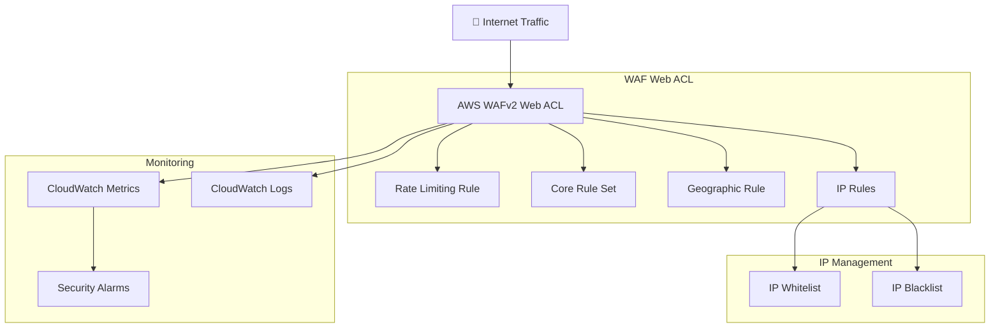

# WAF Security Module

A comprehensive AWS WAF v2 module providing enterprise-grade web application security with OWASP Top 10 protection, rate limiting, and advanced threat detection for CloudFront distributions.

## Features

- **🛡️ OWASP Top 10 Protection**: AWS Managed Core Rule Set for common vulnerabilities
- **⚡ Rate Limiting**: IP-based request throttling with configurable limits
- **🌍 Geographic Controls**: Country-based access control and geo-blocking
- **🔒 IP Management**: Whitelist and blacklist functionality with CIDR support
- **📊 Comprehensive Logging**: CloudWatch integration with configurable retention
- **🚨 Real-time Monitoring**: CloudWatch alarms for security events
- **🔍 Request Sampling**: Detailed analysis of blocked/allowed traffic

## Architecture



## Security Rules

### 1. Rate Limiting Rule (Priority 1)
- **Purpose**: Prevent DDoS and brute force attacks
- **Method**: IP-based request counting over 5-minute windows
- **Action**: Block IPs exceeding configured threshold
- **Default**: 2000 requests per 5 minutes per IP

### 2. AWS Managed Core Rule Set (Priority 2)
- **Purpose**: OWASP Top 10 protection
- **Coverage**: SQL injection, XSS, RFI, LFI, command injection
- **Maintenance**: Automatically updated by AWS
- **Customizable**: Override specific rules to COUNT mode

### 3. Known Bad Inputs (Priority 3)
- **Purpose**: Block known malicious patterns
- **Coverage**: Common attack vectors and exploits
- **Performance**: Low latency, high-accuracy detection
- **Updates**: Maintained by AWS security team

### 4. IP Reputation (Priority 4)
- **Purpose**: Block traffic from known malicious IPs
- **Sources**: AWS threat intelligence feeds
- **Coverage**: Compromised hosts, open proxies, malicious bots
- **Accuracy**: Continuously updated threat data

### 5. Geographic Controls (Priority 10)
- **Purpose**: Country-based access control
- **Method**: GeoIP lookup and blocking
- **Configuration**: ISO 3166-1 alpha-2 country codes
- **Use Cases**: Compliance, regional restrictions

### 6. IP Whitelist (Priority 5)
- **Purpose**: Always allow trusted IPs
- **Method**: CIDR block matching
- **Scope**: Override all blocking rules
- **Use Cases**: Admin access, partner networks

### 7. IP Blacklist (Priority 6)
- **Purpose**: Block specific malicious IPs
- **Method**: Exact IP or CIDR matching  
- **Priority**: High priority blocking
- **Use Cases**: Known attackers, abuse sources

## Usage

### Basic Configuration

```hcl
module "waf" {
  source = "./modules/security/waf"
  
  # Required configuration
  web_acl_name = "my-website-waf"
  
  # Rate limiting (requests per 5-minute window per IP)
  rate_limit = 2000
  
  # Basic security settings
  max_body_size = 8192  # 8KB request body limit
  
  # Common tags
  common_tags = {
    Environment = "production"
    Project     = "my-website"
  }
}
```

### Advanced Security Configuration

```hcl
module "waf_advanced" {
  source = "./modules/security/waf"
  
  web_acl_name = "advanced-security-waf"
  
  # Strict rate limiting for high-security environments
  rate_limit = 1000
  
  # Geographic restrictions
  enable_geo_blocking = true
  blocked_countries   = ["CN", "RU", "KP"]  # Block China, Russia, North Korea
  
  # IP management
  ip_whitelist = [
    "203.0.113.0/24",     # Office network
    "198.51.100.50/32",   # Admin IP
  ]
  
  ip_blacklist = [
    "192.0.2.0/24",       # Known attack source
    "198.51.100.100/32",  # Specific malicious IP
  ]
  
  # Core Rule Set customization
  core_rule_set_overrides = [
    "GenericRFI_BODY",    # Override if causing false positives
    "SizeRestrictions_BODY"
  ]
  
  # Enhanced monitoring
  enable_sampling         = true
  log_retention_days     = 90
  kms_key_arn           = data.aws_kms_key.security.arn
  
  # Alerting configuration
  blocked_requests_threshold = 500
  alarm_actions = [
    aws_sns_topic.security_alerts.arn
  ]
  
  common_tags = {
    Environment = "production"
    Project     = "advanced-website"
    Security    = "high"
    Compliance  = "required"
  }
}
```

### Integration with CloudFront

```hcl
module "waf" {
  source = "./modules/security/waf"
  
  web_acl_name = "cloudfront-protection"
  rate_limit   = 5000
  
  common_tags = var.common_tags
}

module "cloudfront" {
  source = "./modules/networking/cloudfront"
  
  distribution_name      = "secure-website"
  s3_bucket_id          = module.s3.bucket_id
  s3_bucket_domain_name = module.s3.bucket_domain_name
  
  # Associate WAF with CloudFront
  web_acl_id            = module.waf.web_acl_id
  waf_web_acl_dependency = module.waf.web_acl
  
  common_tags = var.common_tags
}
```

## Inputs

| Name | Description | Type | Default | Required |
|------|-------------|------|---------|----------|
| `web_acl_name` | Name of the WAF Web ACL | `string` | n/a | yes |
| `rate_limit` | Rate limit for requests per 5-minute period from a single IP | `number` | `2000` | no |
| `core_rule_set_overrides` | List of Core Rule Set rules to override (set to COUNT mode) | `list(string)` | `[]` | no |
| `enable_geo_blocking` | Enable geographic blocking | `bool` | `false` | no |
| `blocked_countries` | List of country codes to block (ISO 3166-1 alpha-2) | `list(string)` | `[]` | no |
| `ip_whitelist` | List of IP addresses/CIDR blocks to whitelist | `list(string)` | `[]` | no |
| `ip_blacklist` | List of IP addresses/CIDR blocks to blacklist | `list(string)` | `[]` | no |
| `max_body_size` | Maximum request body size in bytes | `number` | `8192` | no |
| `log_retention_days` | Number of days to retain WAF logs | `number` | `30` | no |
| `kms_key_arn` | KMS key ARN for encrypting WAF logs | `string` | `null` | no |
| `blocked_requests_threshold` | Threshold for blocked requests alarm | `number` | `100` | no |
| `alarm_actions` | List of alarm actions (SNS topic ARNs) | `list(string)` | `[]` | no |
| `enable_sampling` | Enable request sampling for detailed monitoring | `bool` | `true` | no |
| `common_tags` | Common tags to apply to all resources | `map(string)` | `{}` | no |

### Rate Limiting Guidelines

| Environment | Recommended Rate Limit | Use Case |
|-------------|----------------------|----------|
| Development | 500-1000 | Testing and development |
| Staging | 1000-2000 | Pre-production validation |
| Production (Low Traffic) | 2000-5000 | Small to medium websites |
| Production (High Traffic) | 5000-10000 | Large websites and applications |
| Enterprise | 10000+ | High-volume applications |

### Country Codes

Use ISO 3166-1 alpha-2 format for country blocking:

```hcl
# Common country codes for security blocking
blocked_countries = [
  "CN",  # China
  "RU",  # Russia
  "KP",  # North Korea
  "IR",  # Iran
  "SY",  # Syria
]

# Regional blocking examples
blocked_countries = [
  "AU", "NZ",     # Block Oceania
  "BR", "AR",     # Block South America
]
```

## Outputs

| Name | Description |
|------|-------------|
| `web_acl_id` | ID of the WAF Web ACL |
| `web_acl_arn` | ARN of the WAF Web ACL |
| `web_acl_name` | Name of the WAF Web ACL |
| `web_acl_capacity` | Current capacity used by the Web ACL |
| `log_group_arn` | ARN of the CloudWatch log group for WAF logs |
| `log_group_name` | Name of the CloudWatch log group for WAF logs |
| `ip_whitelist_arn` | ARN of the IP whitelist set (if created) |
| `ip_blacklist_arn` | ARN of the IP blacklist set (if created) |

## Monitoring and Alerting

### CloudWatch Metrics

Automatically collected metrics:

- **AllowedRequests**: Number of requests allowed
- **BlockedRequests**: Number of requests blocked  
- **CountedRequests**: Number of requests counted (override rules)
- **PassedRequests**: Number of requests passed to origin
- **SampledRequests**: Sampled request details

### Custom Alarms

Built-in CloudWatch alarms:

```hcl
# High blocked requests alarm
blocked_requests_alarm = {
  threshold = var.blocked_requests_threshold
  period    = 300  # 5 minutes
  statistic = "Sum"
}

# Rate limit hits alarm
rate_limit_alarm = {
  threshold = 10   # 10 IPs hitting rate limit
  period    = 300
  statistic = "Sum"
}
```

### Log Analysis

WAF logs are stored in CloudWatch Logs with structured JSON format:

```json
{
  "timestamp": 1576280412771,
  "formatVersion": 1,
  "webaclId": "arn:aws:wafv2:us-east-1:123456789012:global/webacl/ExampleWebACL",
  "terminatingRuleId": "DefaultAction",
  "terminatingRuleType": "REGULAR",
  "action": "ALLOW",
  "httpSourceName": "CF",
  "httpSourceId": "i-1234567890abcdef0",
  "ruleGroupList": [],
  "rateBasedRuleList": [],
  "nonTerminatingMatchingRules": [],
  "httpRequest": {
    "clientIp": "192.0.2.44",
    "country": "US",
    "headers": [
      {
        "name": "Host",
        "value": "example.com"
      }
    ],
    "uri": "/",
    "args": "",
    "httpVersion": "HTTP/2.0",
    "httpMethod": "GET",
    "requestId": "rid"
  }
}
```

## Security Best Practices

### Rule Ordering

Rules are evaluated in priority order (1 = highest):

1. **Rate Limiting** (Priority 1): Fast blocking of obvious abuse
2. **Core Rule Set** (Priority 2): OWASP Top 10 protection
3. **Known Bad Inputs** (Priority 3): Pattern-based blocking
4. **IP Reputation** (Priority 4): Threat intelligence
5. **IP Whitelist** (Priority 5): Trusted source bypass
6. **IP Blacklist** (Priority 6): Known bad actors
7. **Geographic** (Priority 10): Country-based controls

### Performance Optimization

- **Rule Efficiency**: Most common blocks at highest priority
- **Capacity Planning**: Monitor Web ACL capacity usage
- **Regional Deployment**: WAF must be in us-east-1 for CloudFront
- **Caching Impact**: Consider impact on CloudFront cache hit ratio

### Security Hardening

```hcl
# High-security configuration
module "waf_hardened" {
  source = "./modules/security/waf"
  
  web_acl_name = "hardened-waf"
  
  # Aggressive rate limiting
  rate_limit = 500
  
  # Strict body size limit
  max_body_size = 4096
  
  # Enable all security features
  enable_geo_blocking = true
  enable_sampling     = true
  
  # Extended log retention for forensics
  log_retention_days = 365
  
  # Encrypted logs
  kms_key_arn = aws_kms_key.security.arn
  
  common_tags = {
    SecurityLevel = "Maximum"
    Compliance    = "Required"
  }
}
```

## Testing

### Unit Tests

```bash
# Run WAF module tests
cd test/unit
./test-waf.sh

# Test specific security rules
./test-waf-rules.sh --rule-set core
./test-waf-rules.sh --rule-set rate-limit
```

### Security Testing

```bash
# Test rate limiting (requires running WAF)
./test/security/test-rate-limiting.sh --target https://example.com

# Test OWASP Top 10 protection
./test/security/test-owasp-top10.sh --target https://example.com

# Test geographic blocking
./test/security/test-geo-blocking.sh --target https://example.com --country CN
```

### Penetration Testing

Consider professional security testing:

- **OWASP ZAP**: Automated security scanning
- **Burp Suite**: Manual penetration testing
- **AWS Security Hub**: Compliance scanning
- **Third-party Testing**: Professional security audits

## Cost Considerations

### Pricing Components

1. **Web ACL**: $1.00 per Web ACL per month
2. **Rules**: $0.60 per million requests evaluated
3. **Request Processing**: $0.60 per million requests
4. **Managed Rule Groups**: $1.00 per million requests (Core Rule Set)
5. **IP Lists**: $1.00 per IP list per month
6. **Logs**: CloudWatch Logs standard pricing

### Cost Optimization

```hcl
# Development environment - cost optimized
module "waf_dev" {
  source = "./modules/security/waf"
  
  web_acl_name = "dev-waf"
  
  # Minimal rule set for development
  rate_limit = 10000  # Higher limit for testing
  
  # Shorter log retention
  log_retention_days = 7
  
  # Disable expensive features
  enable_sampling = false
  
  common_tags = {
    Environment = "development"
    CostOptimized = "true"
  }
}
```

### Capacity Management

WAF Web ACLs have capacity limits:

- **Maximum Capacity**: 1,500 WCU (Web ACL Capacity Units)
- **Core Rule Set**: ~700 WCU
- **Rate-based Rule**: ~2 WCU
- **IP Match Rule**: ~1 WCU per 1,000 IPs

Monitor capacity usage:

```bash
# Check Web ACL capacity
aws wafv2 describe-web-acl \
  --scope CLOUDFRONT \
  --id <web-acl-id> \
  --query 'WebACL.Capacity'
```

## Troubleshooting

### Common Issues

**False Positives**
```hcl
# Override specific Core Rule Set rules causing false positives
core_rule_set_overrides = [
  "GenericRFI_BODY",
  "GenericRFI_QUERYARGUMENTS", 
  "SizeRestrictions_BODY"
]
```

**Rate Limiting Too Aggressive**
```bash
# Check blocked requests metrics
aws cloudwatch get-metric-statistics \
  --namespace AWS/WAFV2 \
  --metric-name BlockedRequests \
  --dimensions Name=WebACL,Value=<web-acl-name> \
  --start-time 2023-01-01T00:00:00Z \
  --end-time 2023-01-01T23:59:59Z \
  --period 3600 \
  --statistics Sum
```

**Geographic Blocking Issues**
```bash
# Test IP geolocation
curl -s "http://ip-api.com/json/8.8.8.8" | jq .country
```

### Debugging Commands

```bash
# List Web ACLs
aws wafv2 list-web-acls --scope CLOUDFRONT

# Get Web ACL configuration
aws wafv2 get-web-acl --scope CLOUDFRONT --id <web-acl-id>

# Check sampled requests
aws wafv2 get-sampled-requests \
  --web-acl-arn <web-acl-arn> \
  --rule-metric-name <rule-name> \
  --scope CLOUDFRONT \
  --time-window StartTime=<start>,EndTime=<end> \
  --max-items 100
```

### Log Analysis Queries

CloudWatch Logs Insights queries:

```sql
-- Top blocked IP addresses
fields @timestamp, httpRequest.clientIp, action
| filter action = "BLOCK"
| stats count() by httpRequest.clientIp
| sort count() desc
| limit 20

-- Rate limit violations
fields @timestamp, httpRequest.clientIp, terminatingRuleId
| filter terminatingRuleId = "RateLimitRule"
| stats count() by httpRequest.clientIp
| sort count() desc

-- Geographic analysis
fields @timestamp, httpRequest.clientIp, httpRequest.country, action
| filter action = "BLOCK"
| stats count() by httpRequest.country
| sort count() desc
```

## Compliance

### Standards Supported

- **OWASP Top 10**: Core Rule Set provides comprehensive coverage
- **PCI DSS**: Web application security requirements
- **SOC 2**: Security monitoring and logging
- **ISO 27001**: Information security management
- **NIST Cybersecurity Framework**: Detect, protect, respond

### Audit Features

- **Comprehensive Logging**: All requests logged with detailed metadata
- **Immutable Logs**: CloudWatch Logs with optional KMS encryption
- **Metrics Export**: CloudWatch metrics for compliance reporting
- **Access Patterns**: Geographic and behavioral analysis

## Examples

### E-commerce Security

```hcl
module "ecommerce_waf" {
  source = "./modules/security/waf"
  
  web_acl_name = "ecommerce-security"
  
  # Moderate rate limiting for customer traffic
  rate_limit = 3000
  
  # Block high-risk countries for payment processing
  enable_geo_blocking = true
  blocked_countries = ["CN", "RU", "KP", "IR"]
  
  # Allow office and payment processor IPs
  ip_whitelist = [
    "203.0.113.0/24",    # Office network
    "198.51.100.0/28",   # Payment processor
  ]
  
  # Enhanced monitoring for financial compliance
  enable_sampling    = true
  log_retention_days = 365
  
  common_tags = {
    Environment = "production"
    Application = "ecommerce"
    Compliance  = "PCI-DSS"
  }
}
```

### API Protection

```hcl
module "api_waf" {
  source = "./modules/security/waf"
  
  web_acl_name = "api-protection"
  
  # Strict rate limiting for API endpoints
  rate_limit = 1000
  
  # Smaller body size for API requests
  max_body_size = 4096
  
  # API-specific overrides
  core_rule_set_overrides = [
    "SizeRestrictions_BODY",     # APIs may have larger payloads
    "GenericRFI_QUERYARGUMENTS"  # APIs use complex query params
  ]
  
  # Enhanced alerting for API abuse
  blocked_requests_threshold = 50
  alarm_actions = [aws_sns_topic.api_alerts.arn]
  
  common_tags = {
    Environment = "production"
    Application = "api"
    Tier        = "critical"
  }
}
```

## License

This module is released under the MIT License. See [LICENSE](../../../../LICENSE) for details.

## Support

For security issues and questions:

1. Review [AWS WAF Documentation](https://docs.aws.amazon.com/waf/)
2. Check [Security Best Practices](#security-best-practices)
3. Contact security team for incident response
4. Open issue for non-security bugs

---

**⚠️ Security Notice**: This module provides baseline security. Additional security measures may be required based on your specific threat model and compliance requirements.