# S3 Module

Secure S3 bucket configuration for static website hosting with encryption, cross-region replication, and comprehensive security controls.

## 📋 Module Overview

**🎯 Purpose**: Provides secure S3 storage for static website content with enterprise-grade security, backup, and cost optimization features.

**🔑 Key Features**:
- **Security**: Server-side encryption with KMS, public access blocking, secure bucket policies
- **Availability**: Cross-region replication for disaster recovery
- **Cost Optimization**: Intelligent tiering and lifecycle management
- **Compliance**: ASVS L1/L2 requirements and AWS security best practices

**🏗️ Architecture**:

```mermaid
graph LR
    %% Accessibility
    accTitle: S3 Module Architecture
    accDescr: Shows primary S3 bucket in us-east-1 replicating to secondary bucket in us-west-2, with separate access logs bucket for monitoring and compliance.

    subgraph "Primary Region (us-east-1)"
        PRIMARY[📦 Primary S3 Bucket<br/>• Website Files<br/>• KMS Encryption<br/>• Intelligent Tiering<br/>• Lifecycle Policies]
    end

    subgraph "Secondary Region (us-west-2)"
        SECONDARY[🔄 Secondary S3 Bucket<br/>• Replicated Content<br/>• Cross-Region Backup<br/>• Same Security Config<br/>• Disaster Recovery]
    end

    subgraph "Logging"
        LOGS[📊 Access Logs Bucket<br/>• Request Logging<br/>• Security Monitoring<br/>• Compliance Tracking<br/>• CloudTrail Integration]
    end

    %% Flow
    PRIMARY --> SECONDARY
    PRIMARY --> LOGS

    %% Styling
    classDef primaryBox fill:#e3f2fd,stroke:#1565c0,stroke-width:3px,color:#0d47a1
    classDef secondaryBox fill:#fff3cd,stroke:#856404,stroke-width:2px,color:#212529
    classDef logsBox fill:#e8f5e8,stroke:#2e7d32,stroke-width:2px,color:#1b5e20

    class PRIMARY primaryBox
    class SECONDARY secondaryBox
    class LOGS logsBox
```


## 🔧 Usage

### Basic Configuration

```hcl
module "s3" {
  source = "./modules/s3"

  # Required
  project_name = "my-website"
  environment  = "prod"

  # Optional
  enable_cross_region_replication = true
  replication_region = "us-west-2"
  
  # Tags
  tags = {
    Environment = "production"
    Project     = "static-website"
    ManagedBy   = "terraform"
  }
}
```

### Advanced Configuration

```hcl
module "s3" {
  source = "./modules/s3"

  # Basic settings
  project_name = "enterprise-website"
  environment  = "prod"
  
  # Security settings
  kms_key_id = "arn:aws:kms:us-east-1:123456789012:key/12345678-1234-1234-1234-123456789012"
  enable_versioning = true
  
  # Replication settings
  enable_cross_region_replication = true
  replication_region = "us-west-2"
  replication_storage_class = "STANDARD_IA"
  
  # Lifecycle settings
  transition_to_ia_days = 30
  transition_to_glacier_days = 90
  expiration_days = 365
  
  # Monitoring
  enable_access_logging = true
  enable_server_access_logging = true
  
  # Compliance
  force_destroy = false
  
  tags = {
    Environment = "production"
    Project     = "enterprise-website"
    ManagedBy   = "terraform"
    Compliance  = "ASVS-L2"
  }
}
```

## 📥 Inputs

### Required Variables

| Name | Description | Type | Example |
|------|-------------|------|---------|
| `project_name` | Project identifier for resource naming | `string` | `"my-website"` |
| `environment` | Environment name (dev, staging, prod) | `string` | `"prod"` |

### Optional Variables

| Name | Description | Type | Default | Example |
|------|-------------|------|---------|---------|
| `enable_cross_region_replication` | Enable cross-region replication | `bool` | `false` | `true` |
| `replication_region` | Secondary region for replication | `string` | `"us-west-2"` | `"eu-west-1"` |
| `replication_storage_class` | Storage class for replicated objects | `string` | `"STANDARD"` | `"STANDARD_IA"` |
| `kms_key_id` | KMS key for encryption | `string` | `null` | `"arn:aws:kms:..."` |
| `enable_versioning` | Enable S3 versioning | `bool` | `true` | `false` |
| `transition_to_ia_days` | Days to transition to IA | `number` | `30` | `60` |
| `transition_to_glacier_days` | Days to transition to Glacier | `number` | `90` | `180` |
| `expiration_days` | Days to expire objects | `number` | `365` | `730` |
| `enable_access_logging` | Enable access logging | `bool` | `true` | `false` |
| `enable_server_access_logging` | Enable server access logging | `bool` | `true` | `false` |
| `force_destroy` | Allow bucket destruction | `bool` | `false` | `true` |
| `tags` | Resource tags | `map(string)` | `{}` | `{"Environment": "prod"}` |

### Validation Rules

- `project_name`: Must be 3-63 characters, lowercase, alphanumeric with hyphens
- `environment`: Must be one of: dev, staging, prod
- `replication_region`: Must be different from primary region
- `*_days`: Must be positive integers
- `kms_key_id`: Must be valid KMS key ARN if provided

## 📤 Outputs

| Name | Description | Type | Example |
|------|-------------|------|---------|
| `bucket_id` | Primary S3 bucket ID | `string` | `"my-website-prod-content"` |
| `bucket_arn` | Primary S3 bucket ARN | `string` | `"arn:aws:s3:::my-website-prod-content"` |
| `bucket_domain_name` | Primary S3 bucket domain name | `string` | `"my-website-prod-content.s3.amazonaws.com"` |
| `bucket_regional_domain_name` | Regional domain name | `string` | `"my-website-prod-content.s3.us-east-1.amazonaws.com"` |
| `replication_bucket_id` | Replication bucket ID | `string` | `"my-website-prod-replication"` |
| `replication_bucket_arn` | Replication bucket ARN | `string` | `"arn:aws:s3:::my-website-prod-replication"` |
| `access_logs_bucket_id` | Access logs bucket ID | `string` | `"my-website-prod-access-logs"` |
| `access_logs_bucket_arn` | Access logs bucket ARN | `string` | `"arn:aws:s3:::my-website-prod-access-logs"` |
| `kms_key_id` | KMS key ID used for encryption | `string` | `"arn:aws:kms:us-east-1:123456789012:key/..."` |
| `replication_configuration` | Replication configuration | `object` | `{status: "Enabled", ...}` |

## 🔐 Security Features

### Encryption

- **Server-side encryption** with KMS keys
- **Bucket key** optimization for cost reduction
- **Encryption in transit** for all API calls
- **Key rotation** support for enhanced security

### Access Control

- **Public access blocking** at bucket and account level
- **Bucket policies** with least privilege access
- **IAM integration** for role-based access
- **Origin Access Control** for CloudFront integration

### Monitoring & Logging

- **Access logging** to dedicated logging bucket
- **CloudTrail integration** for API activity
- **CloudWatch metrics** for monitoring
- **Compliance reporting** for audit requirements

### Backup & Recovery

- **Cross-region replication** for disaster recovery
- **Versioning** with lifecycle management
- **Point-in-time recovery** capabilities
- **Automated backup validation**

## 🔄 Cross-Region Replication

### Configuration

```hcl
# Enable replication
enable_cross_region_replication = true
replication_region = "us-west-2"
replication_storage_class = "STANDARD_IA"

# Replication settings
replication_prefix = "static-content/"
replication_delete_marker_replication = true
replication_replica_modifications = true
```

### Replication Rules

1. **Full Bucket Replication**: All objects replicated to secondary region
2. **Prefix-based Replication**: Optional prefix filtering
3. **Storage Class Transition**: Automatic cost optimization
4. **Delete Marker Replication**: Maintains consistency
5. **Replica Modifications**: Synchronizes metadata changes

### Monitoring Replication

```bash
# Check replication status
aws s3api get-bucket-replication --bucket my-website-prod-content

# Monitor replication metrics
aws cloudwatch get-metric-statistics \
  --namespace AWS/S3 \
  --metric-name ReplicationLatency \
  --dimensions Name=SourceBucket,Value=my-website-prod-content \
  --start-time $(date -d '1 hour ago' -u +%Y-%m-%dT%H:%M:%S) \
  --end-time $(date -u +%Y-%m-%dT%H:%M:%S) \
  --period 300 \
  --statistics Average,Maximum
```

## 💰 Cost Optimization

### Intelligent Tiering

- **Automatic optimization** based on access patterns
- **Standard tier** for frequently accessed objects
- **Infrequent Access tier** for less frequently accessed objects
- **Archive tiers** for long-term storage

### Lifecycle Management

```hcl
# Lifecycle configuration
transition_to_ia_days = 30        # Move to IA after 30 days
transition_to_glacier_days = 90   # Move to Glacier after 90 days
expiration_days = 365             # Delete after 1 year
```

### Cost Monitoring

```bash
# Check storage costs
aws ce get-cost-and-usage \
  --time-period Start=$(date -d '1 month ago' +%Y-%m-%d),End=$(date +%Y-%m-%d) \
  --granularity MONTHLY \
  --metrics BlendedCost \
  --group-by Type=DIMENSION,Key=SERVICE \
  --filter '{"Dimensions":{"Key":"SERVICE","Values":["Amazon Simple Storage Service"]}}'
```

## 🔍 Troubleshooting

### Common Issues

**Access Denied Errors**:
```bash
# Check bucket policy
aws s3api get-bucket-policy --bucket my-website-prod-content

# Verify public access block
aws s3api get-public-access-block --bucket my-website-prod-content
```

**Replication Issues**:
```bash
# Check replication configuration
aws s3api get-bucket-replication --bucket my-website-prod-content

# Verify IAM role permissions
aws iam get-role --role-name s3-replication-role
```

**Encryption Issues**:
```bash
# Check encryption configuration
aws s3api get-bucket-encryption --bucket my-website-prod-content

# Verify KMS key permissions
aws kms describe-key --key-id arn:aws:kms:us-east-1:123456789012:key/12345678-1234-1234-1234-123456789012
```

### Debug Commands

```bash
# Test bucket access
aws s3 ls s3://my-website-prod-content/

# Check lifecycle configuration
aws s3api get-bucket-lifecycle-configuration --bucket my-website-prod-content

# Monitor access logs
aws s3 ls s3://my-website-prod-access-logs/
```

## 🧪 Testing

### Unit Tests

```bash
# Run S3 module tests
cd ../../../test/unit
./test-s3.sh

# Run with verbose output
./test-s3.sh --verbose
```


### Security Tests

```bash
# Security scan
trivy config .

# Compliance check
checkov -f main.tf --check CKV_AWS_S3_*
```

## 📚 Resources

- [S3 Security Best Practices](https://docs.aws.amazon.com/AmazonS3/latest/userguide/security-best-practices.html)
- [S3 Cross-Region Replication](https://docs.aws.amazon.com/AmazonS3/latest/userguide/replication.html)
- [S3 Lifecycle Management](https://docs.aws.amazon.com/AmazonS3/latest/userguide/object-lifecycle-mgmt.html)
- [S3 Encryption](https://docs.aws.amazon.com/AmazonS3/latest/userguide/bucket-encryption.html)

## 🤝 Contributing

1. **Test changes**: Run unit tests before submitting
2. **Security review**: Ensure security best practices
3. **Documentation**: Update README for any changes
4. **Validation**: Verify with multiple environments

**Questions?** → [Main Documentation](../../../docs/README.md) | [GitHub Issues](https://github.com/celtikill/static-site/issues)