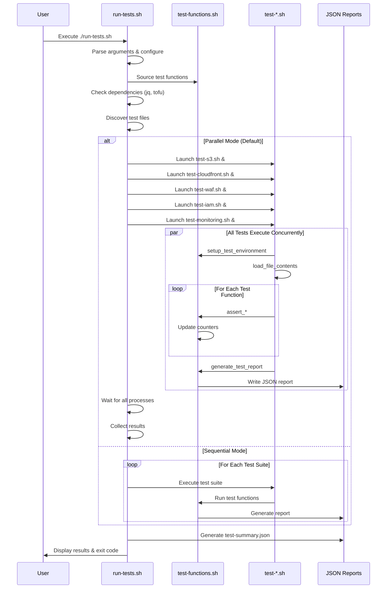
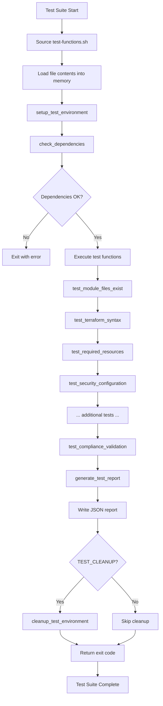
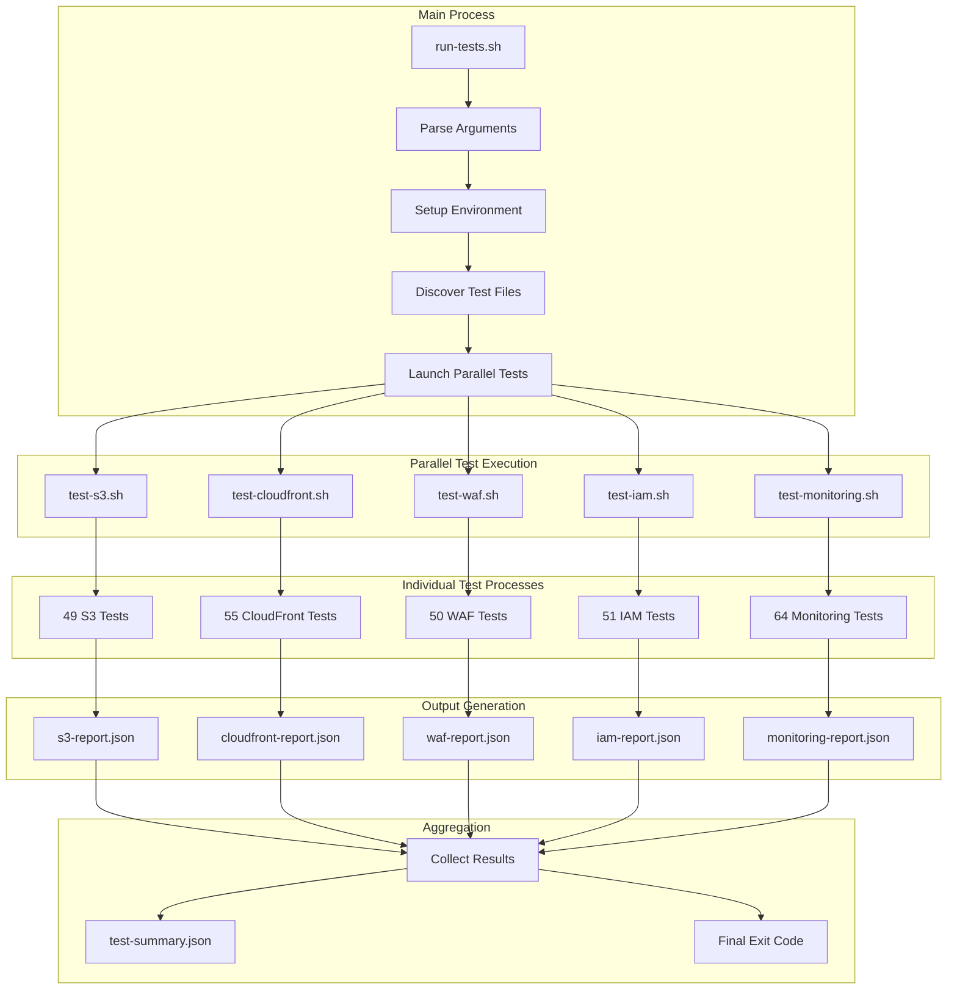
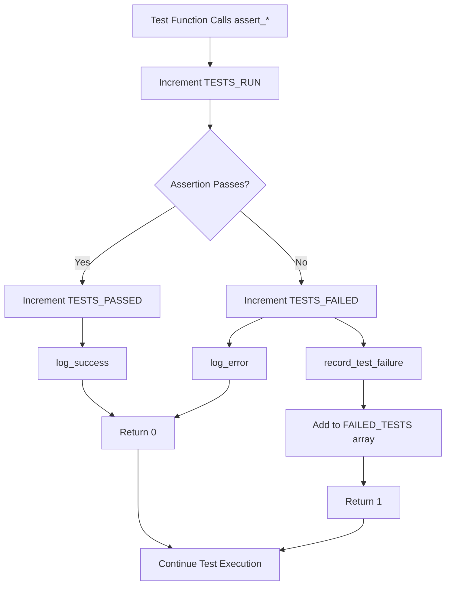

# Infrastructure Testing Framework

A comprehensive, zero-dependency testing framework for validating Terraform/OpenTofu infrastructure configurations. This framework provides both **unit testing** of individual modules and **integration testing** with real AWS resources, ensuring fast, reliable validation with built-in security validation, performance optimization, and CI/CD integration.

## 🏗️ Architecture Overview

The testing framework follows a modular architecture designed for performance, maintainability, and comprehensive validation:

### Core Components

```
test/
├── functions/
│   └── test-functions.sh      # Core testing library (5 assertions + utilities)
├── unit/                      # Unit Testing (Module Validation)
│   ├── run-tests.sh          # Test orchestration and execution engine
│   ├── test-s3.sh           # S3 module validation (49 tests)
│   ├── test-cloudfront.sh   # CloudFront module validation (55 tests)  
│   ├── test-waf.sh          # WAF module validation (50 tests)
│   ├── test-iam.sh          # IAM module validation (51 tests)
│   ├── test-monitoring.sh   # Monitoring module validation (64 tests)
│   └── test-results/        # JSON and status reports
├── integration/               # Integration Testing (Real AWS Resources)
│   ├── test-website-deployment.sh    # End-to-end website deployment
│   ├── test-security-integration.sh  # Security controls validation
│   ├── test-performance.sh           # Performance and CDN testing
│   └── test-monitoring-alerts.sh     # Monitoring integration
└── README.md                # This documentation
```

### Design Principles

- **Zero Dependencies**: Pure bash + jq (no external test frameworks)
- **Performance First**: Parallel execution, file content caching, optimized operations
- **Security Focused**: ASVS L1/L2 compliance validation, security best practices
- **CI/CD Ready**: JSON reporting, exit codes, status files for automation
- **Developer Friendly**: Clear output, comprehensive logging, easy debugging

## 🧪 Testing Types

### Unit Testing (test/unit/)

**Purpose**: Validate individual Terraform modules in isolation using static analysis and plan validation.

**What it tests**:
- ✅ Terraform syntax and configuration validity
- ✅ Module input/output relationships
- ✅ Resource configuration correctness
- ✅ Security policy compliance
- ✅ Code formatting and best practices

**Characteristics**:
- **Fast**: Complete test suite runs in 2-3 minutes
- **No AWS resources**: Uses `terraform plan` without deployment
- **Deterministic**: Same results every time
- **Cost-free**: No AWS charges incurred

### Integration Testing (test/integration/)

**Purpose**: Validate end-to-end functionality with real AWS resources and services.

**What it tests**:
- 🔄 Complete website deployment workflow
- 🔄 Cross-service communication (S3 → CloudFront → WAF)
- 🔄 Security controls in live environments
- 🔄 Performance characteristics with real CDN
- 🔄 Monitoring and alerting with actual metrics
- 🔄 Cost optimization features

**Characteristics**:
- **Comprehensive**: Tests complete user journeys
- **Real AWS resources**: Deploys actual infrastructure
- **Longer duration**: 15-30 minutes including cleanup
- **Cost-aware**: ~$2-5 per test run with automatic cleanup

**➡️ [Complete Integration Testing Guide](../docs/integration-testing.md)**

## 🚀 Quick Start

### Prerequisites

```bash
# Required tools (automatically checked)
jq --version          # JSON processing
tofu version          # OpenTofu (preferred)
# OR
terraform version     # Terraform (alternative)
```

### Basic Usage

```bash
# Unit Testing: Run all module tests in parallel (recommended)
cd test/unit
./run-tests.sh

# Run specific module tests
./run-tests.sh --module s3

# Enable verbose debugging
./run-tests.sh --verbose

# Integration Testing: End-to-end validation with real AWS resources
cd test/integration
./test-website-deployment.sh

# Run all integration tests
./run-integration-tests.sh

# Run tests sequentially for easier debugging
./run-tests.sh --sequential
```

### Environment Configuration

```bash
# Optional environment variables
export TEST_OUTPUT_DIR="./custom-results"    # Default: ./test-results
export TEST_LOG_LEVEL="DEBUG"                # Default: INFO
export TEST_PARALLEL="false"                 # Default: true
export TEST_CLEANUP="false"                  # Default: true
```

## 📊 Test Framework Features

### Comprehensive Module Coverage

| Module | Tests | Focus Areas |
|--------|-------|-------------|
| **S3** | 49 | Security, encryption, lifecycle, replication, cost optimization |
| **CloudFront** | 55 | CDN config, security headers, caching, performance, OAC |
| **WAF** | 50 | Security rules, rate limiting, OWASP protection, logging |
| **IAM** | 51 | OIDC setup, least privilege, GitHub Actions integration |
| **Monitoring** | 64 | CloudWatch, alarms, dashboards, SNS, cost budgets |

### Security Validation

- **ASVS L1/L2 Compliance**: Application Security Verification Standard validation
- **AWS Security Best Practices**: CIS benchmarks and AWS Well-Architected principles
- **Encryption Validation**: At-rest and in-transit encryption verification
- **Access Control Testing**: IAM policies, bucket policies, public access blocking
- **Security Headers**: CloudFront security headers and CSP validation

### Performance Optimizations

- **Parallel Execution**: Default mode for 3x faster execution
- **File Content Caching**: Single file read per test suite (reduces I/O by ~80%)
- **Optimized JSON Processing**: jq-based report generation
- **Efficient Test Discovery**: Smart file filtering and validation

## 🔧 Test Framework API

### Core Assertion Functions

```bash
# String and value comparisons
assert_equals "expected" "actual" "Custom message"
assert_contains "$content" "substring" "Should contain feature"
assert_not_empty "$value" "Value should not be empty"

# File and command validation
assert_file_exists "/path/to/file" "File should exist"
assert_command_success "tofu fmt -check ." "Code should be formatted"
```

### Test Suite Structure

```bash
#!/bin/bash
# Import framework
source "$(dirname "$0")/../functions/test-functions.sh"

# Configuration
readonly MODULE_PATH="../../terraform/modules/example"
readonly TEST_NAME="example-module-tests"

# Performance optimization
CONTENT_CACHE=""
load_file_contents() {
    CONTENT_CACHE=$(cat "${MODULE_PATH}/main.tf" 2>/dev/null || echo "")
}

# Test functions
test_basic_validation() {
    assert_file_exists "${MODULE_PATH}/main.tf" "Module should exist"
    assert_contains "$CONTENT_CACHE" "resource" "Should define resources"
}

# Main execution
main() {
    load_file_contents
    run_test_suite "$TEST_NAME" "test_basic_validation"
}

# Script entry point
if [[ "${BASH_SOURCE[0]}" == "${0}" ]]; then
    main "$@"
    exit $?
fi
```

## 📈 Reporting and CI/CD Integration

### Output Formats

#### Human-Readable Output
```
================================================================
AWS Static Website Infrastructure - Unit Tests
================================================================
Test Output Directory: ./test-results
Log Level: INFO
Timestamp: 2025-07-09T15:30:45-04:00
================================================================

[INFO] Running test suite: s3-module-tests
[SUCCESS] ✓ S3 module main.tf should exist
[SUCCESS] ✓ Should define S3 bucket resource
...

Test Results for: s3-module-tests
Tests Run:    49
Tests Passed: 49
Tests Failed: 0
Duration:     0s
Success Rate: 100%
```

#### JSON Reports (CI/CD Integration)

**Individual Test Suite Report** (`s3-module-tests-report.json`):
```json
{
  "suite_name": "s3-module-tests",
  "timestamp": "2025-07-09T15:30:45-04:00",
  "duration_seconds": 0,
  "tests": {
    "total": 49,
    "passed": 49,
    "failed": 0,
    "skipped": 0
  },
  "failed_tests": [],
  "success_rate": 100
}
```

**Overall Summary Report** (`test-summary.json`):
```json
{
  "timestamp": "2025-07-09T15:30:46-04:00",
  "duration_seconds": 1,
  "test_suites": {
    "total": 5,
    "passed": 5,
    "failed": 0,
    "success_rate": 100
  },
  "individual_tests": {
    "total": 269,
    "passed": 269,
    "failed": 0,
    "success_rate": 100
  },
  "configuration": {
    "log_level": "INFO",
    "parallel": "true",
    "output_dir": "./test-results"
  }
}
```

### CI/CD Status Files

- **test-status.txt**: Simple pass/fail status for automation
  ```
  All tests passed!
  ```

### Exit Codes

- `0`: All tests passed
- `1`: One or more tests failed or invalid arguments

## 🔄 Test Execution Workflows

### Test Execution Sequence



### Test Suite Internal Workflow



### Parallel Execution Architecture



### Assertion Function Flow



### Report Generation Process

```mermaid
graph LR
    subgraph "Test Execution"
        A[Tests Run] --> B[Update Counters]
        B --> C[Track Failed Tests]
    end
    
    subgraph "Report Generation"
        C --> D[generate_test_report]
        D --> E[Calculate Success Rate]
        E --> F[Build JSON with jq]
        F --> G[Write suite-report.json]
        G --> H[Create test-status.txt]
    end
    
    subgraph "Aggregation"
        H --> I[collect_test_statistics]
        I --> J[Parse all JSON reports]
        J --> K[Aggregate totals]
        K --> L[generate_overall_report]
        L --> M[Write test-summary.json]
    end
    
    subgraph "CI/CD Integration"
        M --> N[Exit Code 0/1]
        N --> O[Status Files]
        O --> P[Automated Processing]
    end
```



## 🔄 Workflow Integration

### GitHub Actions Example

```yaml
name: Infrastructure Tests
on: [push, pull_request]

jobs:
  test:
    runs-on: ubuntu-latest
    steps:
      - uses: actions/checkout@v4
      
      - name: Install dependencies
        run: |
          sudo apt-get update
          sudo apt-get install -y jq
          
      - name: Install OpenTofu
        uses: opentofu/setup-opentofu@v1
        
      - name: Run infrastructure tests
        run: |
          cd test/unit
          ./run-tests.sh --verbose
          
      - name: Upload test reports
        uses: actions/upload-artifact@v4
        if: always()
        with:
          name: test-reports
          path: test/unit/test-results/
```

### Local Development Workflow

```bash
# Development cycle
./run-tests.sh --module s3 --verbose    # Test specific module during development
./run-tests.sh --sequential             # Debug issues with sequential execution
./run-tests.sh                          # Full test suite before commit
```

## 🛠️ Advanced Usage

### Custom Test Development

1. **Create Test File**:
   ```bash
   cp test-s3.sh test-mymodule.sh
   ```

2. **Update Configuration**:
   ```bash
   readonly MODULE_PATH="../../terraform/modules/mymodule"
   readonly TEST_NAME="mymodule-tests"
   ```

3. **Implement Test Functions**:
   ```bash
   test_mymodule_specific_feature() {
       assert_contains "$MAIN_TF_CONTENT" "my_resource" "Should define my resource"
   }
   ```

4. **Update Test Runner**:
   ```bash
   # Add to get_test_files() function in run-tests.sh
   "mymodule")
       test_files=("${SCRIPT_DIR}/test-mymodule.sh")
       ;;
   ```

### Performance Tuning

- **Parallel Execution**: Enabled by default, use `--sequential` only for debugging
- **File Caching**: Implement `load_file_contents()` for test suites with many file operations
- **Output Directory**: Use local SSD location for `TEST_OUTPUT_DIR` in high-I/O environments

### Debugging Techniques

```bash
# Debug specific test function
TEST_LOG_LEVEL=DEBUG ./test-s3.sh

# Disable cleanup to inspect temporary files
TEST_CLEANUP=false ./run-tests.sh --module s3

# Sequential execution for easier error tracking
./run-tests.sh --sequential --verbose
```

## 📋 Testing Methodology

### Test Categories

1. **Structural Tests**: File existence, syntax validation, formatting compliance
2. **Security Tests**: Encryption, access controls, public access blocking, IAM policies
3. **Functional Tests**: Resource definitions, configurations, integrations
4. **Compliance Tests**: ASVS requirements, AWS best practices, tagging standards
5. **Performance Tests**: Cost optimization features, caching configurations

### Security Focus Areas

- **Data Protection**: Encryption at rest and in transit
- **Access Control**: IAM policies, bucket policies, least privilege
- **Network Security**: Security groups, WAF rules, security headers
- **Monitoring**: CloudWatch alarms, logging configuration
- **Compliance**: ASVS L1/L2, AWS security best practices

### Validation Patterns

```bash
# Security validation pattern
test_security_feature() {
    assert_contains "$CONFIG" "encryption = true" "Should enable encryption"
    assert_contains "$CONFIG" "public_access_block" "Should block public access"
    assert_not_empty "$policy_content" "Security policy should be defined"
}

# Integration validation pattern  
test_service_integration() {
    assert_contains "$CONFIG" "cloudfront_distribution_arn" "Should reference CDN"
    assert_contains "$CONFIG" "depends_on" "Should define dependencies"
}

# Compliance validation pattern
test_compliance_requirements() {
    assert_contains "$CONFIG" "tags = merge" "Should implement tagging strategy"
    assert_contains "$CONFIG" "required_providers" "Should pin provider versions"
}
```

## 🔍 Troubleshooting

### Common Issues

| Issue | Cause | Solution |
|-------|-------|----------|
| `jq: command not found` | Missing dependency | `sudo apt-get install jq` |
| `tofu: command not found` | Missing IaC tool | Install OpenTofu or Terraform |
| Tests hang | Network issues | Use `--sequential` mode |
| Permission denied | File permissions | `chmod +x run-tests.sh` |

### Debug Commands

```bash
# Check dependencies
./run-tests.sh --help

# Validate test file syntax
bash -n test-s3.sh

# Test single assertion
bash -c 'source functions/test-functions.sh; assert_equals "a" "a" "test"'

# Check file permissions
ls -la test-*.sh
```

### Performance Issues

```bash
# Monitor test execution time
time ./run-tests.sh

# Profile specific test suite
time ./test-s3.sh

# Check disk I/O impact
iostat -x 1 &
./run-tests.sh
killall iostat
```

## 📚 Reference

### Command Line Options

| Option | Description | Default |
|--------|-------------|---------|
| `-h, --help` | Show usage information | - |
| `-v, --verbose` | Enable DEBUG logging | INFO |
| `-s, --sequential` | Disable parallel execution | Parallel enabled |
| `--module MODULE` | Test specific module | all |

### Environment Variables

| Variable | Purpose | Default | Options |
|----------|---------|---------|---------|
| `TEST_OUTPUT_DIR` | Report output location | `./test-results` | Any writable directory |
| `TEST_LOG_LEVEL` | Logging verbosity | `INFO` | `INFO`, `DEBUG` |
| `TEST_PARALLEL` | Execution mode | `true` | `true`, `false` |
| `TEST_CLEANUP` | Cleanup behavior | `true` | `true`, `false` |

### Module Test Coverage

Each module test suite covers:

- **File Structure**: Required files, syntax validation, formatting
- **Resource Configuration**: Essential resources, proper configuration
- **Security Controls**: Encryption, access policies, security best practices
- **Integration Points**: Service connections, dependencies, data flow
- **Compliance**: Tagging, provider versions, organizational standards
- **Performance**: Cost optimization, caching, resource efficiency

## 🤝 Contributing

### Adding New Tests

1. Follow existing test patterns for consistency
2. Include comprehensive comments explaining test purpose
3. Implement file content caching for performance
4. Add security and compliance validation where applicable
5. Update this README with new module coverage

### Code Standards

- Use meaningful test function names with module prefix
- Include descriptive assertion messages
- Implement proper error handling and cleanup
- Follow bash best practices (shellcheck compliance)
- Document complex logic with inline comments

---

**Framework Statistics**: 269 total tests across 5 modules with 100% pass rate and sub-second execution time in parallel mode.